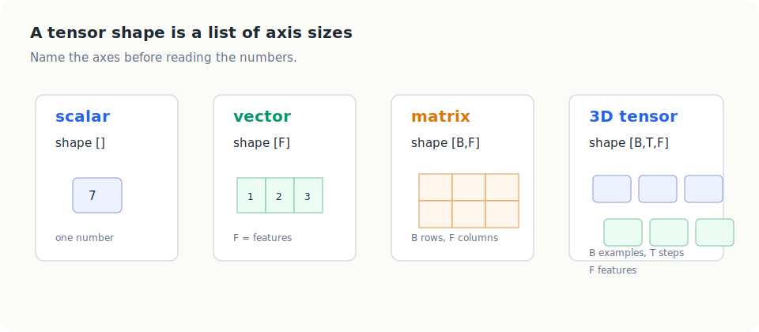
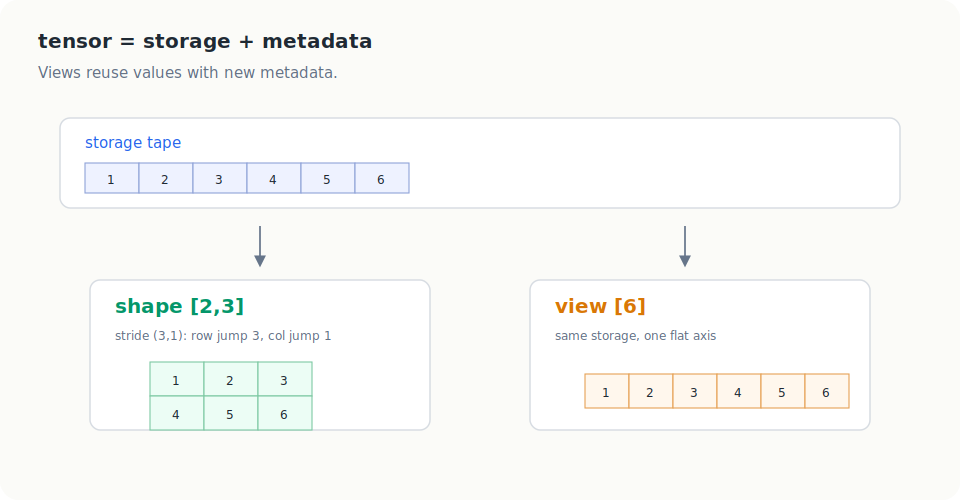
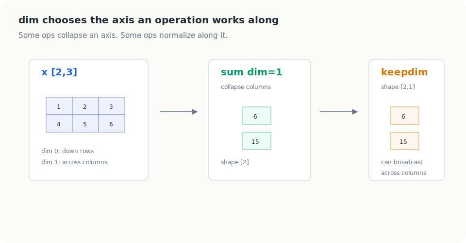
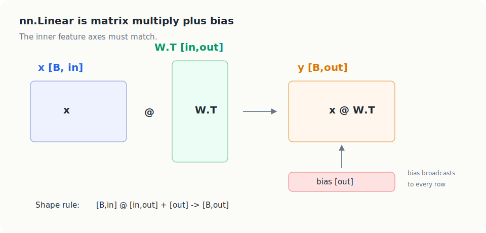
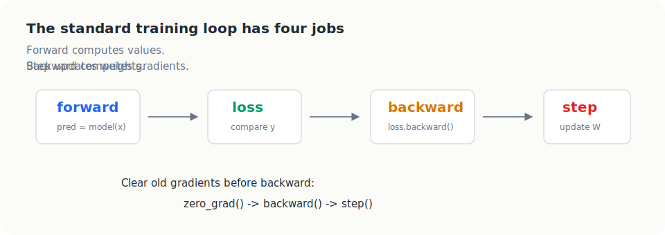

# PyTorch Basics

This note is a foundation for reading the later makemore notebooks. The goal is
not to memorize every PyTorch API. The goal is to build a durable way to reason
about tensors.

The main habit:

```text
always know what each axis means
```

Most PyTorch confusion comes from reading shapes as anonymous numbers:

```text
[32, 3, 2]
```

Instead, read them as named axes:

```text
[B, T, E]
```

meaning:

```text
B = batch examples
T = time steps / context positions
E = embedding width, or learned numbers per token
```

Once the axes have names, operations like `view`, `sum(dim=...)`,
`softmax(dim=...)`, broadcasting, `@`, and `nn.Embedding` become much easier to
predict.

## How To Study This Note

Use this note as worked examples, not as passive reading.

For every code block, ask four questions:

```text
1. What are the input shapes?
2. What does each axis mean?
3. Which axis is kept, removed, created, or merged?
4. What output shape should I expect before running the code?
```

That habit is more important than any single API.

The structure of this note follows a few learning principles:

- use named axes so the shape has meaning
- use one small running example repeatedly
- show the operation visually before the abstraction
- use worked examples before shortcuts
- add small recall checks so the idea survives after reading

## Shape Vocabulary

A tensor is a container of numbers. The number of axes is the tensor's rank.
The size of each axis is the tensor's shape.



Common forms:

| object | example shape | meaning |
| --- | --- | --- |
| scalar | `[]` | one number |
| vector | `[F]` | one axis of features |
| matrix | `[B, F]` | examples by features |
| 3D tensor | `[B, T, F]` | examples by time by features |

Common axis names in this repo:

| axis | meaning | examples |
| --- | --- | --- |
| `B` | batch size | examples processed together |
| `T` | time or context length | characters in a context |
| `F` | feature count | columns, hidden features |
| `E` | embedding width | learned numbers per token |
| `V` | vocabulary size | possible characters or tokens |
| `H` | hidden width | neurons in a hidden layer |
| `C` | classes or channels | output classes, image channels |

When you see:

```python
x.shape
```

do not stop at:

```text
torch.Size([2, 3])
```

Translate it:

```text
[B, F] = [2 examples, 3 features per example]
```

## The Running Tensor

We will reuse this small tensor:

```python
import torch

x = torch.tensor([[1, 2, 3],
                  [4, 5, 6]])
```

Its shape is:

```text
x.shape = [2, 3]
```

Read that as:

```text
2 rows / examples
3 columns / features
```

Its storage order is:

```text
1, 2, 3, 4, 5, 6
```

This one example is enough to understand shape, stride, views, reductions, and
broadcasting.

## Tensor Attributes

PyTorch tensors have values plus metadata.

The most useful attributes are:

```python
x.shape
x.dtype
x.device
x.requires_grad
```

Example:

```python
x = torch.rand(2, 3)

print(x.shape)         # torch.Size([2, 3])
print(x.dtype)         # torch.float32
print(x.device)        # cpu, cuda, or mps
print(x.requires_grad) # False
```

What they mean:

- `shape`: how many values live on each axis
- `dtype`: what kind of numbers are stored, such as `float32` or `int64`
- `device`: where the tensor lives, such as CPU or GPU
- `requires_grad`: whether autograd should track operations for gradients

Learnable weights are usually floating point tensors with
`requires_grad=True`. Token ids are usually integer tensors, often
`torch.int64`.

## Tensor = Storage + Metadata

A very useful mental model is:

```text
tensor = storage + metadata
```

Storage is the actual values in memory.

Metadata tells PyTorch how to interpret those values:

- `shape`: the logical axis sizes
- `stride`: how far to jump in storage when moving by 1 along each axis
- `storage_offset`: where this tensor's view starts



This is why two tensors can share the same values but have different shapes.
PyTorch can often create a new view by changing metadata instead of copying
data.

## Stride

Stride tells PyTorch how to move through storage.

For:

```python
x = torch.tensor([[1, 2, 3],
                  [4, 5, 6]])

print(x.shape)    # torch.Size([2, 3])
print(x.stride()) # (3, 1)
```

The stride is `(3, 1)`.

Read it as:

```text
dim 0 stride = 3: moving down one row jumps 3 values
dim 1 stride = 1: moving right one column jumps 1 value
```

Storage:

```text
index:   0  1  2  3  4  5
value:   1  2  3  4  5  6
```

Indexing uses:

```text
storage_offset = row_index * row_stride + col_index * col_stride
```

Examples:

```text
x[0, 0] -> 0*3 + 0*1 = 0 -> 1
x[0, 2] -> 0*3 + 2*1 = 2 -> 3
x[1, 0] -> 1*3 + 0*1 = 3 -> 4
x[1, 2] -> 1*3 + 2*1 = 5 -> 6
```

You do not need to compute strides every day. But understanding them makes
`view`, `transpose`, slicing, and contiguity much less mysterious.

## Indexing And Slicing

For a 2D tensor:

```python
x = torch.tensor([[1, 2, 3],
                  [4, 5, 6]])
```

Basic indexing:

```python
x[0, 0]  # 1
x[0, 2]  # 3
x[1, 0]  # 4
```

Slices:

```python
x[1, :]  # tensor([4, 5, 6])
x[:, 0]  # tensor([1, 4])
x[:, 1:] # tensor([[2, 3],
          #         [5, 6]])
```

How to read `:`:

```text
: means keep the whole axis
```

So:

```python
x[:, 0]
```

means:

```text
all rows, column 0
```

Shape effects:

| expression | result shape | why |
| --- | --- | --- |
| `x[1, :]` | `[3]` | choose one row, keep columns |
| `x[:, 0]` | `[2]` | keep rows, choose one column |
| `x[:, 1:]` | `[2, 2]` | keep rows, keep columns 1 and 2 |

Choosing a single integer index removes that axis. Slicing with `:` or `1:`
keeps an axis.

## View And Reshape

`view` changes how PyTorch groups the same values.

Start with:

```python
x = torch.tensor([[1, 2, 3],
                  [4, 5, 6]])
```

The values in storage order are:

```text
1, 2, 3, 4, 5, 6
```

This works:

```python
y = x.view(6)
print(y)
```

Result:

```python
tensor([1, 2, 3, 4, 5, 6])
```

Nothing was learned, summed, or multiplied. PyTorch just changed the grouping:

```text
[2, 3] -> [6]
```

The rule:

```text
old number of scalars must equal new number of scalars
```

So:

```text
[2, 3] has 2 * 3 = 6 values
[6] has 6 values
```

Allowed:

```text
[2, 3] -> [6]
[2, 3] -> [3, 2]
[2, 3] -> [1, 6]
```

Not allowed:

```text
[2, 3] -> [4, 2]
```

because `6 != 8`.

### What `-1` Means

`-1` means:

```text
infer this dimension from the number of values
```

Example:

```python
emb = torch.tensor([
    [[1, 10], [2, 20], [3, 30]],
    [[4, 40], [5, 50], [6, 60]],
])

print(emb.shape)  # torch.Size([2, 3, 2])
flat = emb.view(emb.shape[0], -1)
print(flat.shape) # torch.Size([2, 6])
```

Named axes:

```text
emb:  [B, T, E] = [2, 3, 2]
flat: [B, T*E] = [2, 6]
```

Why:

```text
total values = 2 * 3 * 2 = 12
keep B = 2
remaining axis = 12 / 2 = 6
```

Output:

```python
tensor([[ 1, 10,  2, 20,  3, 30],
        [ 4, 40,  5, 50,  6, 60]])
```

Memory hook:

```text
view redraws dividers around the same values
```

### `view` vs `reshape`

`view` requires the tensor's stride layout to be compatible with the new shape.
If not, it can fail.

`reshape` is more flexible:

- it returns a view when possible
- it makes a copy when needed

So in practical code:

```python
x.reshape(...)
```

is often safer, while:

```python
x.view(...)
```

is useful when you know the tensor is compatible.

## `dim` Means Axis

Many PyTorch functions take `dim`.

Read:

```python
x.sum(dim=1)
```

as:

```text
sum along axis 1
```

For:

```python
x = torch.tensor([[1, 2, 3],
                  [4, 5, 6]])
```

The axes are:

```text
dim 0 = rows
dim 1 = columns
```



Examples:

```python
x.sum(dim=0)  # tensor([5, 7, 9])
x.sum(dim=1)  # tensor([ 6, 15])
```

Interpretation:

- `sum(dim=0)` collapses the row axis, so columns remain
- `sum(dim=1)` collapses the column axis, so rows remain

Shape changes:

```text
x:            [2, 3]
x.sum(dim=0): [3]
x.sum(dim=1): [2]
```

## `keepdim=True`

`keepdim=True` keeps the collapsed axis with size `1`.

```python
x.sum(dim=1, keepdim=True)
```

Shape:

```text
[2, 3] -> [2, 1]
```

Why this matters:

```python
row_sums = x.sum(dim=1, keepdim=True)
normalized = x / row_sums
```

`row_sums` has shape `[2, 1]`, so it can broadcast across the columns of
`x`, which has shape `[2, 3]`.

If `keepdim=False`, `row_sums` would have shape `[2]`, which does not mean
"one value per row" to broadcasting. Broadcasting compares from the right, so
`[2]` tries to line up with the column axis of `[2, 3]`.

Practical rule:

```text
when reducing an axis that you will divide by later, consider keepdim=True
```

## Softmax

`softmax` turns scores into probabilities along one axis.

It does not collapse the axis. It normalizes along that axis.

```python
scores = torch.tensor([[1.0, 2.0, 3.0],
                       [4.0, 5.0, 6.0]])

row_probs = torch.softmax(scores, dim=1)
```

Shape:

```text
[2, 3] -> [2, 3]
```

`dim=1` means each row becomes a probability distribution over columns.

For a model output shaped:

```text
[B, V]
```

where `V` is the vocabulary or class axis, we usually use:

```python
probs = torch.softmax(logits, dim=1)
```

or equivalently:

```python
probs = torch.softmax(logits, dim=-1)
```

when the vocabulary axis is last.

## Broadcasting

Broadcasting lets a smaller tensor act like a larger tensor when the shapes are
compatible.

Example:

```python
a = torch.tensor([[1.0, 1.0, 1.0],
                  [1.0, 1.0, 1.0]])

b = torch.tensor([10.0, 20.0, 30.0])

out = a + b
```

Shapes:

```text
a:   [2, 3]
b:      [3]
out: [2, 3]
```

PyTorch reads `b` as if it were:

```text
[1, 3]
```

then repeats it down the batch axis:

```python
[[10., 20., 30.],
 [10., 20., 30.]]
```

The rules:

```text
compare shapes from the right
dimensions are compatible if they are equal or one is 1
missing leading dimensions behave like 1
```

Examples:

| left | right | result | valid? |
| --- | --- | --- | --- |
| `[2, 3]` | `[3]` | `[2, 3]` | yes |
| `[2, 3]` | `[2, 1]` | `[2, 3]` | yes |
| `[4, 2, 3]` | `[1, 3]` | `[4, 2, 3]` | yes |
| `[2, 3]` | `[2]` | none | no |

Common uses:

- adding bias: `[B, H] + [H] -> [B, H]`
- row normalization: `[B, F] / [B, 1] -> [B, F]`
- token plus position embeddings: `[B, T, E] + [T, E] -> [B, T, E]`
- attention masks: `[B, heads, T, T] + [1, 1, T, T]`

## Matrix Multiplication

Matrix multiplication contracts the matching inner axis.



Rule:

```text
[rows, shared] @ [shared, cols] -> [rows, cols]
```

Example:

```python
x = torch.tensor([[1.0, 2.0, 3.0]])  # [1, 3]

W = torch.tensor([[0.2, -0.5],
                  [1.0,  0.3],
                  [0.7, -0.1]])      # [3, 2]

y = x @ W
print(y.shape)  # torch.Size([1, 2])
```

Shape check:

```text
[1, 3] @ [3, 2] -> [1, 2]
```

The two `3`s match and disappear. The outside axes `1` and `2` become the
output shape.

## Linear Layers

A linear layer is:

```text
y = x @ weight.T + bias
```

PyTorch stores `nn.Linear(in_features, out_features)` weights as:

```text
weight.shape = [out_features, in_features]
bias.shape   = [out_features]
```

So if:

```python
import torch.nn as nn

layer = nn.Linear(3, 2)
x = torch.randn(5, 3)
y = layer(x)

print(x.shape)            # torch.Size([5, 3])
print(layer.weight.shape) # torch.Size([2, 3])
print(layer.bias.shape)   # torch.Size([2])
print(y.shape)            # torch.Size([5, 2])
```

The math is:

```text
x:        [B, in]  = [5, 3]
weight.T: [in,out] = [3, 2]
bias:     [out]    = [2]
y:        [B,out]  = [5, 2]
```

Bias broadcasts across the batch:

```text
[5, 2] + [2] -> [5, 2]
```

## `torch.cat`

`torch.cat` joins tensors along an existing axis.

```python
a = torch.tensor([[1, 2],
                  [3, 4]])

b = torch.tensor([[5, 6],
                  [7, 8]])
```

Concatenate along rows:

```python
torch.cat([a, b], dim=0)
```

Shape:

```text
[2, 2] + [2, 2] -> [4, 2]
```

Result:

```python
tensor([[1, 2],
        [3, 4],
        [5, 6],
        [7, 8]])
```

Concatenate along columns:

```python
torch.cat([a, b], dim=1)
```

Shape:

```text
[2, 2] + [2, 2] -> [2, 4]
```

Result:

```python
tensor([[1, 2, 5, 6],
        [3, 4, 7, 8]])
```

Rule:

```text
all axes must match except the cat axis
```

## `torch.stack`

`torch.stack` creates a new axis.

```python
a = torch.tensor([1, 2, 3])
b = torch.tensor([4, 5, 6])

torch.stack([a, b], dim=0)
```

Result:

```python
tensor([[1, 2, 3],
        [4, 5, 6]])
```

Shape:

```text
[3] and [3] -> [2, 3]
```

Compare:

```text
cat joins along an existing axis
stack creates a new axis
```

## Embeddings

`nn.Embedding(num_embeddings, embedding_dim)` is a learned lookup table.

Terms:

- token: a discrete item, such as a character or word
- vocab size `V`: how many token ids exist
- embedding width `E`: how many learned numbers each token gets

Important: `E` means embedding width. It does not mean the character `e`.

Example:

```python
import torch
import torch.nn as nn

embedding = nn.Embedding(num_embeddings=3, embedding_dim=2)
ids = torch.tensor([[0, 1, 2, 1]])

out = embedding(ids)
print(out.shape)
```

Shape:

```text
ids: [B, T]    = [1, 4]
table: [V, E]  = [3, 2]
out: [B, T, E] = [1, 4, 2]
```

Why the new axis appears:

```text
each scalar id becomes a vector with E learned numbers
```

For example:

```text
0 -> row 0 -> [feature 0 value, feature 1 value]
1 -> row 1 -> [feature 0 value, feature 1 value]
2 -> row 2 -> [feature 0 value, feature 1 value]
```

So:

```text
same [B, T] grid,
but every cell now contains a vector of length E
```

Conceptually:

```python
one_hot(id) @ W
```

and:

```python
embedding(id)
```

do the same lookup. `nn.Embedding` is the efficient version.

## `torch.gather`

`torch.gather(input, dim, index)` selects values along one axis using index
positions.

Example:

```python
x = torch.tensor([[10, 20, 30],
                  [40, 50, 60]])

index = torch.tensor([[2, 1],
                      [0, 2]])

out = torch.gather(x, dim=1, index=index)
```

Result:

```python
tensor([[30, 20],
        [40, 60]])
```

Read it row by row:

```text
row 0 picks columns 2 and 1 -> [30, 20]
row 1 picks columns 0 and 2 -> [40, 60]
```

Shape rule:

```text
out.shape == index.shape
```

`gather` is useful when the index tensor says which column to pick for each
row.

## Target Indexing

In classification, model probabilities often have shape:

```text
probs: [B, C]
```

where `C` is the class axis.

Targets often have shape:

```text
y: [B]
```

where each value is the correct class index for that row.

To pick the probability assigned to the correct class:

```python
correct_probs = probs[torch.arange(B), y]
```

Read it as:

```text
row 0, column y[0]
row 1, column y[1]
row 2, column y[2]
...
```

Output shape:

```text
[B]
```

This is the same idea used in negative log likelihood:

```python
loss = -correct_probs.log().mean()
```

## Autograd

Autograd is PyTorch's automatic differentiation system.

If a tensor has:

```python
requires_grad=True
```

PyTorch tracks operations involving that tensor during the forward pass.

Example:

```python
a = torch.tensor(2.0, requires_grad=True)
b = torch.tensor(3.0, requires_grad=True)

y = a * b
y.backward()

print(a.grad)  # tensor(3.)
print(b.grad)  # tensor(2.)
```

Why:

```text
y = a * b
dy/da = b
dy/db = a
```

When `a=2` and `b=3`:

```text
dy/da = 3
dy/db = 2
```

Autograd stores a computation graph:

```text
a ----\
       (*) ---- y
b ----/
```

Calling:

```python
y.backward()
```

walks backward through the graph and fills `.grad` on leaf tensors that require
gradients.

## `nn.Parameter`

`nn.Parameter` is a tensor that an `nn.Module` treats as learnable.

```python
import torch.nn as nn

p = nn.Parameter(torch.randn(3, 4))
print(p.requires_grad)  # True
```

Use:

- plain tensors for ordinary data
- `nn.Parameter` for weights that should be learned

Most of the time, you do not create `nn.Parameter` directly. Layers like
`nn.Linear` create parameters for you.

## `nn.Module`

`nn.Module` is PyTorch's standard container for a model.

It has two main jobs:

```text
__init__: define layers and parameters
forward: define how input flows through them
```

Example:

```python
import torch
import torch.nn as nn

class TinyModel(nn.Module):
    def __init__(self):
        super().__init__()
        self.linear = nn.Linear(3, 2)

    def forward(self, x):
        return self.linear(x)
```

Build it:

```python
model = TinyModel()
print(model)
```

Why `nn.Module` matters:

- it stores layers in one object
- it registers parameters automatically
- `model.parameters()` can find every learnable tensor
- optimizers can update those parameters

## `torch.optim`

An optimizer updates model parameters using gradients.

```python
import torch.optim as optim

optimizer = optim.Adam(model.parameters(), lr=0.001)
```

The optimizer does not compute gradients. It only uses gradients that already
exist on parameters.

## The Standard Training Step



The usual loop is:

```python
pred = model(x)
loss = loss_fn(pred, y)

optimizer.zero_grad()
loss.backward()
optimizer.step()
```

What each line does:

| line | job |
| --- | --- |
| `pred = model(x)` | forward pass |
| `loss = loss_fn(pred, y)` | compare prediction to target |
| `optimizer.zero_grad()` | clear old gradients |
| `loss.backward()` | compute new gradients |
| `optimizer.step()` | update parameters |

Why `zero_grad()` comes before `backward()`:

```text
PyTorch accumulates gradients by default
```

If you forget to clear gradients, the next backward pass adds new gradients on
top of old gradients.

## Common Neural Network Layers

### Activation

An activation function changes values while usually keeping shape the same.

Example:

```python
x = torch.tensor([[-1.0, 2.0]])
torch.relu(x)
```

Output:

```python
tensor([[0., 2.]])
```

Shape:

```text
[1, 2] -> [1, 2]
```

`ReLU` keeps positive values and turns negative values into `0`.

### LayerNorm

`nn.LayerNorm` normalizes across the last axis by default.

```python
x = torch.tensor([[1.0, 2.0, 3.0],
                  [4.0, 5.0, 6.0]])

layer_norm = nn.LayerNorm(3)
y = layer_norm(x)
```

Shape:

```text
[2, 3] -> [2, 3]
```

It changes values, not shape.

For `[B, F]`, `nn.LayerNorm(F)` normalizes each example's `F` features.

For `[B, T, H]`, `nn.LayerNorm(H)` normalizes each token's hidden vector.

### Dropout

`nn.Dropout(p)` randomly zeros values during training.

```python
dropout = nn.Dropout(p=0.5)
y = dropout(x)
```

Shape:

```text
same as input
```

Dropout changes values, not shape. During evaluation, dropout is turned off.

### Softmax Module

`nn.Softmax(dim=...)` is the module version of `torch.softmax`.

```python
softmax = nn.Softmax(dim=-1)
y = softmax(logits)
```

For logits shaped `[B, C]`, `dim=-1` normalizes over classes.

## Shape Debugging Checklist

When a PyTorch expression feels confusing, slow down and write:

```text
name: shape = axis meanings
```

Example:

```text
ids:    [B, T]    = token ids
C:      [V, E]    = embedding table
emb:    [B, T, E] = token vectors
flat:   [B, T*E]  = one feature row per example
W1:     [T*E, H]  = first linear weights
h:      [B, H]    = hidden features
logits: [B, V]    = one score per next token
```

Then ask:

```text
Is an axis being selected?
Is an axis being collapsed?
Is an axis being created?
Are two axes being merged?
Are two tensors being aligned from the right?
Are inner matmul axes equal?
```

This catches most beginner PyTorch shape bugs.

## Quick Recall Checks

Try these without looking back.

1. `x.shape = [2, 3]`. What is `x.sum(dim=1).shape`?
2. `x.shape = [2, 3]`. What is `x.sum(dim=1, keepdim=True).shape`?
3. `emb.shape = [32, 3, 10]`. What is `emb.view(32, -1).shape`?
4. `a.shape = [4, 5]`, `b.shape = [5]`. What is `(a + b).shape`?
5. `x.shape = [8, 16]`, `W.shape = [16, 32]`. What is `(x @ W).shape`?
6. `ids.shape = [4, 7]`, embedding table shape is `[27, 12]`. What is the embedding output shape?

<details>
<summary>Answers</summary>

1. `[2]`
2. `[2, 1]`
3. `[32, 30]`
4. `[4, 5]`
5. `[8, 32]`
6. `[4, 7, 12]`

</details>

## Easy Memory Hook

Use this map:

```text
Tensor basics:
  shape = axis sizes
  dtype = number type
  device = where it lives

Shape operations:
  index selects
  sum/mean collapse
  softmax normalizes
  view/reshape regroup
  cat joins
  stack creates
  broadcast expands virtually
  matmul contracts inner axes

Training:
  Module stores parameters
  loss measures error
  backward computes gradients
  optimizer updates parameters
```

## References

PyTorch references:

- Tensors tutorial: https://docs.pytorch.org/tutorials/beginner/basics/tensor_tutorial
- Tensor views: https://docs.pytorch.org/docs/main/tensor_view.html
- Broadcasting semantics: https://docs.pytorch.org/docs/2.9/notes/broadcasting.html
- Named tensors: https://docs.pytorch.org/docs/stable/named_tensor.html
- `torch.matmul`: https://docs.pytorch.org/docs/stable/generated/torch.matmul
- `torch.cat`: https://docs.pytorch.org/docs/stable/generated/torch.cat
- `torch.gather`: https://docs.pytorch.org/docs/stable/generated/torch.gather.html

Learning-design references used for this rewrite:

- worked examples and cognitive load:
  https://www.mdpi.com/2227-7102/14/8/813
- retrieval practice:
  https://link.springer.com/article/10.1007/s10648-021-09595-9
- spaced retrieval in math learning:
  https://link.springer.com/article/10.1007/s10648-022-09677-2
