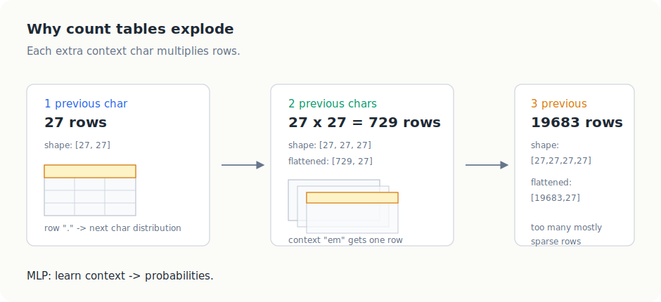
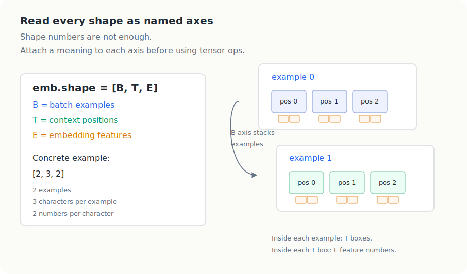
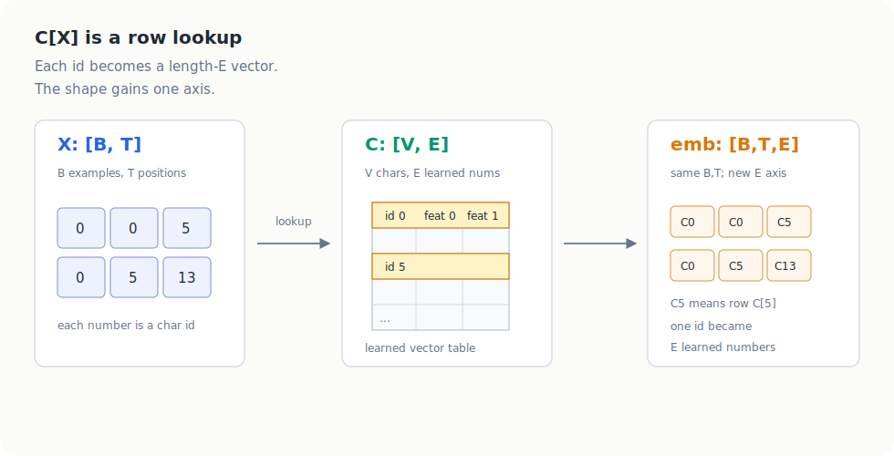
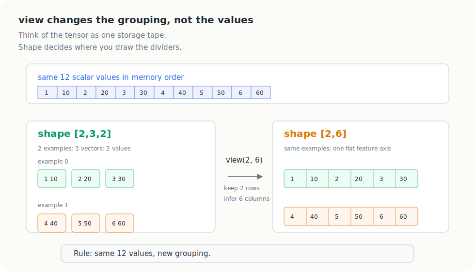
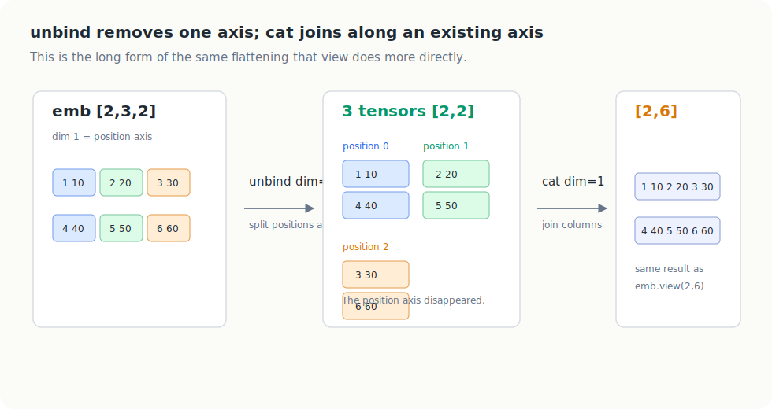
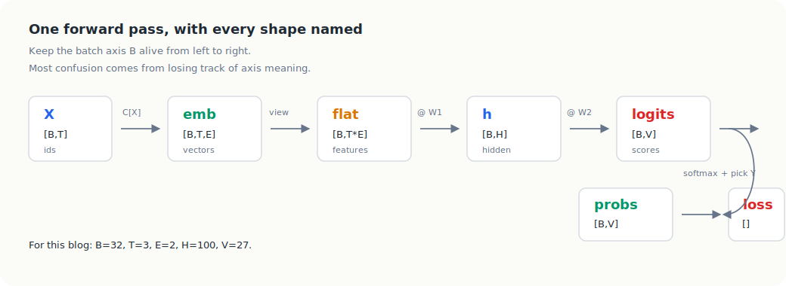
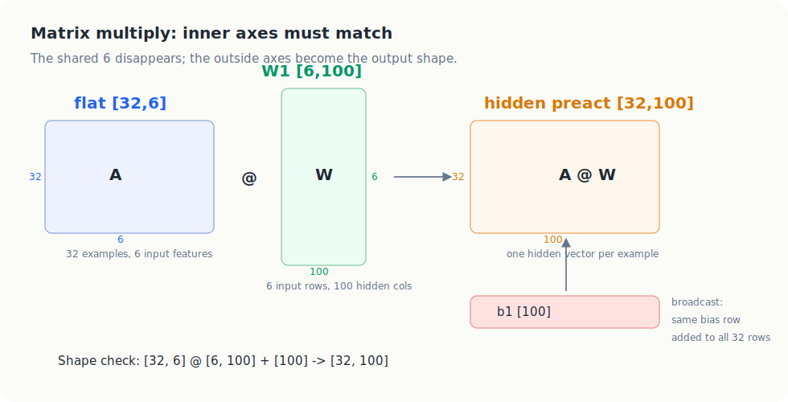
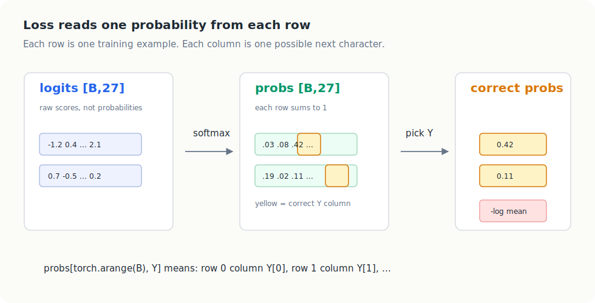

# Building Makemore Part 2: MLP

This note starts with the motivation for moving past count-based character
models.

## Why We Need Something Beyond Count Tables

In the bigram model, we used one character of context:

```text
current character -> next character
```

That gives a count matrix and a probability matrix with shape:

```text
[27, 27]
```

That means:

- `27` possible current-character contexts
- `27` possible next characters

So each row represents one current character, and each row stores next-character
counts or probabilities.

For example:

```text
row "." -> probabilities for what starts a name
row "e" -> probabilities for what comes after e
row "m" -> probabilities for what comes after m
```

This is manageable.

But suppose we want more context.

### Two Characters of Context

If we move from a bigram model to a trigram model, one example becomes:

```text
current 2 characters -> next character
```

Now the model must represent all possible 2-character contexts:

```text
27 * 27 = 729
```

So we can think about the count/probability table in two equivalent ways:

```text
[27, 27, 27]
```

or flattened as:

```text
[729, 27]
```

The meaning is the same:

- `729` possible two-character contexts
- `27` possible next characters for each context

For example, one row might correspond to the context:

```text
e m
```

and that row would store probabilities for:

```text
what comes after "em"?
```

### Three Characters of Context

If we use three characters of context, then the number of possible contexts
becomes:

```text
27 * 27 * 27 = 19683
```

Now the count/probability table can be viewed as:

```text
[27, 27, 27, 27]
```

or flattened as:

```text
[19683, 27]
```

That is already much larger, and it is clear that this approach is not
scalable.



The visual lesson is:

```text
more context characters
-> exponentially more exact contexts
-> many sparse rows
-> weak generalization
```

This is why the MLP matters. It gives us a way to use longer context without
building a separate row for every possible exact character sequence.

## Why Move to an MLP

This is the reason to move to a neural model.

Instead of storing a separate probability row for every possible context, we
will learn a function:

```text
context -> next-character probabilities
```

In Part 2, that function will be a small multilayer perceptron (MLP).

The MLP will let us:

- take more context into account
- avoid building an enormous explicit count table
- learn shared structure across similar contexts
- predict the next character from learned parameters instead of raw counts

So the transition is:

```text
count table lookup
```

to:

```text
embed the context
-> feed it through an MLP
-> predict the next character
```

That is the setup for the rest of Part 2.

## How To Read Tensor Shapes In This Note

Before going further, we need a reliable way to read tensor dimensions.

Many PyTorch expressions look short:

```python
emb.view(-1, 6) @ W1 + b1
```

But the expression is only readable if we know what every axis means. So
throughout this note, use this rule:

```text
never read a shape as just numbers;
read it as named axes
```

For the small makemore MLP, the recurring axis names are:

| symbol | meaning | common value in examples |
| --- | --- | ---: |
| `B` | batch size, or number of examples being processed together | `32` |
| `T` | context length, or number of previous characters | `3` |
| `E` | embedding size, or numbers per character vector | `2` |
| `H` | hidden-layer width | `100` |
| `V` | vocabulary size, or number of possible characters | `27` |

So instead of reading:

```text
[32, 3, 2]
```

as three anonymous numbers, read it as:

```text
[B, T, E]
```

meaning:

```text
[examples, context positions, embedding features]
```



This gives us a small shape grammar:

| operation | what it does to axes | example |
| --- | --- | --- |
| lookup | replaces ids with vectors, adding a feature axis | `[B, T] -> [B, T, E]` |
| flatten/view | merges adjacent axes without doing arithmetic | `[B, T, E] -> [B, T*E]` |
| unbind | removes one axis by splitting along it | `[B, T, E] -> T tensors of [B, E]` |
| cat | joins tensors along an existing axis | three `[B, E]` tensors -> `[B, 3E]` |
| matmul | contracts the matching inner axis | `[B, 6] @ [6, H] -> [B, H]` |
| broadcast | virtually repeats a smaller tensor across a missing axis | `[B, H] + [H] -> [B, H]` |
| softmax | normalizes along the vocabulary axis | logits `[B, V]` -> probs `[B, V]` |

The important habit is to keep asking:

```text
which axis is being kept?
which axis is being removed?
which axis is being created?
which axes are being merged?
```

If you can answer those four questions, the PyTorch operation usually becomes
much less mysterious.

The main dimension-heavy ideas in this note are:

- context table growth: why `[27, 27, 27, 27]` can also be read as `[19683, 27]`
- embedding lookup: why `C[X]` changes `[B, T]` into `[B, T, E]`
- flattening: why `[B, T, E]` becomes `[B, T*E]`
- slicing/indexing: why `emb[:, 0, :]` keeps some axes and removes others
- `unbind`: why splitting along `dim=1` removes the context-position axis
- `cat`: why joining position slices side by side recreates the flat feature row
- `view`: why `-1` means "infer this axis from the total number of scalars"
- matrix multiply: why `[B, 6] @ [6, H]` becomes `[B, H]`
- broadcasting: why `[B, H] + [H]` is valid
- target indexing: why `probs[torch.arange(B), Y]` returns one probability per example
- initialization scale: why large random logits create fake confidence before learning starts

The rest of the note repeatedly returns to those operations.

## Intuition Behind the Modeling Approach

The basic intuition comes from Bengio et al. (2003), *A Neural Probabilistic
Language Model*.

Instead of treating each word as an isolated symbol, we will give each word a
learned vector.

So if the vocabulary has around `17000` words, and each word gets a
`30`-dimensional embedding, then we can think of the model as learning:

```text
17000 points in a 30-dimensional space
```

At the beginning, these vectors are random. During training, backprop updates
them, so the points move around in the space.

The hope is that words playing similar roles end up near each other. For
example:

- `dog` and `cat`
- `the` and `a`
- `room` and `bedroom`

If two words are nearby in embedding space, then the model can treat them as
similar in useful ways.

That matters because the model will often see a phrase at test time that never
appeared exactly in training.

For example, maybe the exact phrase:

```text
a dog was running in a room
```

never appeared in the training set.

But maybe the model did see related phrases such as:

```text
the cat is walking in the bedroom
```

If training has pushed:

- `dog` near `cat`
- `a` near `the`
- `room` near `bedroom`

then the model can transfer what it learned from one phrase to another similar
phrase.

This is the key advantage over a raw count table.

A count table only knows exact contexts it has seen before.

An embedding-based model can generalize across similar contexts, because the
neural network is learning a smooth function over these vectors rather than
memorizing every context literally.

Another way to say it is:

```text
by learning and manipulating the embedding space, the model can transfer
knowledge and make reasonable predictions for novel inputs it never saw exactly
during training
```

So the core picture is:

```text
word -> vector
similar words -> nearby vectors
nearby vectors -> similar predictions
```

That is the intuition for why embeddings plus an MLP can handle longer context
better than explicit count tables.

## Bengio Paper Setup

This Part 2 modeling idea follows the basic setup from:

Bengio et al. (2003), *A Neural Probabilistic Language Model*  
https://www.jmlr.org/papers/volume3/bengio03a/bengio03a.pdf

The original paper uses word-level language modeling. So instead of a small
character vocabulary, imagine a vocabulary of about `17000` words.

The task is:

```text
given the previous 3 words, predict the next word
```

So if the previous words are:

```text
w1, w2, w3
```

the model tries to predict:

```text
the 4th word
```

## Simplified Diagram

Below is the same core idea as the paper's diagram, but in simpler form:

```text
word id w1      word id w2      word id w3
    |               |               |
    v               v               v
 lookup in C     lookup in C     lookup in C
    |               |               |
    v               v               v
 30-d vector     30-d vector     30-d vector
      \             |             /
       \            |            /
        +------ concatenate ------+
                   |
                   v
             90 input numbers
                   |
                   v
              hidden layer
                   |
                   v
                  tanh
                   |
                   v
      output layer: 17000 scores/logits
                   |
                   v
                 softmax
                   |
                   v
 probabilities over 17000 possible next words
```

## Reading the Diagram Step by Step

### 1. The inputs are word ids

Each of the three previous words is first just an integer id.

Since the vocabulary has `17000` words, each input is an integer between:

```text
0 and 16999
```

By themselves, these integers do not carry meaning. They are just word labels.

### 2. Each word id looks up a row in the embedding matrix `C`

`C` is a learned embedding table with shape:

```text
[17000, 30]
```

That means:

- `17000` rows: one row per word
- `30` columns: the 30 learned features of that word

So each input word id is converted into a `30`-dimensional vector:

```text
w1 -> C(w1)
w2 -> C(w2)
w3 -> C(w3)
```

This is just a table lookup:

```text
word id -> embedding vector
```

The same matrix `C` is shared across all words. We are not learning a separate
embedding table for each input position.

### 3. The three embeddings are joined together

Each word gives `30` numbers.

So three words give:

```text
3 * 30 = 90
```

That is why the input to the neural network is a vector of `90` numbers.

### 4. The 90 numbers go into a hidden layer

The hidden layer size is a design choice.

For example, it might have `100` neurons.

This layer is fully connected to the `90` input numbers. Then we apply a
`tanh` nonlinearity.

So at this point the model has turned:

```text
3 previous words
```

into:

```text
a learned hidden representation of the context
```

### 5. The output layer produces 17000 scores

Next, the hidden layer connects to the output layer.

Because the model must choose among `17000` possible next words, the output
layer has:

```text
17000 neurons
```

Each one produces one score, often called a logit.

So the model is effectively producing:

```text
one score for each possible next word in the vocabulary
```

This is also why most of the computation happens here: the output layer is
very large.

### 6. Softmax turns scores into probabilities

The `17000` scores are passed through softmax.

Softmax turns them into a probability distribution over all `17000` candidate
next words:

```text
probability of word 0
probability of word 1
...
probability of word 16999
```

All of these probabilities add up to `1`.

So now the model can say:

```text
given w1, w2, w3,
how likely is each possible next word?
```

### 7. Training pushes up the probability of the correct next word

During training, we know the true next word.

So we look at the probability the model assigned to that correct word.

If the model assigned a low probability, the loss is high.

Backprop then updates:

- the embedding matrix `C`
- the hidden-layer weights
- the output-layer weights

so that the correct next word gets a higher probability next time.

## The Same Idea in Makemore

The Bengio paper is word-level with a vocabulary of about `17000` words.

`makemore` uses the same idea, but at the character level.

So here:

- vocabulary size = `27` characters
- context length = `3` characters
- embedding size in the toy example = `2`

That makes the tensors much smaller and easier to inspect by hand.

### 1. Building `X` and `Y`

The dataset is built as:

```text
3 previous characters -> next character
```

For the word `emma`, we pad on the left with dots and generate:

```text
... -> e
..e -> m
.em -> m
emm -> a
mma -> .
```

If:

```text
. = 0
a = 1
e = 5
m = 13
```

then these become:

```text
X row             Y
[0, 0, 0]   ->    5
[0, 0, 5]   ->    13
[0, 5, 13]  ->    13
[5, 13, 13] ->    1
[13, 13, 1] ->    0
```

So:

- `X` stores the input contexts
- `Y` stores the target next-character indices

If we build the dataset from the first 5 names and get `32` training examples,
then:

```text
X.shape = [32, 3]
Y.shape = [32]
```

This means:

- `32` total examples
- each input has `3` character ids
- each label has `1` character id

### 2. One-hot encoding vs lookup table

Suppose we want the embedding for character index `5`.

One way is direct lookup:

```python
C[5]
```

Another way is to one-hot encode `5` and multiply by `C`:

```python
F.one_hot(torch.tensor(5), num_classes=27).float() @ C
```

These are the same operation.

Why?

Because the one-hot vector has zeros everywhere except at position `5`, so the
matrix multiply simply selects row `5` of `C`.

So the useful mental model is:

```text
one-hot + matrix multiply = row lookup
```

In practice we use direct indexing because it is simpler and faster.

### 3. What the embedding table `C` looks like

If:

```python
C = torch.randn((27, 2))
```

then:

```text
C.shape = [27, 2]
```

That means:

- `27` rows: one row per character
- `2` columns: two embedding numbers per character

So every character id gets mapped to a 2-dimensional vector.

#### Visualizing the 2D embeddings

Because this toy model uses a 2-dimensional embedding, we can draw the learned
character vectors directly as points.

This plot is read after training, once the loss has been minimized. At that
point, `C` is no longer a random table. Backprop has moved each character vector
to a position that helps the MLP predict the next character.

A simplified version of the embedding plot looks like this:

```text
                    learned embedding space

        rare / unusual region
                  q


    boundary region                         consonants spread out
          .                              b   g   k   m   t
                                            r   s   n   l


        vowel-like region
        a   e   i   o   u
```

How to read the plot:

- each dot is one row of the embedding table `C`
- the x- and y-axes are learned coordinates, not hand-designed features
- nearby characters are characters the model has learned to use similarly
- far-apart characters are characters the model treats differently

The vowel cluster is the easiest pattern to interpret. Characters like `a`,
`e`, `i`, `o`, and `u` often appear in similar positions inside names, so their
gradients tend to push them into a similar part of the space.

`q` often ends up far away because it is rare and has a very specific behavior.
In names, it usually strongly constrains what can come next, especially toward
`u`, so the model benefits from giving it a distinctive embedding.

The `.` token is also special. It is not a letter; it marks both the beginning
and the end of a name. Because its job is structurally different from ordinary
characters, training often pushes it into its own region of the plot.

The exact coordinates do not matter. The important signal is the geometry:
training has arranged the characters so that similar roles are close together
and special cases are pushed apart.

### 4. What `C[X]` does

PyTorch lets us index tensors in a very convenient way.

For a single character index:

```python
C[5]
```

returns one embedding vector:

```text
[-0.4713, 0.7868]
```

But PyTorch also lets us index a tensor with a list or another tensor.

So:

```python
C[[5, 6, 7]]
```

returns:

```text
[
  C[5],
  C[6],
  C[7]
]
```

stacked together as one tensor.

This is the important bridge to the full dataset.

If `X` is itself a tensor of indices, then:

```python
C[X]
```

means:

```text
take every integer inside X
and replace it with the corresponding row of C
```

If:

```text
X.shape = [32, 3]
```

then:

```python
emb = C[X]
```

replaces every integer in `X` by its 2D embedding vector from `C`.

So the shape becomes:

```text
emb.shape = [32, 3, 2]
```

Read this as:

```text
[number of examples, context length, embedding size]
```

So in this case:

- `32` examples
- `3` characters per example
- `2` numbers per character embedding

Visually:



The shape move is:

```text
X:   [B, T]       character ids
C:   [V, E]       lookup table
C[X]: [B, T, E]   every id replaced by an E-number vector
```

Here `E` does not mean the character `e`. It means the embedding width: how
many learned numbers we store for each character. In the toy setup:

```text
E = 2
```

so each character row in `C` has two learned values:

```text
C[5] = [feature 0 value, feature 1 value]
```

The batch axis `B` and context-position axis `T` stay exactly where they were.
The new axis `E` appears because each integer id has been replaced by a vector.

#### Memory anchor

Whenever you see:

```python
C[X]
```

say this out loud:

```text
same grid as X, but every cell now contains a vector
```

### 5. A concrete example of `[32, 3, 2]`

Take one input row:

```text
[0, 0, 5]
```

Suppose for illustration that:

```text
C[0] = [1.6, -0.2]
C[5] = [-0.5, 0.8]
```

Then this one input row becomes:

```text
[
  [ 1.6, -0.2 ],
  [ 1.6, -0.2 ],
  [ -0.5,  0.8 ]
]
```

This has shape:

```text
[3, 2]
```

because:

- 3 input characters
- each one becomes a vector of length 2

If we do this for all `32` rows in `X`, then stacking all of them gives:

```text
[32, 3, 2]
```

### 6. Why `[32, 3, 2]` becomes `[32, 6]`

The MLP wants one flat feature vector per example.

For one example, we currently have:

```text
[3, 2]
```

That means:

```text
3 characters * 2 numbers each = 6 total numbers
```

So the example:

```text
[
  [ 1.6, -0.2 ],
  [ 1.6, -0.2 ],
  [ -0.5,  0.8 ]
]
```

gets flattened into:

```text
[ 1.6, -0.2, 1.6, -0.2, -0.5, 0.8 ]
```

This is now a vector of length `6`.

So one row goes from:

```text
[3, 2]
```

to:

```text
[6]
```

and the full batch goes from:

```text
[32, 3, 2]
```

to:

```text
[32, 6]
```



That flattened `[32, 6]` tensor is what gets fed into the next linear layer.

The mental model:

```text
keep the example axis separate
merge the context-position axis and embedding-feature axis
```

In named-axis form:

```text
[B, T, E] -> [B, T*E]
```

For this toy case:

```text
[32, 3, 2] -> [32, 3*2] -> [32, 6]
```

Nothing has been averaged, summed, multiplied, or learned. The numbers are only
being lined up into one feature row per training example.

### 7. Shape Summary

| tensor | meaning | shape |
| --- | --- | --- |
| `X` | input character-index contexts | `[32, 3]` |
| `Y` | target next-character indices | `[32]` |
| `C` | embedding lookup table | `[27, 2]` |
| `emb = C[X]` | embedded input contexts | `[32, 3, 2]` |
| `emb_flat` | flattened embeddings for the MLP | `[32, 6]` |

### 8. A Tiny Tensor Example for Indexing, `unbind`, and `view`

To make the tensor operations concrete, take a very small example:

```python
emb = torch.tensor([
    [[1, 10], [2, 20], [3, 30]],
    [[4, 40], [5, 50], [6, 60]],
])
```

Its shape is:

```text
[2, 3, 2]
```

Read this as:

- `2` examples
- `3` positions in the context
- `2` embedding numbers per position

In named-axis form:

```text
emb: [B, T, E]
```

The values are deliberately chosen so the movement is visible:

```text
example 0: [1,10] [2,20] [3,30]
example 1: [4,40] [5,50] [6,60]
```

So the dimensions mean:

- `dim 0` = which example
- `dim 1` = which character position
- `dim 2` = which embedding coordinate

#### What does `emb[:, 0, :]` mean?

```python
emb[:, 0, :]
```

means:

- `:` on `dim 0` -> take all examples
- `0` on `dim 1` -> take the first character position
- `:` on `dim 2` -> take both embedding numbers

Result:

```python
tensor([
    [1, 10],
    [4, 40],
])
```

Shape:

```text
[2, 2]
```

A few similar cases:

```python
emb[:, 1, :]
```

gives the second character position from every example:

```python
tensor([
    [2, 20],
    [5, 50],
])
```

```python
emb[0, :, :]
```

gives the first full example:

```python
tensor([
    [1, 10],
    [2, 20],
    [3, 30],
])
```

```python
emb[:, :, 0]
```

gives the first embedding coordinate from every position:

```python
tensor([
    [1, 2, 3],
    [4, 5, 6],
])
```

#### What does `torch.unbind` do?

`torch.unbind` splits a tensor along one chosen dimension.

The shape rule is:

```text
unbind removes the chosen axis
```

So if:

```text
emb: [B, T, E] = [2, 3, 2]
```

then:

```text
torch.unbind(emb, dim=1)
```

splits the `T` axis into `T` separate tensors. Each result keeps only:

```text
[B, E] = [2, 2]
```

```python
torch.unbind(emb, dim=0)
```

splits by example, so we get 2 tensors of shape `[3, 2]`.

```python
torch.unbind(emb, dim=1)
```

splits by character position, so we get 3 tensors:

```python
(
  tensor([[1, 10], [4, 40]]),
  tensor([[2, 20], [5, 50]]),
  tensor([[3, 30], [6, 60]])
)
```

Each has shape:

```text
[2, 2]
```

```python
torch.unbind(emb, dim=2)
```

splits by embedding coordinate, so we get:

```python
(
  tensor([[1, 2, 3],
          [4, 5, 6]]),
  tensor([[10, 20, 30],
          [40, 50, 60]])
)
```

Each has shape:

```text
[2, 3]
```

#### Why does `torch.cat(torch.unbind(emb, 1), 1)` flatten it?

First:

```python
torch.unbind(emb, 1)
```

returns the 3 character positions separately:

```python
(
  tensor([[1, 10], [4, 40]]),
  tensor([[2, 20], [5, 50]]),
  tensor([[3, 30], [6, 60]])
)
```

Then:

```python
torch.cat(torch.unbind(emb, 1), 1)
```

concatenates them along dimension `1`, producing:

```python
tensor([
    [1, 10, 2, 20, 3, 30],
    [4, 40, 5, 50, 6, 60],
])
```

Shape:

```text
[2, 6]
```



This is why:

```python
torch.cat(torch.unbind(emb, 1), 1)
```

and:

```python
emb.view(emb.shape[0], -1)
```

produce the same flattened layout for this contiguous tensor. The first version
shows the operation in slow motion:

```text
split positions apart
-> line the position vectors up side by side
```

The second version says the same thing directly:

```text
keep B, merge T and E
```

The important thing to remember is that `view` is easiest to understand from
the inside out:

```text
1. PyTorch has the values in a fixed order.
2. A shape tells PyTorch how to group those values.
3. view gives the same values a different grouping.
```

For this example, the underlying order is:

```text
1, 10, 2, 20, 3, 30, 4, 40, 5, 50, 6, 60
```

As `[2, 3, 2]`, we group those values as:

```text
2 examples
  each example has 3 positions
    each position has 2 embedding numbers
```

As `[2, 6]`, we group the same values as:

```text
2 examples
  each example has 6 flat feature numbers
```

So for this operation, do not picture the tensor as changing its values.
Picture the dividers being redrawn around the same values.

#### What does `emb.view(emb.shape[0], -1)` mean?

Since:

```text
emb.shape = [2, 3, 2]
```

we have:

```python
emb.shape[0] = 2
```

So:

```python
emb.view(emb.shape[0], -1)
```

means:

```python
emb.view(2, -1)
```

The `-1` tells PyTorch:

```text
infer this dimension for me
```

Because there are:

```text
2 * 3 * 2 = 12
```

numbers total, PyTorch infers:

```text
12 / 2 = 6
```

So the result is:

```python
emb.view(2, 6)
```

which gives:

```python
tensor([
    [1, 10, 2, 20, 3, 30],
    [4, 40, 5, 50, 6, 60],
])
```

So `view` is just another way to turn:

```text
[2, 3, 2]
```

into:

```text
[2, 6]
```

by flattening each example.

#### The two rules of `view`

For this note, remember two rules.

Rule 1:

```text
view can change the shape, but not the number of scalars
```

So these are allowed because both contain `12` numbers:

```text
[2, 3, 2] -> [2, 6]
[2, 3, 2] -> [6, 2]
[2, 3, 2] -> [12]
```

This is not allowed:

```text
[2, 3, 2] -> [2, 7]
```

because:

```text
2 * 3 * 2 = 12
2 * 7 = 14
```

Rule 2:

```text
-1 means infer the missing axis from the total count
```

So:

```python
emb.view(emb.shape[0], -1)
```

means:

```text
keep axis 0 as 2 examples,
then infer however many columns are needed
```

Because the tensor has `12` numbers total and axis 0 is fixed at `2`, the
second axis must be:

```text
12 / 2 = 6
```

So the result is:

```text
[2, 6]
```

The deeper idea:

```text
view is not a neural-network operation;
it is a bookkeeping operation
```

It prepares the data layout so the next matrix multiply sees one feature vector
per example.

#### Quick shape checks

Try answering these before looking ahead:

1. If `emb.shape = [32, 3, 2]`, what is `emb.view(32, -1).shape`?
2. If `emb.shape = [32, 5, 12]`, what is `emb.view(32, -1).shape`?
3. If `emb.shape = [B, T, E]`, what axes are merged by `emb.view(B, -1)`?

<details>
<summary>Answers</summary>

1. `[32, 6]`, because `3 * 2 = 6`.
2. `[32, 60]`, because `5 * 12 = 60`.
3. The `T` and `E` axes are merged into one feature axis.

</details>

## Main Intuition

A very compact summary of the whole model is:

```text
3 word ids
-> 3 embedding lookups
-> concatenate into one vector
-> hidden layer + tanh
-> 17000 output scores
-> softmax
-> probabilities for the next word
```

The paper's diagram may look complicated at first, but the actual idea is
simple:

```text
turn words into vectors
combine the vectors
use a neural net to predict the next word
```

## Training the Model

Here is the full forward pass as a shape pipeline:



Read the pipeline left to right:

```text
ids
-> vectors
-> one flat row per example
-> hidden features
-> one score per possible next character
-> probabilities
-> one scalar loss
```

For the small character-level `makemore` setup, one simple parameterization is:

- `C`: embedding table of shape `[27, 2]`
- `W1`: first-layer weights of shape `[6, 100]`
- `b1`: first-layer bias of shape `[100]`
- `W2`: second-layer weights of shape `[100, 27]`
- `b2`: second-layer bias of shape `[27]`

With named axes, this is:

| parameter | named shape | meaning |
| --- | --- | --- |
| `C` | `[V, E]` | one embedding vector per character |
| `W1` | `[T*E, H]` | maps flattened context features to hidden features |
| `b1` | `[H]` | one bias per hidden neuron |
| `W2` | `[H, V]` | maps hidden features to character scores |
| `b2` | `[V]` | one bias per output character |

Here `6` comes from:

```text
3 context characters * 2 embedding numbers each = 6
```

So after:

```python
emb = C[X]
```

each example has shape:

```text
[3, 2]
```

and after flattening:

```text
[6]
```

If the batch has `32` examples, then:

```text
emb.view(-1, 6) -> [32, 6]
```

So `W1` must start with `6` rows, because the first linear layer is doing:

```text
[32, 6] @ [6, 100] = [32, 100]
```

That is why:

```python
W1 = torch.randn((6, 100), generator=g)
```

The `100` is the hidden-layer width: the number of hidden neurons we want.



The matrix multiply rule is:

```text
[rows, shared] @ [shared, columns] -> [rows, columns]
```

So:

```text
[32, 6] @ [6, 100] -> [32, 100]
```

The two `6`s match and disappear. The outside dimensions, `32` and `100`,
become the result.

In named-axis form:

```text
[B, T*E] @ [T*E, H] -> [B, H]
```

### Forward pass

The forward pass is:

```python
emb = C[X]                        # [32, 3, 2]
h = torch.tanh(emb.view(-1, 6) @ W1 + b1)   # [32, 100]
logits = h @ W2 + b2             # [32, 27]
counts = logits.exp()
probs = counts / counts.sum(1, keepdim=True)
```

Why `emb.view(-1, 6)`?

- `emb` starts as `[32, 3, 2]`
- each example is `3 x 2 = 6` numbers
- `view(-1, 6)` flattens each example and lets PyTorch infer the batch size

So:

```text
[32, 3, 2] -> [32, 6]
```

Broadcasting also happens in:

```python
emb.view(-1, 6) @ W1 + b1
```

because:

- `emb.view(-1, 6) @ W1` has shape `[32, 100]`
- `b1` has shape `[100]`

PyTorch automatically adds the same `b1` row to every example in the batch.

This is broadcasting. The model does not store `32` separate copies of `b1`.
PyTorch treats:

```text
b1: [H]
```

as if it were:

```text
[B, H]
```

for the purpose of this addition.

The shape intuition:

```text
one bias per hidden neuron,
shared across every example in the batch
```

### From logits to probabilities

`logits` are just raw scores for the `27` possible next characters.

After softmax-style normalization, `probs` becomes a probability distribution
for each row.

To see how much probability the model gave to the correct next character, we
index like this:

```python
probs[torch.arange(X.shape[0]), Y]
```

This means:

- take row `0`, column `Y[0]`
- take row `1`, column `Y[1]`
- ...

So we are extracting the probability assigned to the correct label for each
training example.

The manual negative log-likelihood loss is:

```python
loss = -probs[torch.arange(X.shape[0]), Y].log().mean()
```



The indexing expression is easier if we name the axes:

```text
probs: [B, V]
Y:     [B]
```

`Y` stores one correct column index for every row in the batch.

So:

```python
probs[torch.arange(B), Y]
```

means:

```text
for each example row,
select the probability in the correct target column
```

That produces:

```text
[B]
```

Then `.log().mean()` turns those `B` correct-character probabilities into one
scalar loss.

### Backward pass and update

The trainable parameters are:

```python
parameters = [C, W1, b1, W2, b2]
```

Then the training step is:

```python
for p in parameters:
    p.grad = None

loss.backward()

for p in parameters:
    p.data += -lr * p.grad
```

This is standard gradient descent:

- forward pass computes the loss
- backward pass computes gradients
- update step moves parameters in the direction that lowers the loss

### Minibatching

Using the full dataset for every update is expensive.

So instead, we sample a minibatch:

```python
batchsize = 32
batchix = torch.randint(0, X_all.shape[0], (batchsize,))
bx, by = X_all[batchix], Y_all[batchix]
```

Then we run forward, backward, and update only on that subset.

This makes training much faster.

The gradient is noisier because it is estimated from only part of the data, but
in practice that is usually a very good tradeoff.

### Learning rate intuition

The learning rate controls step size.

- too small: training barely moves
- too large: training becomes unstable and loss can blow up

One practical way to search is to sweep values on a log scale:

```python
lre = torch.linspace(-3, 0, 1000)
lrs = 10**lre
```

Then train briefly with each candidate and plot loss against learning rate.

The goal is not to find a magical exact number. The goal is to find a sensible
range where loss drops well and stays stable.

### Picking the learning rate from a plot

During minibatch training, the loss often fluctuates. That is normal, because
each update only sees a small random subset of the data.

But the fluctuations also raise a real question:

```text
are we stepping too slowly or too aggressively?
```

If the learning rate is too small, training barely moves.

If it is too large, the updates overshoot and training becomes unstable.

A practical way to build confidence is:

1. choose a range of candidate learning rates
2. space them exponentially
3. train briefly with each one
4. plot loss versus learning rate

For example:

```python
lre = torch.linspace(-3, 0, 1000)
lrs = 10**lre
```

This sweeps learning rates from:

```text
0.001 up to 1
```

on a log scale.

Then for each candidate learning rate, run a short minibatch training loop,
record the loss, and plot:

```python
plt.plot(lrei, lossi)
```

The useful pattern is:

- at very small learning rates, loss improves too slowly
- as learning rate increases, loss drops faster
- after some point, loss starts rising again because the steps are too large

So the rule of thumb is:

```text
pick a learning rate near the lowest, most stable part of the curve,
before the loss starts trending upward
```

In this run, the selected learning rate was:

```python
lr = 10**lrei[lossi.index(min(lossi))]
```

which gave:

```text
lr = 0.2309
```

That does not mean `0.2309` is universally best. It only means that for this
model and this setup, it looked like a strong choice from the sweep.

Using that learning rate and training longer gave a final loss around:

```text
2.5242
```

### What the training-loss plot usually looks like

A typical minibatch training curve looks like this:

```text
loss
^
|\
| \
|  \__
|     \___ noisy plateau
+----------------------------> steps
```

At the beginning, the loss usually drops quickly because the model is learning
the most obvious structure first.

After that, the curve becomes noisy and flatter:

- noisy, because each step uses a different random minibatch
- flatter, because improvements become smaller once the easy gains are gone

So a plot like this is normal:

- a sharp early decrease
- then a long, jittery band of losses

The important question is not whether every step goes down. In minibatch
training it will not. The important question is whether the overall trend is
going down over time.

## Train, Validation, and Test Splits

A lower training loss is not enough to claim that we have a better model.

Why?

Because a model with enough capacity can simply memorize the training set.

In that case:

- training loss becomes very low
- but the model does not generalize well to new examples

This is the basic overfitting problem.

So the standard practice is to split the dataset into three parts:

- train: about `80%`
- validation (or dev): about `10%`
- test: about `10%`

Each split has a different role:

- the **training split** is used to fit the model parameters
- the **validation split** is used to compare model choices and tune hyperparameters
- the **test split** is used only at the end for a final evaluation

The key idea is:

```text
train on train
choose settings on validation
report final performance on test
```

This matters because every time we look at the test set and learn from it, we
start adapting our choices to that test set too. So the test split should be
used very sparingly.

### A typical split

For the names dataset:

```python
random.seed(42)
random.shuffle(words)

n1 = int(0.8 * len(words))
n2 = int(0.9 * len(words))

xtrain, ytrain = build_dataset(words[:n1])
xval, yval = build_dataset(words[n1:n2])
xtest, ytest = build_dataset(words[n2:])
```

In the original notebook this gives roughly:

- `25626` words in train
- `3203` words in validation
- `3204` words in test

After converting words into `(context -> next character)` examples, the tensor
sizes become much larger because each word contributes multiple training rows.

### How to read train vs validation loss

Suppose after training we get:

```text
train loss = 2.08
validation loss = 2.43
```

The validation loss is higher, which is expected, because the model has already
seen the training data.

What matters is the size of the gap.

- if train loss is much lower than validation loss, the model may be overfitting
- if train and validation loss are both high and fairly close, the model may be underfitting

In the notebook, train and validation losses stay fairly close. That suggests
the model is not severely overfitting yet. In fact, the small network is closer
to underfitting: it still has room to improve by becoming a bit larger.

### Scaling the model

One simple way to increase model capacity is to widen the hidden layer.

For example:

```python
parameters = define_nn(l1out=300)
```

This gives the model more hidden units and therefore more capacity to model the
training data.

The usual workflow is:

1. train on the training split
2. evaluate on the validation split
3. change hyperparameters such as hidden width, embedding size, learning rate, or regularization
4. repeat until validation performance stops improving
5. run the final model on the test split once

## How Sampling Works

After training, we can use the model to generate new names one character at a
time.

The idea is:

```text
start with ...
-> predict next-character probabilities
-> sample one character
-> shift the context window
-> repeat until .
```

### Step 1. Start with an empty context

If `block_size = 3`, sampling starts with:

```python
context = [0, 0, 0]
```

Since `0` is the `.` token, this means the starting context is:

```text
...
```

### Step 2. Run one forward pass

For the current context, we do:

```python
emb = C[torch.tensor([context])]
h = torch.tanh(emb.view(1, -1) @ W1 + b1)
logits = h @ W2 + b2
probs = F.softmax(logits, dim=1)
```

This is the same forward pass as training, except now we only have one example,
so the batch size is `1`.

The shapes are:

```text
context                 [T]
torch.tensor([context]) [1, T]
emb                     [1, T, E]
emb.view(1, -1)         [1, T*E]
h                       [1, H]
logits                  [1, V]
probs                   [1, V]
```

So sampling does not use a different model. It is the same model with:

```text
B = 1
```

The result is:

```text
probabilities for the next character
```

### Step 3. Sample the next character

```python
ix = torch.multinomial(probs, num_samples=1, generator=g).item()
```

This does not always pick the single most likely character. Instead, it samples
according to the probability distribution.

That is important, because deterministic argmax decoding would produce much
less varied names.

### Step 4. Update the context

After sampling the next character index `ix`, we shift the context window:

```python
context = context[1:] + [ix]
```

So if:

```python
context = [0, 0, 0]
ix = 3
```

then the new context becomes:

```python
[0, 0, 3]
```

We also append `ix` to the output sequence we are building.

### Step 5. Stop at the end token

If the model samples:

```python
ix == 0
```

then it has predicted the `.` token, which means the name is finished.

So generation stops there.

### Tiny example

One possible generation might look like:

```text
... -> c
..c -> a
.ca -> r
car -> .
```

which gives:

```text
car
```

So sampling is just the training-time prediction rule used repeatedly in a
loop, feeding each new sampled character back into the context.

## Part 2 Exercises and Optimization Notes

These exercises use the same basic character-level MLP, but now the goal is to
build optimization judgment:

```text
how do we know what to tune,
which changes helped,
which changes only memorized the train set,
and what should we try next?
```

The experiments below used:

- dataset: `data/names.txt`
- split: `80%` train, `10%` validation/dev, `10%` test
- metric: average negative log likelihood, so lower is better
- implementation: `scripts/makemore_part2_exercises.py`

The validation set is the main model-selection split. The test set should be
read as the final held-out check after choosing from validation.

### E01. Tune Hyperparameters to Beat Validation Loss 2.2

The target from the lecture was to beat a validation loss of about:

```text
2.2
```

The first tuned baseline already beat that target:

```text
validation loss = 2.1236
```

Then the rest of the exercise was about understanding which knobs improved
validation loss and which ones only improved training loss.

#### Step 1. Start from a sane baseline

Baseline configuration:

```text
block_size = 3
embedding size = 10
hidden size = 200
parameters = 11897
```

Results:

| model | train loss | validation loss | test loss |
| --- | ---: | ---: | ---: |
| baseline careful init | `2.0766` | `2.1236` | `2.1184` |

This is already below `2.2`.

The train and validation losses are close:

```text
train = 2.0766
validation = 2.1236
gap = 0.0470
```

That means the model is not badly overfitting. It is still limited enough that
it cannot perfectly memorize the training set.

The useful diagnosis is:

```text
mostly healthy, maybe still under-capacity
```

So it is reasonable to try a larger hidden layer or a richer embedding.

#### Step 2. Increase hidden width

Change:

```text
hidden size: 200 -> 300
```

Results:

| model | train loss | validation loss | test loss |
| --- | ---: | ---: | ---: |
| hidden 200 | `2.0766` | `2.1236` | `2.1184` |
| hidden 300 | `2.0536` | `2.1083` | `2.1060` |

This worked.

Why it helped:

- the model had more hidden units
- the training loss went down
- the validation loss also went down

That is the good kind of capacity increase.

If only train loss had improved, that would suggest memorization. But because
validation improved too, the model was using the extra capacity to learn real
structure.

#### Step 3. Increase embedding size

Change:

```text
embedding size: 10 -> 16
hidden size: 300
block_size: 3
```

Results:

| model | train loss | validation loss | test loss |
| --- | ---: | ---: | ---: |
| embed 10, hidden 300 | `2.0536` | `2.1083` | `2.1060` |
| embed 16, hidden 300 | `2.0360` | `2.0957` | `2.0921` |

This also worked.

Why it helped:

The embedding table `C` gives each character a vector. With only a few
embedding dimensions, the model has to compress all useful character properties
into a small space.

Increasing embedding size gives the model more room to represent character
roles:

```text
vowel-like behavior
rare-character behavior
start/end behavior
common consonant behavior
```

Again, both train and validation loss improved, so this was not just
memorization.

#### Step 4. Increase context length

This was the biggest improvement.

Instead of predicting from the previous 3 characters, try more previous
characters:

```text
block_size = 4
block_size = 5
block_size = 8
```

Results:

| model | block_size | train loss | validation loss | test loss |
| --- | ---: | ---: | ---: | ---: |
| b3 e16 h300 | 3 | `2.0360` | `2.0957` | `2.0921` |
| b4 e12 h300 | 4 | `1.9619` | `2.0602` | `2.0508` |
| b5 e12 h300 | 5 | `1.9312` | `2.0464` | `2.0373` |
| b8 e12 h300 | 8 | `1.9064` | `2.0411` | `2.0383` |

This worked strongly.

Why context helped:

Names have local structure longer than 3 characters. For example, after seeing:

```text
...ch
...shi
...ella
...ann
```

the model has more information about what characters are plausible next.

A short context asks the model to predict from incomplete evidence. Increasing
context gives the model more of the spelling pattern.

This is the most important intuition from E01:

```text
more capacity helps,
but better input information helps more
```

#### Step 5. Increase model size around the best context

Since `block_size = 8` helped, the next test was:

```text
block_size = 8
embedding size = 16
hidden size = 400
```

Results:

| model | parameters | train loss | validation loss | test loss |
| --- | ---: | ---: | ---: | ---: |
| b8 e12 h300 | `37551` | `1.9064` | `2.0411` | `2.0383` |
| b8 e16 h400 | `62859` | `1.8015` | `2.0325` | `2.0181` |

This worked.

The train loss dropped a lot, and validation/test also improved.

The model is starting to overfit more:

```text
train = 1.8015
validation = 2.0325
gap = 0.2310
```

But because validation improved, the extra capacity was still useful.

Diagnosis:

```text
mild-to-moderate overfitting, but best validation result
```

#### Step 6. Push hidden size further

Change:

```text
hidden size: 400 -> 500
```

Results:

| model | train loss | validation loss | test loss |
| --- | ---: | ---: | ---: |
| b8 e16 h400 | `1.8015` | `2.0325` | `2.0181` |
| b8 e16 h500 | `1.7711` | `2.0340` | `2.0210` |

This was a net negative.

Why:

- train loss improved
- validation loss got slightly worse
- test loss got slightly worse

That is the classic signal that capacity is no longer the main bottleneck. The
larger model is better at fitting the training set, but not better at
generalizing.

Diagnosis:

```text
more overfit, no validation gain
```

#### Step 7. Increase batch size without retuning learning rate

Change:

```text
batch size: 64 -> 128
same learning-rate schedule
```

Results:

| model | train loss | validation loss | test loss |
| --- | ---: | ---: | ---: |
| b8 e16 h400, batch 64 | `1.8015` | `2.0325` | `2.0181` |
| b8 e16 h400, batch 128 | `1.7771` | `2.0433` | `2.0296` |

This was also a net negative.

Why:

A larger batch gives a less noisy gradient estimate. That can be good, but it
also changes the effective optimization behavior. With the same learning-rate
schedule, it did not improve validation loss here.

The important lesson:

```text
batch size is not an isolated knob
```

If batch size changes, the learning rate schedule may also need to change.

#### E01 Summary

Best result:

| best model | train loss | validation loss | test loss |
| --- | ---: | ---: | ---: |
| b8 e16 h400 | `1.8015` | `2.0325` | `2.0181` |

What worked:

- careful initialization
- wider hidden layer up to a point
- larger embeddings
- longer context
- moderate extra capacity after increasing context

What did not work:

- hidden size `500` after `400`
- batch size `128` with the same learning-rate schedule

Main intuition:

```text
first improve the information the model sees,
then add enough capacity to use that information,
then stop when validation no longer improves
```

### E02. Initialization

Initialization means the model's parameter values before training starts.

In this MLP, the trainable parameters are:

```text
C   = embedding table
W1  = first-layer weights
b1  = first-layer bias
W2  = output-layer weights
b2  = output-layer bias
```

The forward pass is:

```text
characters
-> embedding lookup
-> hidden layer
-> logits
-> softmax probabilities
-> loss
```

The key object is the logits.

Logits are raw scores before softmax. Softmax turns them into probabilities.

For a tiny 4-class example:

```text
logits  = [0, 0, 0, 0]
softmax = [0.25, 0.25, 0.25, 0.25]
```

That is a calm model. It is saying:

```text
I do not know yet
```

But if logits are large and random:

```text
logits  = [18, -4, 2, 9]
softmax = [almost 1, tiny, tiny, tiny]
```

Now the model is extremely confident in one random answer.

At initialization, that confidence is fake. The model has not learned anything
yet.

#### What loss should we expect at initialization?

There are 27 possible next characters:

```text
.abcdefghijklmnopqrstuvwxyz
```

At initialization, the model should have no reason to strongly prefer any one
character. So the ideal initial prediction is approximately uniform:

```text
probability of each character = 1 / 27
```

The loss for the correct character is:

```text
-log(probability of correct character)
```

So the expected uniform loss is:

```text
-log(1 / 27) = log(27) = 3.2958
```

This does not mean the model is good. It means the model is honestly uncertain.

#### What happened with careless initialization?

Results:

| initialization | train loss | validation loss | test loss |
| --- | ---: | ---: | ---: |
| careless lecture-style | `26.0047` | `26.0105` | `26.0153` |

This is very bad.

A loss around `26` means the model is assigning almost zero probability to the
correct next character for many examples.

That happens because:

```text
large random W2 and b2
-> large random logits
-> softmax becomes extremely confident
-> confidence is usually on the wrong class
-> loss becomes huge
```

This is why bad initialization can make the early loss misleading.

The first part of training is not really learning name structure. It is mostly
undoing the bad scale of the logits.

That is what this means:

```text
if initialization is bad, early loss is dominated by broken logits,
not model quality
```

If a model starts at loss `26`, the early decrease from `26` to `4` is not a
meaningful language-modeling improvement. It is the optimizer repairing a bad
starting scale.

#### Fix 1. Make the output layer small

Change:

```text
W2 = small random numbers
b2 = zeros
```

Results:

| initialization | train loss | validation loss | test loss |
| --- | ---: | ---: | ---: |
| small output layer | `3.3079` | `3.3076` | `3.3078` |

This is close to:

```text
log(27) = 3.2958
```

Why it works:

The output logits are computed as:

```text
logits = h @ W2 + b2
```

If `W2` is small and `b2` is zero, then logits start near zero:

```text
logits ≈ [0, 0, 0, ..., 0]
```

Then softmax is near-uniform:

```text
probabilities ≈ [1/27, 1/27, ..., 1/27]
```

So the starting loss is close to the expected random baseline.

#### Fix 2. Also scale the hidden layer

Change:

```text
W1 scale ≈ (5 / 3) / sqrt(fan_in)
b1 = small values
W2 = small random numbers
b2 = zeros
```

Results:

| initialization | train loss | validation loss | test loss |
| --- | ---: | ---: | ---: |
| careful output + tanh scaling | `3.3082` | `3.3080` | `3.3081` |

This starts at roughly the same loss as the small-output-layer fix. The main
benefit is not only the initial loss. It also keeps hidden activations healthier.

The hidden layer is:

```text
h = tanh(emb @ W1 + b1)
```

If `W1` is too large, then `emb @ W1 + b1` has very large positive and negative
values.

Then `tanh` saturates:

```text
large positive -> tanh ≈ 1
large negative -> tanh ≈ -1
```

That is bad because the gradient of `tanh` is very small near `-1` and `1`.
So learning signal gets blocked.

The hidden-layer scaling keeps the pre-activations closer to a useful range.

The intuition:

```text
W2 small -> do not start confidently wrong
W1 scaled -> do not saturate tanh
```

#### E02 Summary

| initialization | train loss | validation loss | test loss | interpretation |
| --- | ---: | ---: | ---: | --- |
| careless | `26.0047` | `26.0105` | `26.0153` | confidently wrong |
| small output layer | `3.3079` | `3.3076` | `3.3078` | near-uniform logits |
| careful output + tanh scaling | `3.3082` | `3.3080` | `3.3081` | near-uniform logits and healthier hidden layer |

Good initialization does not make the trained model magically better by itself.
It makes the optimization problem cleaner.

The model starts from:

```text
humbly uncertain
```

instead of:

```text
loudly wrong
```

That gives the optimizer a better first job:

```text
learn name structure
```

instead of:

```text
repair broken parameter scale
```

### E03. Try Ideas From Bengio et al. 2003

Bengio et al. propose the basic idea used in this makemore model:

```text
token id
-> learned vector from C
-> concatenate context vectors
-> neural network
-> probability distribution over next token
```

The paper also suggests several ideas worth trying:

- longer context
- regularization
- optional direct input-to-output connections
- mixture with an interpolated n-gram model

I tried two paper-inspired ideas:

1. direct input-to-output connections
2. a mixture of neural predictions and a trigram model

#### Idea 1. Direct input-to-output connection

The normal makemore MLP computes:

```text
flat embeddings -> hidden tanh layer -> logits
```

The Bengio-style direct connection adds a shortcut:

```text
flat embeddings -----------------------> logits
flat embeddings -> hidden tanh layer --> logits
```

So the logits get two sources of information:

```text
logits = hidden_path + direct_path
```

Results:

| model | train loss | validation loss | test loss |
| --- | ---: | ---: | ---: |
| b5 e12 h300 baseline | `1.9312` | `2.0464` | `2.0373` |
| b5 e12 h300 direct path | `1.9321` | `2.0463` | `2.0359` |

This was mostly neutral.

Why it might help:

The direct path can learn simple linear effects directly from the context
embeddings. That leaves the hidden layer free to model more nonlinear
interactions.

For example, a direct path can cheaply learn:

```text
if the recent context contains q, boost u
if the recent context ends in a, boost n or .
```

Why it did not help much here:

The vocabulary is tiny, only 27 characters, and the hidden layer was already
large enough to learn many of these simple effects. So the shortcut did not add
much new useful capacity.

Diagnosis:

```text
not harmful, but not a major win by itself
```

#### Idea 2. Mixture with a trigram model

Bengio et al. also discuss combining the neural model with an interpolated
trigram model.

That suggests this mixture:

```text
final probability =
    85% neural MLP probability
  + 15% trigram probability
```

The `15%` trigram weight was selected on the validation set.

Results:

| model | train loss | validation loss | test loss |
| --- | ---: | ---: | ---: |
| direct neural model | `1.9321` | `2.0463` | `2.0359` |
| direct neural + trigram mixture | `1.9362` | `2.0332` | `2.0261` |

This worked.

The train loss got slightly worse:

```text
1.9321 -> 1.9362
```

But validation and test improved:

```text
validation: 2.0463 -> 2.0332
test:       2.0359 -> 2.0261
```

That is a good tradeoff. We care more about held-out loss than training loss.

Why the mixture helped:

The neural model is good at generalization:

```text
similar contexts -> similar embeddings -> similar predictions
```

The trigram model is good at exact local evidence:

```text
if this exact two-character context was common in training,
its empirical next-character distribution can be very useful
```

The mixture combines both:

```text
neural model = smoother, more general
trigram model = sharper, more local
```

A small trigram weight helped because it corrected the neural model in cases
where exact short-context counts were reliable.

Too much trigram weight hurt. At `100%` trigram, validation loss was about:

```text
2.2225
```

That is worse than the neural model, because the trigram model is sparse and
cannot generalize as well.

The best result came from a small amount of trigram information:

```text
alpha_trigram = 0.15
```

#### E03 Summary

| idea | train loss | validation loss | test loss | outcome |
| --- | ---: | ---: | ---: | --- |
| direct path | `1.9321` | `2.0463` | `2.0359` | neutral |
| direct path + trigram mixture | `1.9362` | `2.0332` | `2.0261` | worked |

The mixture result is an important optimization lesson:

```text
lower training loss is not always the best model
```

The mixture slightly worsened train loss but improved validation and test loss.
That means it generalized better.

### How to Approach Optimization

The practical optimization loop from these exercises is:

1. Check the expected initial loss.
2. Fix initialization if the starting loss is far above `log(vocab_size)`.
3. Establish a baseline train/dev/test result.
4. If train and validation are both high and close, try more capacity.
5. If extra capacity helps both train and validation, keep it.
6. If train improves but validation worsens, stop increasing that knob.
7. Try giving the model better input information, such as longer context.
8. Use validation to choose hyperparameters.
9. Use test only as a final held-out check.

The most useful diagnostic is the train-validation gap.

#### Underfitting pattern

```text
train loss high
validation loss high
gap small
```

Interpretation:

```text
the model is not powerful enough,
or the input does not contain enough information,
or training has not run long enough
```

Try:

- larger hidden layer
- larger embedding size
- longer context
- better learning-rate schedule
- train longer

#### Overfitting pattern

```text
train loss keeps improving
validation loss stops improving or gets worse
gap grows
```

Interpretation:

```text
the model is memorizing training-specific patterns
```

Try:

- smaller model
- weight decay
- less training
- more data
- dropout or other regularization in larger models
- choose the earlier or smaller model with better validation loss

#### Good optimization pattern

```text
train loss improves
validation loss improves
test loss later confirms the improvement
```

This is what happened for:

- hidden `200 -> 300`
- embedding `10 -> 16`
- context `3 -> 4 -> 5 -> 8`
- b8 e16 h400
- neural + trigram mixture

The broad lesson is:

```text
do not optimize by making the model bigger blindly
```

A better order is:

```text
make optimization stable
-> improve the information available to the model
-> add enough capacity to use that information
-> stop when validation stops improving
```

### Reference Points

The external reference points that helped interpret these runs:

- Karpathy's original Part 2 notebook gives a validation loss around `2.17` for
  the starter MLP setup.
- Part 3 initialization notes explain why the ideal initial loss is
  `log(27) = 3.2958` and why very large random logits create a fake high loss.
- Bengio et al. 2003 motivates distributed embeddings, longer contexts, direct
  connections, regularization, and mixing neural predictions with n-gram
  predictions.
- Tensor shape vocabulary is easier to learn when each axis has a name and a
  visual role. TensorFlow's tensor guide uses the same vocabulary of shape,
  rank, axis, and size, and emphasizes keeping track of what each axis means:
  https://www.tensorflow.org/guide/tensor
- PyTorch's docs are the ground truth for the operations used here:
  `view`/tensor views, broadcasting, `unbind`, `cat`, and matrix multiplication:
  https://docs.pytorch.org/docs/main/tensor_view.html,
  https://docs.pytorch.org/docs/2.9/notes/broadcasting.html,
  https://docs.pytorch.org/docs/2.12/generated/torch.unbind.html,
  https://docs.pytorch.org/docs/stable/generated/torch.cat,
  https://docs.pytorch.org/docs/stable/generated/torch.matmul
- The visual rewrite follows a few learning-science principles: words plus
  pictures, worked examples, and retrieval practice. Useful summaries:
  https://instructionaldesign.io/toolkit/mayer/,
  https://www.mdpi.com/2227-7102/14/8/813,
  https://link.springer.com/article/10.1007/s10648-021-09595-9
