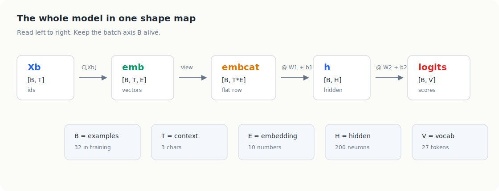
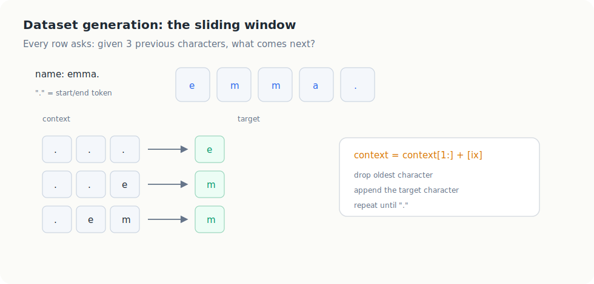
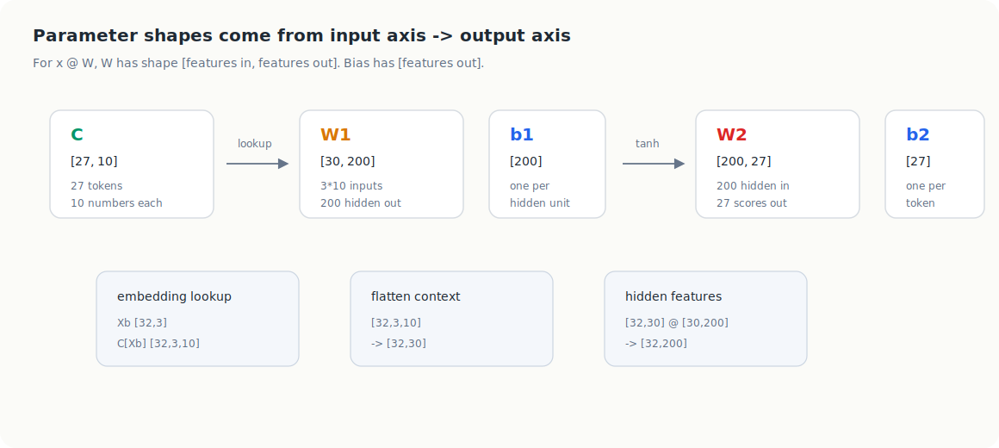
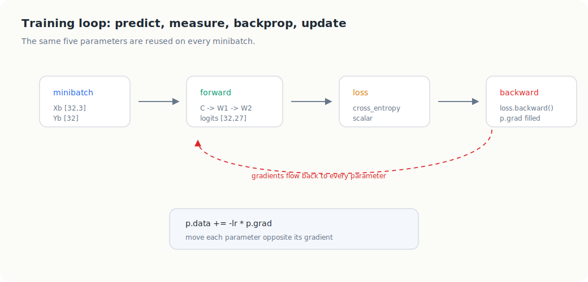
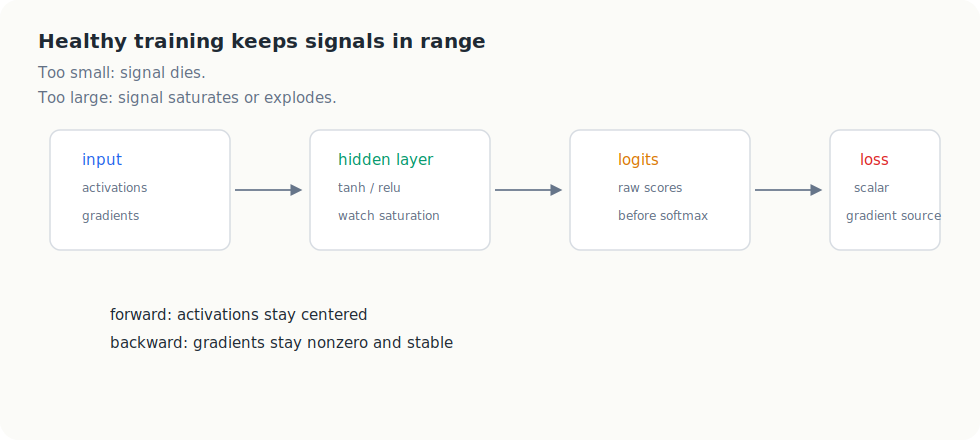
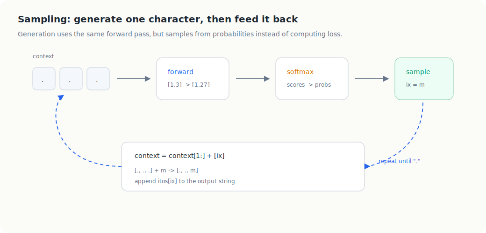
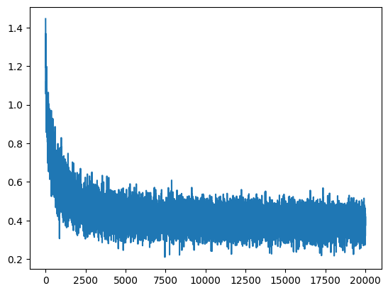
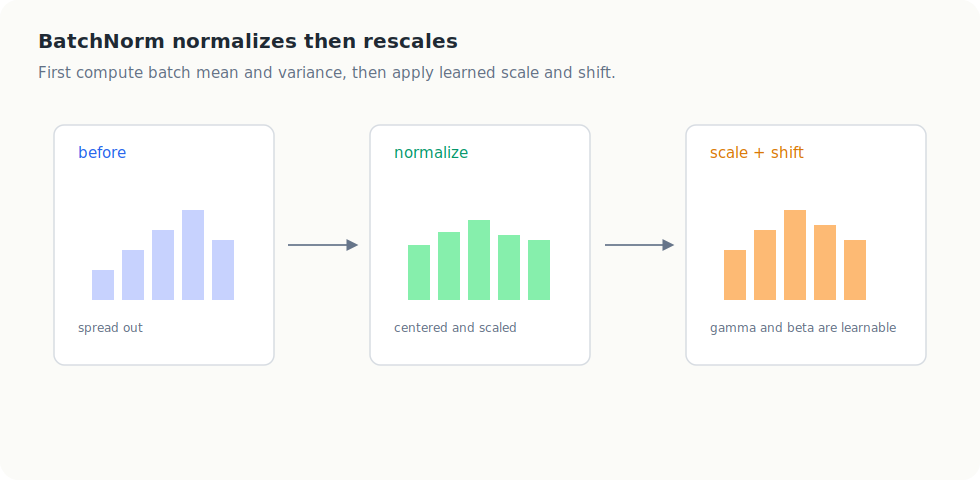

# Building Makemore Part 3: Activations, Gradients, and BatchNorm

This post builds a Makemore-style MLP from tensors and explains every shape
along the way.

The goal is not just to run the code. The goal is to make the tensor pipeline
stick in memory:

```text
character ids
-> embedding lookup
-> flatten context embeddings
-> hidden layer
-> logits
-> loss
-> gradients
-> parameter update
```

Keep this one-line shape map in mind:

```text
Xb [B, T]
-> C[Xb] [B, T, E]
-> view [B, T*E]
-> @ W1 [B, H]
-> @ W2 [B, V]
-> loss
```

Where:

| symbol | meaning | value in this build |
| --- | --- | ---: |
| `B` | batch size | `32` |
| `T` | context length | `3` |
| `E` | embedding size | `10` |
| `H` | hidden neurons | `200` |
| `V` | vocabulary size | `27` |

The memory trick is:

```text
ids become vectors
vectors become one flat row
flat row becomes hidden features
hidden features become character scores
```



This structure uses worked examples, shape diagrams, and small recall checks.
Those are useful here because tensor programming overloads working memory if the
reader has to infer every dimension from scratch.

## A Brief Neural Network Mental Model

A neural network is a function with learned numbers inside it.

For this character model, the function is:

```text
previous 3 characters -> probability of the next character
```

Before training, the learned numbers are random. During training, the model:

```text
1. predicts the next character
2. measures how wrong it was
3. computes gradients for every parameter
4. nudges the parameters to reduce the loss
```

The model is a small MLP:

```text
context character ids
    |
    v
embedding table C
    |
    v
flattened embedding row
    |
    v
linear layer W1, b1
    |
    v
tanh nonlinearity
    |
    v
linear layer W2, b2
    |
    v
logits for 27 possible next characters
```

The important idea:

```text
every parameter exists because one axis has to be transformed into another axis
```

When you see a weight matrix, ask:

```text
what comes in?
what should come out?
```

With the PyTorch convention used here:

```text
x @ W
```

the matrix `W` usually has shape:

```text
[input_features, output_features]
```

That one rule explains almost all of the parameter shapes below.

## 1. Dataset Generation, Tokens, and Splits

Assume we start with a Python list of names:

```python
words = ["emma", "olivia", "ava", "isabella", ...]
```

The important tensor concept is this:

```text
Python strings -> integer token ids -> tensors X and Y
```

The model cannot read characters directly. It needs each character converted
into an integer id. Conceptually, we create two maps:

```text
stoi: character -> integer id
itos: integer id -> character
```

The special token `.` gets index `0`. It means both:

```text
start padding
end of name
```

So the vocabulary size is:

```text
26 letters + "." = 27 tokens
```

### Building Training Examples

The task is:

```text
given the previous 3 characters, predict the next character
```

For one name, `emma`, the training examples are:

```text
context     target
-------     ------
...         e
..e         m
.em         m
emm         a
mma         .
```

In token form, each row becomes one input-output training pair:

```text
[0, 0, 0] -> e
[0, 0, e] -> m
[0, e, m] -> m
[e, m, m] -> a
[m, m, a] -> .
```



The core dataset operation is the sliding context window:

```python
block_size = 3
context = [0] * block_size

ix = stoi[ch]
X.append(context)
Y.append(ix)
context = context[1:] + [ix]
```

After repeating that for every character in every name, convert the collected
lists into tensors:

```python
X = torch.tensor(X)  # [num_examples, block_size]
Y = torch.tensor(Y)  # [num_examples]
```

The tensor concept is:

```text
X stores contexts
Y stores the next-character target for each context
```

The line to remember:

```python
context = context[1:] + [ix]
```

That shifts the context window one step:

```text
[0, 0, 0] + e -> [0, 0, e]
[0, 0, e] + m -> [0, e, m]
[0, e, m] + m -> [e, m, m]
```

If this line is wrong, sampling and training examples will not represent a
moving character history.

### Train, Dev, and Test Splits

The split is only there to measure generalization. Use most names for training,
some names for validation, and a final held-out group for testing.

The resulting split shapes look like:

```text
torch.Size([182625, 3]) torch.Size([182625])
torch.Size([22655, 3])  torch.Size([22655])
torch.Size([22866, 3])  torch.Size([22866])
```

Read the first training shape as:

```text
Xtr: [182625, 3]
     182625 examples
     3 previous-character ids per example

Ytr: [182625]
     one target next-character id per example
```

`X` stores context ids. `Y` stores the answer.

## 2. MLP Revisited: Creating the Parameters

The model uses five learned tensors:

```python
n_embd = 10
n_hidden = 200

C = torch.randn((vocab_size, n_embd))
W1 = torch.randn((n_embd * block_size, n_hidden))
b1 = torch.randn(n_hidden)
W2 = torch.randn((n_hidden, vocab_size))
b2 = torch.randn(vocab_size)

parameters = [C, W1, b1, W2, b2]
```

The whole model is inside these five tensors.

For PyTorch to learn these tensors, they must track gradients:

```python
for p in parameters:
    p.requires_grad = True
```

### The Parameter Shape Rule

Use this rule:

```text
weight matrix shape = [what comes in, what goes out]
bias shape          = [what comes out]
```

Now each parameter becomes predictable.

| parameter | shape | why |
| --- | --- | --- |
| `C` | `[V, E]` = `[27, 10]` | one embedding vector per character |
| `W1` | `[T*E, H]` = `[30, 200]` | map flattened context into hidden features |
| `b1` | `[H]` = `[200]` | one bias per hidden neuron |
| `W2` | `[H, V]` = `[200, 27]` | map hidden features into character scores |
| `b2` | `[V]` = `[27]` | one bias per output character |



### Why `C` Is `[vocab_size, n_embd]`

`C` is the embedding table:

```text
27 characters
10 learned numbers per character
```

So:

```text
C [27, 10]
```

If `Xb` has shape:

```text
[B, T] = [32, 3]
```

then:

```python
emb = C[Xb]
```

has shape:

```text
[B, T, E] = [32, 3, 10]
```

Each integer id got replaced by a 10-number vector.

### Why `W1` Is `[n_embd * block_size, n_hidden]`

For one training example:

```text
3 context characters
10 embedding numbers per character
```

After lookup, one example is:

```text
[3, 10]
```

The first linear layer does not want a small table. It wants one flat row:

```text
3 * 10 = 30 input features
```

So:

```text
input to W1: 30 numbers
output from W1: 200 hidden features
```

Therefore:

```text
W1 [30, 200]
```

This is the mental imprint:

```text
embcat [B, 30] @ W1 [30, 200] -> hpreact [B, 200]
```

The inner dimensions match:

```text
30 with 30
```

The outside dimensions survive:

```text
B and 200
```

### Why `b1` Is `[n_hidden]`

After:

```python
embcat @ W1
```

the result is:

```text
[B, H] = [32, 200]
```

So `b1` has one bias per hidden feature:

```text
b1 [200]
```

PyTorch broadcasts it across the batch:

```text
[32, 200] + [200] -> [32, 200]
```

### Why `W2` Is `[n_hidden, vocab_size]`

The hidden layer produces:

```text
h [B, H] = [32, 200]
```

The model needs one score for each possible next character:

```text
V = 27
```

So:

```text
h [B, 200] @ W2 [200, 27] -> logits [B, 27]
```

Therefore:

```text
W2 [200, 27]
```

### Why `b2` Is `[vocab_size]`

The output has:

```text
27 scores
```

So `b2` has one bias per character:

```text
b2 [27]
```

PyTorch broadcasts it:

```text
[32, 27] + [27] -> [32, 27]
```

### Parameter Count

The parameter count is the number of scalar values across all five learned
tensors:

The count is:

```text
C:   27 * 10       =   270
W1:  30 * 200      =  6000
b1:  200           =   200
W2:  200 * 27      =  5400
b2:  27            =    27
--------------------------------
total              = 11897
```

In PyTorch, this is what `p.nelement()` or `p.numel()` measures for each tensor.

### How Should These Dimensions Be Chosen?

`vocab_size` is fixed by the data:

```text
letters plus "." = 27
```

`block_size` controls how much history the model sees:

```text
larger T -> more context
larger T -> larger flattened input T*E
larger T -> more parameters in W1
```

`n_embd` controls how much information each character vector can store:

```text
small E -> less capacity, easier to inspect
large E -> more capacity, more parameters
```

`n_hidden` controls the width of the hidden layer:

```text
small H -> weaker model
large H -> stronger model, slower training, more overfitting risk
```

For this stage:

```text
T = 3
E = 10
H = 200
V = 27
```

is a reasonable teaching setup. It is large enough to generate name-like
samples, but small enough that every tensor can still be reasoned about by hand.

### The Dimension Recipe

When creating parameters from scratch, use this checklist:

```text
1. Count tokens:
   V = vocab_size

2. Pick context length:
   T = block_size

3. Pick embedding width:
   E = n_embd

4. Pick hidden width:
   H = n_hidden

5. Build parameters:
   C  [V, E]
   W1 [T*E, H]
   b1 [H]
   W2 [H, V]
   b2 [V]
```

This is the compact memory version:

```text
token id -> E numbers
T tokens -> T*E numbers
T*E numbers -> H hidden features
H hidden features -> V next-token scores
```

## Tensor Concepts Used In This Model

Before the training loop, it helps to isolate three PyTorch ideas that appear
again and again.

### `C[Xb]`: Tensor Indexing As Lookup

`C` is an embedding table:

```text
C [27, 10]
```

`Xb` is a batch of character ids:

```text
Xb [32, 3]
```

When we write:

```python
emb = C[Xb]
```

PyTorch replaces every id in `Xb` with the matching row from `C`.

So:

```text
[32, 3] ids -> [32, 3, 10] vectors
```

The new final axis is the embedding axis.

### `view`: Reshape Without Changing The Values

The first linear layer wants one flat feature row per example.

Before `view`:

```text
emb [32, 3, 10]
```

Read this as:

```text
32 examples
3 context positions
10 embedding numbers per position
```

After:

```python
embcat = emb.view(emb.shape[0], -1)
```

the shape is:

```text
[32, 30]
```

`emb.shape[0]` keeps the batch axis. The `-1` asks PyTorch to infer the rest.

Because:

```text
3 * 10 = 30
```

the last two axes merge into one feature axis.

`view` does not average, sum, or learn anything. It only regroups the same
numbers into a different shape. If PyTorch ever complains about `view` on a
non-contiguous tensor, `reshape` is the more forgiving version.

### `F.cross_entropy`: Logits Plus Target Class Ids

The output layer gives raw scores:

```text
logits [32, 27]
```

The targets are integer class ids:

```text
Yb [32]
```

Then:

```python
loss = F.cross_entropy(logits, Yb)
```

does the training loss calculation.

It expects:

```text
one row of scores per example
one correct class id per example
```

Do not apply softmax first. `F.cross_entropy` already performs the stable
version of:

```text
softmax -> pick correct class probability -> negative log -> average
```

### `torch.multinomial`: Sample One Index From Probabilities

During sampling, we do want probabilities:

```python
probs = F.softmax(logits, dim=1)
```

If `probs` is:

```text
[1, 27]
```

then:

```python
ix = torch.multinomial(probs, num_samples=1).item()
```

means:

```text
pick one character id according to the 27 probabilities
```

High probability means more likely, not guaranteed.

## 3. Training: Forward Pass, Backward Pass, Update

Here is the complete training loop:



```python
max_steps = 200000
batch_size = 32

for i in range(max_steps):

    # minibatch
    ix = torch.randint(0, Xtr.shape[0], (batch_size,))
    Xb, Yb = Xtr[ix], Ytr[ix]

    # forward pass
    emb = C[Xb]
    embcat = emb.view(emb.shape[0], -1)
    h = torch.tanh(embcat @ W1 + b1)
    logits = h @ W2 + b2
    loss = F.cross_entropy(logits, Yb)

    # backward pass
    for p in parameters:
        p.grad = None
    loss.backward()

    # update
    lr = 0.1 if i < 100000 else 0.01
    for p in parameters:
        p.data += -lr * p.grad

```

### Minibatch

```python
ix = torch.randint(0, Xtr.shape[0], (batch_size,))
Xb, Yb = Xtr[ix], Ytr[ix]
```

This randomly chooses `32` training examples.

Shapes:

```text
Xb [32, 3]
Yb [32]
```

`Xb` contains context character ids. `Yb` contains the target next-character ids.

### Forward Pass

The forward pass computes the prediction and loss.

```python
emb = C[Xb]
```

Shape:

```text
Xb      [32, 3]
C       [27, 10]
emb     [32, 3, 10]
```

Meaning:

```text
for every character id in Xb, look up its 10-number embedding vector
```

Then:

```python
embcat = emb.view(emb.shape[0], -1)
```

Shape:

```text
emb      [32, 3, 10]
embcat   [32, 30]
```

`emb.shape[0]` is the batch size, `32`. The `-1` means:

```text
PyTorch, infer the remaining dimension
```

Since:

```text
3 * 10 = 30
```

PyTorch reshapes the tensor into:

```text
[32, 30]
```

Then:

```python
h = torch.tanh(embcat @ W1 + b1)
```

Shape:

```text
embcat       [32, 30]
W1           [30, 200]
embcat @ W1  [32, 200]
b1           [200]
h            [32, 200]
```

The `tanh` squashes each hidden pre-activation into roughly:

```text
[-1, 1]
```

Then:

```python
logits = h @ W2 + b2
```

Shape:

```text
h        [32, 200]
W2       [200, 27]
logits   [32, 27]
b2       [27]
```

Each row of `logits` contains raw scores for the `27` possible next characters.

Finally:

```python
loss = F.cross_entropy(logits, Yb)
```

`F.cross_entropy` compares:

```text
logits [32, 27]
Yb     [32]
```

It asks:

```text
for each example, did the model give a high score to the correct target id?
```

The output is one scalar loss.

Important PyTorch habit:

```text
use raw logits with F.cross_entropy
do not manually softmax before F.cross_entropy
```

`cross_entropy` internally applies the stable form of softmax plus negative log
likelihood.

### Backward Pass

```python
for p in parameters:
    p.grad = None
loss.backward()
```

The first loop clears old gradients.

Then:

```python
loss.backward()
```

fills:

```text
C.grad
W1.grad
b1.grad
W2.grad
b2.grad
```

Each gradient has the same shape as its parameter:

```text
C.grad  [27, 10]
W1.grad [30, 200]
b1.grad [200]
W2.grad [200, 27]
b2.grad [27]
```

The gradient means:

```text
how should this parameter change to reduce the loss?
```

### Update

```python
lr = 0.1 if i < 100000 else 0.01
for p in parameters:
    p.data += -lr * p.grad
```

This is manual stochastic gradient descent.

Read it as:

```text
new parameter = old parameter - learning_rate * gradient
```

The learning rate decay:

```text
0.1 for the first 100000 steps
0.01 for the last 100000 steps
```

lets the model move quickly early, then take smaller steps later.

In production PyTorch, you would usually use an optimizer such as
`torch.optim.SGD` or `torch.optim.Adam`. Here the manual update is useful
because it exposes the whole learning loop.

### Single-Glance Training Map

```text
minibatch
  Xb [32, 3], Yb [32]

embedding lookup
  C [27, 10]
  C[Xb] -> emb [32, 3, 10]

flatten
  emb.view(32, -1) -> embcat [32, 30]

hidden layer
  embcat [32, 30] @ W1 [30, 200] + b1 [200]
  -> h [32, 200]

output layer
  h [32, 200] @ W2 [200, 27] + b2 [27]
  -> logits [32, 27]

loss
  cross_entropy(logits [32, 27], Yb [32])
  -> scalar

backprop
  loss.backward()
  -> gradients for every parameter

update
  p = p - lr * p.grad
```



## 4. Evaluation and Interpreting the Result

Training loss is noisy because each step sees only a minibatch. To evaluate the
model, run the full train or validation split without tracking gradients.

```python
@torch.no_grad()
def split_loss(split):
    x, y = {
        "train": (Xtr, Ytr),
        "val": (Xdev, Ydev),
        "test": (Xte, Yte),
    }[split]

    emb = C[x]
    embcat = emb.view(emb.shape[0], -1)
    hpred = torch.tanh(embcat @ W1 + b1)
    logits = hpred @ W2 + b2
    loss = F.cross_entropy(logits, y)
    return loss.item()

train_loss = split_loss("train")
val_loss = split_loss("val")
```

Example output after training:

```text
train 2.1200809478759766
val   2.166395902633667
```

Interpretation:

```text
lower loss is better
train loss measures fit to training examples
val loss measures generalization to held-out names
```

The train and validation losses are close:

```text
train: 2.12
val:   2.17
```

That means the model is not obviously memorizing the training data. It has
learned useful character patterns that transfer to held-out names.

A useful baseline is the uniform random model. If all `27` characters were
equally likely, the loss would be:

```text
-log(1 / 27) = log(27) ~= 3.30
```

So a validation loss around `2.17` is much better than random.

Another interpretation is perplexity:

```text
exp(2.17) ~= 8.8
```

That means the model behaves as if it is choosing among about `9` plausible next
characters on average, instead of all `27`.

## 5. Sampling From the Model

Training asks:

```text
given a context, increase probability of the real next character
```

Sampling asks:

```text
given a context, choose one next character from the model's probabilities
```



Here is the complete sampling loop:

```python
out = []
context = [0] * block_size

while True:

    # forward pass the neural net
    emb = C[torch.tensor([context])]
    embcat = emb.view(emb.shape[0], -1)
    h = torch.tanh(embcat @ W1 + b1)
    logits = h @ W2 + b2
    probs = F.softmax(logits, dim=1)

    # sample from the distribution
    ix = torch.multinomial(probs, num_samples=1).item()

    # shift the context window
    context = context[1:] + [ix]
    out.append(itos[ix])

    # if we get to ".", break
    if ix == 0:
        break

generated_name = "".join(out)
```

### Forward Pass The Neural Net

At sampling time there is one context:

```python
context = [0, 0, 0]
```

This is one example, but the model expects a batch. So we wrap it in another
list:

```python
torch.tensor([context])
```

Shapes:

```text
context                  Python list of length 3
torch.tensor(context)    [3]
torch.tensor([context])  [1, 3]
```

The extra brackets add the batch dimension:

```text
1 example
3 context characters
```

Then:

```python
emb = C[torch.tensor([context])]
```

Shape:

```text
[1, 3, 10]
```

Then:

```python
embcat = emb.view(emb.shape[0], -1)
```

Since `emb.shape[0]` is `1`, this becomes:

```text
[1, 30]
```

Then:

```text
[1, 30] @ [30, 200] -> [1, 200]
[1, 200] @ [200, 27] -> [1, 27]
```

The model produces one row of `27` logits.

### Sample From The Distribution

```python
probs = F.softmax(logits, dim=1)
```

`logits` has shape:

```text
[1, 27]
```

The `27` axis is `dim=1`, so softmax should run across `dim=1`.

That means:

```text
turn this one row of 27 scores into one probability distribution over 27 characters
```

Then:

```python
ix = torch.multinomial(probs, num_samples=1).item()
```

means:

```text
pick one character id, weighted by the model's probabilities
```

If:

```text
p(a) = 0.50
p(e) = 0.20
p(z) = 0.01
```

then `a` is most likely, but not guaranteed. That randomness is what makes the
model generate different names.

`.item()` converts a one-value tensor such as:

```text
tensor([[5]])
```

into a plain Python integer:

```text
5
```

### Shift The Context Window

```python
context = context[1:] + [ix]
```

This is the same logic used during dataset generation.

If:

```text
context = [0, 0, 0]
ix = 13
```

then:

```text
context[1:]      -> [0, 0]
context[1:] + [13] -> [0, 0, 13]
```

The sampled character becomes part of the next context.

That is how generation continues:

```text
[0, 0, 0] -> sample m
[0, 0, m] -> sample o
[0, m, o] -> sample n
[m, o, n] -> sample a
[o, n, a] -> sample .
```

Then the decoded output is:

```text
mona.
```

One common bug is:

```python
contex = context[1:] + [ix]
```

That creates a new misspelled variable and leaves `context` unchanged. If
`context` never changes, the model keeps sampling from the start context over
and over.

## Why This Sets Up Activations, Gradients, and BatchNorm

The model above trains, but Part 3 is really about the health of the numbers
inside the network.

An MLP passes information through a chain:

```text
input tokens
-> embeddings
-> linear layers
-> nonlinearities
-> logits
-> loss
```

During the forward pass, activations can become too large, too small, or stuck
inside saturated nonlinearities. During the backward pass, gradients can vanish,
explode, or reach different layers at very different scales.

When that happens, the model may look correct on paper but train poorly in
practice.

The central idea is:

```text
deep learning is controlled signal flow
```

Initialization, activation statistics, gradient diagnostics, and Batch
Normalization are all tools for the same job: keeping the forward signal and
backward learning signal in a useful range while the model trains.

This baseline MLP makes the next questions visible:

- Are the initial logits too confident?
- Is `tanh` saturated?
- Are hidden activations centered and reasonably scaled?
- Are gradients flowing through every layer?
- Are parameter updates large enough to matter but small enough to stay stable?

## Fixing The Initial Loss: Initialization Essentials

The first health check is the very first loss. In this run, training starts
with a huge loss and then drops almost vertically:

```text
      0/  20000: 27.8817
   1000/  20000: 4.2208
   2000/  20000: 2.9934
   3000/  20000: 2.9829
   4000/  20000: 2.2823
```



This plot is `log10(loss)`, so the early spike is compressed visually. The raw
printed loss tells the real story: the first loss is about `27.9`.

That should immediately feel wrong.

At initialization, before the model has learned anything, it should not be
confident. It should behave roughly like a uniform random guess over the `27`
possible next characters.

The expected initial loss for uniform predictions is:

```text
-log(1 / 27) = log(27) ~= 3.30
```

So an initial loss near `3.3` is reasonable. An initial loss near `28` means the
model is confidently wrong.

### Why The Hockey Stick Happens

The output layer produces logits:

```python
logits = h @ W2 + b2
```

Logits are raw scores before softmax. If the logits are large in magnitude at
initialization, softmax turns them into very sharp probabilities.

Example bad initial logits:

```text
[-2.35, 36.44, -10.73, 5.72, 18.64, -11.70, ...]
```

These are not gentle scores around zero. They are huge positive and negative
numbers. A logit like `36` dominates softmax, while many other classes get
probability almost zero.

If the model assigns almost zero probability to the correct next character, then
cross entropy becomes huge:

```text
loss = -log(probability assigned to the correct class)
```

So the early training steps are wasted doing obvious cleanup:

```text
make the overconfident wrong logits less extreme
```

That cleanup is the hockey-stick drop. The model is not learning subtle name
structure yet. It is first undoing bad initialization.

### What We Want At Initialization

At the start, logits should be roughly around zero:

```text
logits ~= [0, 0, 0, ..., 0]
```

If all logits are equal, softmax gives a uniform distribution:

```text
each character probability ~= 1 / 27
```

That gives the healthy starting loss:

```text
log(27) ~= 3.30
```

The model can then spend training steps learning real structure instead of
repairing extreme output scores.

### The Simple Output-Layer Fix

The output layer is the direct source of the logits, so start there.

Instead of initializing `W2` and `b2` at full random scale:

```python
W2 = torch.randn((n_hidden, vocab_size))
b2 = torch.randn(vocab_size)
```

initialize them so the first logits are small:

```python
W2 = torch.randn((n_hidden, vocab_size)) * 0.01
b2 = torch.zeros(vocab_size)
```

This says:

```text
start with weak output weights
start with no output bias preference
```

Then the network begins near uniform predictions.

### The Hidden-Layer Initialization Preview

The output logits are only one part of initialization. The hidden layer also
needs a reasonable scale:

```python
W1 = torch.randn((n_embd * block_size, n_hidden)) * (5 / 3) / ((n_embd * block_size) ** 0.5)
b1 = torch.randn(n_hidden) * 0.01
```

The high-level idea:

```text
W1 should not make hidden pre-activations too large
b1 should not push tanh into saturation
W2 should not make first logits overconfident
```

We will keep unpacking this in the next section. For now, the key habit is:

```text
check the first loss before trusting the training curve
```

## BatchNorm Intuition

BatchNorm is a way to normalize activations and then let the network learn how
to put the scale back.



The steps are:

```text
measure batch mean and variance
-> normalize
-> apply learned scale and shift
```

The useful mental model is:

```text
center the activations
keep their spread reasonable
let the model relearn the best scale
```

That is why BatchNorm often makes optimization easier: it keeps the internal
numbers from drifting into bad ranges.

## Recall Checks

Use these to test whether the tensor flow is sticking.

1. If `Xb` is `[32, 3]` and `C` is `[27, 10]`, what is `C[Xb]`?

```text
[32, 3, 10]
```

2. If `emb` is `[32, 3, 10]`, what is `emb.view(emb.shape[0], -1)`?

```text
[32, 30]
```

3. If `embcat` is `[32, 30]` and the hidden layer has `200` neurons, what shape
must `W1` have?

```text
[30, 200]
```

4. If `h` is `[32, 200]` and there are `27` output characters, what shape must
`W2` have?

```text
[200, 27]
```

5. Why is sampling softmax called with `dim=1`?

```text
because logits is [1, 27], and dim=1 is the character-probability axis
```

## Learning Design References

This note uses worked examples, diagrams, and retrieval checks because they are
well suited to novice tensor reasoning:

- MIT Teaching + Learning Lab, "Worked Examples": https://tll.mit.edu/teaching-resources/how-people-learn/worked-examples/
- Weinstein, Madan, and Sumeracki, "Teaching the science of learning": https://cognitiveresearchjournal.springeropen.com/articles/10.1186/s41235-017-0087-y
- Endres et al., "It matters how to recall - task differences in retrieval practice": https://link.springer.com/article/10.1007/s11251-020-09526-1
