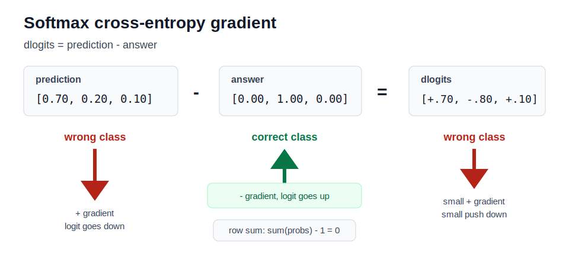
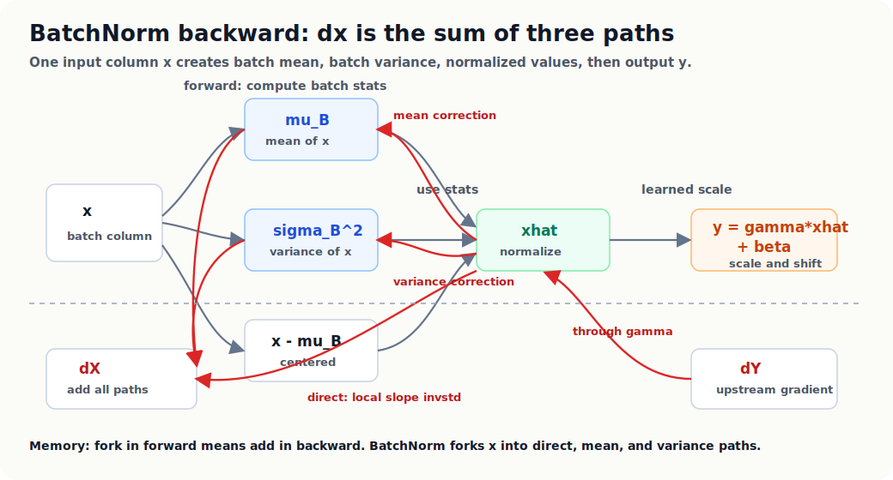

# Building Makemore Part 4: Backprop Ninja

The goal is to learn how to manually derive gradients through a neural network
one operation at a time.

In normal PyTorch training, this line computes all gradients for you:

```python
loss.backward()
```

Here we slow that process down and learn how to produce those gradients by hand.

Backprop is not one giant formula. It is a set of small backward moves:

```text
addition backward
multiplication backward
power backward
sum backward
mean backward
matrix multiply backward
tanh backward
indexing backward
```

If you can do those moves, you can backpropagate through a neural network.

## How To Use This Page

Do not memorize all cards at once.

Use this order:

```text
1. Read the worked example.
2. Rebuild the same example on paper.
3. Read the rule card.
4. Try the practice exercise.
5. Check only after you have an attempt.
```

Each card answers the same question:

```text
I know dL/doutput.
How do I get dL/dinput?
```

The incoming gradient is often called the upstream gradient.

The core pattern is:

```text
input gradient = upstream gradient * local slope
```

For tensors, also ask:

```text
Did the operation change shape?
Did it broadcast something?
Did it reduce a dimension?
Did one value get used more than once?
```

Important shape rule:

```text
sum in forward -> broadcast/copy in backward
broadcast in forward -> sum in backward
```

Why:

```text
sum forward means many values made one value,
so backward copies that one gradient back to all contributors.

broadcast forward means one value was reused many times,
so backward adds all gradient contributions from those reuses.
```

Every gradient must match the shape of the value it belongs to:

```python
assert dx.shape == x.shape
```

## The Hand-Backprop Strategy

The mistake is trying to differentiate the whole neural net in one bite.
Instead, treat the forward pass as a chain of tiny operations.

For every line in the forward pass, write three things:

```text
1. value name and shape
2. local rule
3. how the backward shape gets repaired
```

The backward question is always:

```text
I have dL/dout.
How does this one operation pass it to each input?
```

Use this loop on paper:

```text
1. Start at loss with dloss = 1.
2. Move backward one forward line at a time.
3. Multiply by the local derivative.
4. If forward reduced a dimension, broadcast/copy in backward.
5. If forward broadcast a value, sum in backward.
6. If a value was used in two places, add both gradient contributions.
7. Check every gradient shape before trusting the formula.
```

For vector operations, do not begin with matrix calculus. Start with one output
entry using indices, then convert the pattern back into tensor code.

Example:

```text
Z = X @ W
Z[i, j] = sum_k X[i, k] * W[k, j]
```

Now ask: which `Z[i, j]` values contain `X[i, k]`? All columns `j` in the same
row. That is why `dX` needs `dZ @ W.T`.

The habit to build is:

```text
scalar example -> one indexed tensor entry -> vectorized formula
```

That path is slower at first, but it prevents most shape mistakes.

## Addition Card

Addition is the easiest backward rule.

Forward:

```text
z = x + y
```

If `z` changes by a little bit, `x` gets full credit and `y` gets full credit.
Addition does not scale either input.

### Worked Example 1: Scalars

Forward:

```text
x = 2
y = 3
z = x + y = 5
L = 10 * z
```

We want:

```text
dL/dx
dL/dy
```

Start from the end.

Since:

```text
L = 10 * z
```

then:

```text
dL/dz = 10
```

Now:

```text
z = x + y
```

Changing `x` by `1` changes `z` by `1`.

```text
dz/dx = 1
```

Changing `y` by `1` also changes `z` by `1`.

```text
dz/dy = 1
```

Chain rule:

```text
dL/dx = dL/dz * dz/dx = 10 * 1 = 10
dL/dy = dL/dz * dz/dy = 10 * 1 = 10
```

So addition copies the upstream gradient to both inputs.

### Worked Example 2: Tensors With Same Shape

Forward:

```text
x = [1, 2, 3]
y = [4, 5, 6]
z = x + y
```

Suppose the upstream gradient is:

```text
dz = [10, 20, 30]
```

Because:

```text
z0 = x0 + y0
z1 = x1 + y1
z2 = x2 + y2
```

each element gets its matching upstream gradient:

```text
dx = [10, 20, 30]
dy = [10, 20, 30]
```

### Worked Example 3: Addition With Broadcasting

This is the neural-net bias case.

Forward:

```text
x =
[[10, 20, 30],
 [40, 50, 60]]

b = [1, 2, 3]

z = x + b
```

Shape:

```text
x: [2, 3]
b: [3]
z: [2, 3]
```

The bias `b` was reused for every row:

```text
z[0] = x[0] + b
z[1] = x[1] + b
```

Suppose:

```text
dz =
[[1, 2, 3],
 [4, 5, 6]]
```

For `x`, addition passes gradients through:

```text
dx =
[[1, 2, 3],
 [4, 5, 6]]
```

For `b`, both rows used the same bias, so `b` collects both rows:

```text
db = dz.sum(0)
   = [1 + 4, 2 + 5, 3 + 6]
   = [5, 7, 9]
```

The rule is:

```text
if forward broadcasted a value, backward sums over the broadcasted dimension
```

### Addition Rule Card

```text
Forward:
z = x + y

Known:
dz

Backward:
dx = dz
dy = dz

If x or y was broadcast, sum its gradient back to the original shape.
```

Memory hook:

```text
addition copies gradient to both parents
```

### Practice

Forward:

```text
x.shape = [4, 5]
b.shape = [5]
z = x + b
```

If:

```text
dz.shape = [4, 5]
```

What are:

```text
dx.shape?
db.shape?
which dimension do you sum over to get db?
```

## Multiplication Card

Multiplication is the first operation where each input needs the other input's
forward value.

Forward:

```text
z = x * y
```

If `x` changes, the effect on `z` depends on `y`.

If `y` changes, the effect on `z` depends on `x`.

### Worked Example 1: Scalars

Forward:

```text
x = 2
y = 3
z = x * y = 6
L = 10 * z
```

Since:

```text
L = 10 * z
```

we have:

```text
dL/dz = 10
```

Now:

```text
z = x * y
```

If `x` changes by `1`, `z` changes by `y`.

```text
dz/dx = y = 3
```

If `y` changes by `1`, `z` changes by `x`.

```text
dz/dy = x = 2
```

Chain rule:

```text
dL/dx = dL/dz * dz/dx = 10 * 3 = 30
dL/dy = dL/dz * dz/dy = 10 * 2 = 20
```

### Worked Example 2: Elementwise Tensor Multiply

Forward:

```text
x = [2, 4, 6]
y = [3, 5, 7]
z = x * y
```

Suppose:

```text
dz = [10, 20, 30]
```

Then:

```text
dx = dz * y
   = [10 * 3, 20 * 5, 30 * 7]
   = [30, 100, 210]
```

and:

```text
dy = dz * x
   = [10 * 2, 20 * 4, 30 * 6]
   = [20, 80, 180]
```

### Worked Example 3: Scale Parameter Broadcast

This appears in BatchNorm:

```text
out = gain * xhat + bias
```

Suppose:

```text
xhat.shape = [B, H]
gain.shape = [H]
out.shape = [B, H]
```

The `gain` vector is reused for every batch row.

Forward:

```text
out = gain * xhat
```

Backward before fixing shapes:

```text
dgain_big = dout * xhat
dxhat = dout * gain
```

But:

```text
dgain_big.shape = [B, H]
gain.shape = [H]
```

So we sum over the batch dimension:

```python
dgain = dgain_big.sum(0)
```

### Multiplication Rule Card

```text
Forward:
z = x * y

Known:
dz

Backward:
dx = dz * y
dy = dz * x

If x or y was broadcast, sum its gradient back to the original shape.
```

Memory hook:

```text
multiplication sends each side the other side's value
```

### Practice

Forward:

```text
xhat.shape = [32, 200]
gain.shape = [200]
out = gain * xhat
```

Given:

```text
dout.shape = [32, 200]
```

What are:

```text
dxhat.shape?
dgain.shape?
which dimension must dgain sum over?
```

## Power Card

Power means:

```text
z = x ** k
```

This is an elementwise operation. First understand it with one scalar.

The power rule is:

```text
if z = x ** k
then dz/dx = k * x ** (k - 1)
```

### Worked Example 1: Square

Forward:

```text
x = 3
z = x ** 2 = 9
L = 4 * z
```

Since:

```text
dL/dz = 4
```

and:

```text
dz/dx = 2 * x = 6
```

then:

```text
dL/dx = 4 * 6 = 24
```

### Worked Example 2: Cube

Forward:

```text
x = 2
z = x ** 3 = 8
L = 5 * z
```

Local derivative:

```text
dz/dx = 3 * x ** 2
      = 3 * 2 ** 2
      = 12
```

Upstream gradient:

```text
dL/dz = 5
```

So:

```text
dL/dx = 5 * 12 = 60
```

### Worked Example 3: Negative Power

Negative powers mean division.

```text
z = x ** -1 = 1 / x
```

Power rule:

```text
dz/dx = -1 * x ** -2
      = -1 / x ** 2
```

If:

```text
x = 2
```

then:

```text
dz/dx = -1 / 4 = -0.25
```

If:

```text
x = 0.01
```

then:

```text
dz/dx = -1 / 0.0001 = -10000
```

This is the numerical issue: when `x` is close to zero, the gradient can become
huge. If `x = 0`, the expression is undefined.

This is why neural-net code often adds a tiny epsilon:

```python
std_inv = (variance + 1e-5) ** -0.5
```

### Power Rule Card

```text
Forward:
z = x ** k

Known:
dz

Backward:
dx = dz * k * x ** (k - 1)
```

Memory hook:

```text
bring the power down, subtract one from the power
```

### Practice

Forward:

```text
x = 4
z = x ** 0.5
L = 3 * z
```

Find:

```text
dz/dx
dL/dx
```

Hint:

```text
0.5 * x ** -0.5
```

## Sum Card

Sum is the first reduction operation.

Reduction means:

```text
many values become fewer values
```

Forward:

```python
z = x.sum(dim=0)
```

To know which dimension disappeared, compare shapes.

### Worked Example 1: Sum Over Rows

Forward:

```text
x =
[[1, 2, 3],
 [4, 5, 6]]

z = x.sum(0)
```

Shape:

```text
x: [2, 3]
z: [3]
```

The first dimension disappeared. That is `dim=0`.

Forward values:

```text
z = [1 + 4, 2 + 5, 3 + 6]
  = [5, 7, 9]
```

Suppose:

```text
dz = [10, 20, 30]
```

Each output value came from two inputs, so its gradient spreads back to both:

```text
dx =
[[10, 20, 30],
 [10, 20, 30]]
```

### Worked Example 2: Sum Over Columns

Forward:

```text
x =
[[1, 2, 3],
 [4, 5, 6]]

z = x.sum(1)
```

Shape:

```text
x: [2, 3]
z: [2]
```

The second dimension disappeared. That is `dim=1`.

Forward values:

```text
z = [1 + 2 + 3, 4 + 5 + 6]
  = [6, 15]
```

Suppose:

```text
dz = [10, 20]
```

Then row `0` gets `10` spread across its three elements, and row `1` gets `20`:

```text
dx =
[[10, 10, 10],
 [20, 20, 20]]
```

### Sum Rule Card

```text
Forward:
z = x.sum(dim=d)

Known:
dz

Backward:
dx = dz expanded back to x.shape
```

Memory hook:

```text
sum collects in forward, spreads in backward
```

### Practice

Forward:

```text
x.shape = [4, 5, 6]
z = x.sum(1)
```

What is:

```text
z.shape?
dx.shape?
which dimension disappeared?
```

## Mean Card

Mean is sum plus division by count.

Forward:

```python
z = x.mean(dim=0)
```

Backward is like sum backward, except every contributor gets divided by the
number of values that were averaged.

### Worked Example 1: Mean Over Rows

Forward:

```text
x =
[[1, 2, 3],
 [4, 5, 6]]

z = x.mean(0)
```

Shape:

```text
x: [2, 3]
z: [3]
```

The averaged dimension has size `2`.

Forward values:

```text
z = [(1 + 4) / 2, (2 + 5) / 2, (3 + 6) / 2]
  = [2.5, 3.5, 4.5]
```

Suppose:

```text
dz = [10, 20, 30]
```

Each column's gradient is shared by two inputs:

```text
dx =
[[5, 10, 15],
 [5, 10, 15]]
```

### Worked Example 2: Batch Loss Mean

Suppose each training example has one loss:

```text
losses = [2.0, 4.0, 6.0, 8.0]
loss = losses.mean()
```

Shape:

```text
losses: [4]
loss: scalar
```

If:

```text
dL/dloss = 1
```

then each individual loss receives:

```text
1 / 4
```

So:

```text
dlosses = [0.25, 0.25, 0.25, 0.25]
```

This is why batch averaging scales gradients by batch size.

### Mean Rule Card

```text
Forward:
z = x.mean(dim=d)

Known:
dz

Backward:
dx = dz expanded back to x.shape / number_of_averaged_values
```

Memory hook:

```text
mean spreads like sum, then divides by count
```

### Practice

Forward:

```text
x.shape = [32, 200]
z = x.mean(0)
```

What is:

```text
z.shape?
dx.shape?
what number divides the gradient?
```

## Max Card

Max is also a reduction, but unlike sum and mean, not every input contributes to
the output.

Forward:

```python
z = x.max(dim=1)
```

Only the winning element in each reduced group receives gradient.

### Worked Example

Forward:

```text
x =
[[1, 5, 2],
 [9, 4, 3]]

z = x.max(1)
```

Values:

```text
z = [5, 9]
```

The winners are:

```text
row 0: column 1
row 1: column 0
```

Suppose:

```text
dz = [10, 20]
```

Then:

```text
dx =
[[0, 10, 0],
 [20, 0, 0]]
```

Non-winners get zero gradient because changing them slightly would not change
the max.

### Max Rule Card

```text
Forward:
z = x.max(dim=d)

Known:
dz

Backward:
dx = zero everywhere except the winning max locations
winning locations receive dz
```

Memory hook:

```text
max routes gradient through the winner
```

### Practice

Forward:

```text
x =
[[3, 1, 7],
 [2, 8, 4]]

z = x.max(1)
dz = [5, 6]
```

Write `dx`.

## Exp Card

Exp appears in softmax.

Forward:

```text
z = exp(x)
```

The special thing about `exp` is that its derivative is itself:

```text
dz/dx = exp(x) = z
```

### Worked Example

Forward:

```text
x = 2
z = exp(2)
L = 3 * z
```

Since:

```text
dL/dz = 3
```

and:

```text
dz/dx = z = exp(2)
```

then:

```text
dL/dx = 3 * exp(2)
```

For tensors:

```python
dx = dz * z
```

### Numerical Note

Large positive values can make `exp(x)` overflow.

That is why softmax usually subtracts the row maximum before exponentiating:

```python
shifted = logits - logits.max(1, keepdim=True).values
counts = shifted.exp()
```

Subtracting the same value from all logits in a row does not change the softmax
probabilities, but it keeps exponentials in a safer range.

### Exp Rule Card

```text
Forward:
z = exp(x)

Known:
dz

Backward:
dx = dz * z
```

Memory hook:

```text
exp's slope is exp
```

### Practice

Forward:

```text
x = [0, 1, 2]
z = exp(x)
dz = [10, 10, 10]
```

Write `dx` in terms of `exp(0)`, `exp(1)`, and `exp(2)`.

## Log Card

Log appears in negative log likelihood and cross-entropy.

Forward:

```text
z = log(x)
```

The local derivative is:

```text
dz/dx = 1 / x
```

### Worked Example

Forward:

```text
x = 0.25
z = log(x)
L = -z
```

Since:

```text
L = -z
```

then:

```text
dL/dz = -1
```

Since:

```text
dz/dx = 1 / x = 1 / 0.25 = 4
```

then:

```text
dL/dx = -1 * 4 = -4
```

Interpretation:

```text
if the probability x is small, -log(x) has a large gradient
```

That is why a model gets a strong correction when it assigns tiny probability to
the correct class.

### Numerical Note

`log(x)` requires:

```text
x > 0
```

If `x` is near zero, `1 / x` becomes large.

### Log Rule Card

```text
Forward:
z = log(x)

Known:
dz

Backward:
dx = dz / x
```

Memory hook:

```text
log has slope 1 / x
```

### Practice

Forward:

```text
x = 0.1
z = log(x)
L = -2 * z
```

Find:

```text
dL/dz
dz/dx
dL/dx
```

## Tanh Card

Tanh is an activation function.

Forward:

```text
h = tanh(pre)
```

Its output lives between `-1` and `1`.

The derivative can be written using the output:

```text
dh/dpre = 1 - h ** 2
```

### Worked Example 1: Near Zero

If:

```text
pre = 0
h = tanh(0) = 0
```

then:

```text
dh/dpre = 1 - 0 ** 2 = 1
```

Near zero, tanh passes gradient well.

### Worked Example 2: Saturated

If:

```text
h = 0.99
```

then:

```text
dh/dpre = 1 - 0.99 ** 2
        = 1 - 0.9801
        = 0.0199
```

Only about `2%` of the upstream gradient passes through.

If many tanh units are near `-1` or `1`, gradients shrink.

### Worked Example 3: Backward

Suppose:

```text
h = [0.0, 0.5, 0.99]
dh = [10, 10, 10]
```

Then:

```text
dpre = dh * (1 - h ** 2)
```

Elementwise:

```text
dpre[0] = 10 * (1 - 0.0 ** 2)  = 10
dpre[1] = 10 * (1 - 0.5 ** 2)  = 7.5
dpre[2] = 10 * (1 - 0.99 ** 2) = 0.199
```

### Tanh Rule Card

```text
Forward:
h = tanh(pre)

Known:
dh

Backward:
dpre = dh * (1 - h ** 2)
```

Memory hook:

```text
tanh passes gradients near zero and kills them near the walls
```

### Practice

Suppose:

```text
h = [-0.9, 0.0, 0.8]
dh = [2, 2, 2]
```

Compute:

```text
dpre
```

Which unit passes the most gradient?

## Matrix Multiply Card

Matrix multiply is the core of linear layers.

Forward:

```text
Z = X @ W
```

Shapes:

```text
X: [B, I]
W: [I, O]
Z: [B, O]
```

During backward, suppose:

```text
dZ: [B, O]
```

We need:

```text
dX: [B, I]
dW: [I, O]
```

### Worked Example By Shape

Find `dX`.

We need something shaped `[B, I]`.

We have:

```text
dZ: [B, O]
W:  [I, O]
```

Transpose `W`:

```text
W.T: [O, I]
```

Now:

```text
dZ @ W.T
[B, O] @ [O, I] -> [B, I]
```

So:

```python
dX = dZ @ W.T
```

Find `dW`.

We need something shaped `[I, O]`.

We have:

```text
X:  [B, I]
dZ: [B, O]
```

Transpose `X`:

```text
X.T: [I, B]
```

Now:

```text
X.T @ dZ
[I, B] @ [B, O] -> [I, O]
```

So:

```python
dW = X.T @ dZ
```

### Worked Example By Expanding A 2x2 Matrix

The shape rule is useful, but it can feel like magic. Expanding a tiny matrix
multiply shows where the transpose comes from.

Forward:

```text
D = A @ B + C
```

Use 2x2 matrices:

```text
A =
[[a11, a12],
 [a21, a22]]

B =
[[b11, b12],
 [b21, b22]]

C =
[[c1, c2],
 [c1, c2]]
```

Then:

```text
D =
[[d11, d12],
 [d21, d22]]
```

Expanding the matmul:

```text
d11 = a11*b11 + a12*b21 + c1
d12 = a11*b12 + a12*b22 + c2
d21 = a21*b11 + a22*b21 + c1
d22 = a21*b12 + a22*b22 + c2
```

Now suppose gradients arrive from later:

```text
dD =
[[dL/dd11, dL/dd12],
 [dL/dd21, dL/dd22]]
```

Ask for one element of `A`, for example `a11`.

Where does `a11` appear?

```text
d11 = a11*b11 + ...
d12 = a11*b12 + ...
```

So `a11` affects `d11` and `d12`.

Chain rule:

```text
dL/da11 =
dL/dd11 * dd11/da11
+ dL/dd12 * dd12/da11
```

The local derivatives are:

```text
dd11/da11 = b11
dd12/da11 = b12
```

So:

```text
dL/da11 = dL/dd11 * b11 + dL/dd12 * b12
```

Do the same for the first row of `A`:

```text
dL/da11 = dL/dd11 * b11 + dL/dd12 * b12
dL/da12 = dL/dd11 * b21 + dL/dd12 * b22
```

That is exactly row `0` of:

```text
dA = dD @ B.T
```

because:

```text
B.T =
[[b11, b21],
 [b12, b22]]
```

and:

```text
[dL/dd11, dL/dd12] @ B.T
= [
    dL/dd11*b11 + dL/dd12*b12,
    dL/dd11*b21 + dL/dd12*b22
  ]
```

So the transpose appears because each `a` value connects across a row of outputs,
and the matching `b` values live across a row of `B`. Matrix multiplication needs
those values as a column, so we use `B.T`.

The same idea gives:

```text
dB = A.T @ dD
```

For example, `b11` appears in:

```text
d11 = a11*b11 + ...
d21 = a21*b11 + ...
```

So:

```text
dL/db11 = dL/dd11*a11 + dL/dd21*a21
```

That is the top-left entry of:

```text
A.T @ dD
```

The practical memory:

```text
For D = A @ B:
dA = dD @ B.T
dB = A.T @ dD
```

But the reason is not arbitrary. Each input element can affect multiple output
elements, and its gradient adds all those paths.

### Bias Gradient In The Same Example

For the bias term:

```text
C =
[[c1, c2],
 [c1, c2]]
```

the same bias row is reused for every row of `D`:

```text
d11 = ... + c1
d12 = ... + c2
d21 = ... + c1
d22 = ... + c2
```

So each bias value collects the upstream gradients from the rows where it was
reused:

```text
dL/dc1 = dL/dd11 + dL/dd21
dL/dc2 = dL/dd12 + dL/dd22
```

Matrix form:

```text
dC = dD.sum(0)
```

Keep the dimension only if the original bias was stored as `[1, O]`:

```python
dC = dD.sum(0, keepdim=True)
```

Memory:

```text
forward broadcasts bias over rows
backward sums over rows
```

### Why This Makes Sense

Each weight connects one input feature to one output feature.

For one weight:

```text
W[i, o]
```

the gradient accumulates:

```text
input feature i * upstream gradient for output o
```

across all batch examples.

That is why `dW` uses:

```text
X.T @ dZ
```

The batch dimension gets summed out by the matrix multiply.

### Matrix Multiply Rule Card

```text
Forward:
Z = X @ W

Known:
dZ

Backward:
dX = dZ @ W.T
dW = X.T @ dZ
```

Memory hook:

```text
matmul backward is shape repair with transposes
```

### Practice

Forward:

```text
X.shape = [32, 30]
W.shape = [30, 200]
Z = X @ W
```

Given:

```text
dZ.shape = [32, 200]
```

What are:

```text
dX.shape?
dW.shape?
which formulas produce those shapes?
```

## Reshape Card

Reshape changes the view of values, not the values themselves.

Forward:

```python
z = x.view(new_shape)
```

Backward reshapes the gradient back.

### Worked Example

Forward:

```text
x.shape = [2, 3]
z = x.view(6)
z.shape = [6]
```

Suppose:

```text
dz.shape = [6]
```

Then:

```text
dx = dz.view(2, 3)
```

No values are multiplied, summed, or changed. Only the envelope changes.

### Reshape Rule Card

```text
Forward:
z = x.view(new_shape)

Known:
dz

Backward:
dx = dz.view(x.shape)
```

Memory hook:

```text
reshape changes the envelope, not the contents
```

### Practice

Forward:

```text
emb.shape = [32, 3, 10]
embcat = emb.view(32, 30)
```

Given:

```text
dembcat.shape = [32, 30]
```

What is:

```text
demb.shape?
```

## Indexing Card

Indexing appears in embedding lookup.

Forward:

```python
emb = C[ix]
```

This gathers rows from `C`.

Backward scatter-adds gradients back into `C`.

### Worked Example

Forward:

```text
C.shape = [4, 2]
ix = [2, 2, 0]
emb = C[ix]
```

Rows selected:

```text
emb[0] = C[2]
emb[1] = C[2]
emb[2] = C[0]
```

Suppose:

```text
demb =
[[1, 10],
 [2, 20],
 [3, 30]]
```

Start:

```text
dC =
[[0, 0],
 [0, 0],
 [0, 0],
 [0, 0]]
```

Scatter-add:

```text
demb[0] -> dC[2]
demb[1] -> dC[2]
demb[2] -> dC[0]
```

Result:

```text
dC =
[[3, 30],
 [0, 0],
 [3, 30],
 [0, 0]]
```

Notice row `2`:

```text
[1, 10] + [2, 20] = [3, 30]
```

Repeated indices add. They do not overwrite.

### Indexing Rule Card

```text
Forward:
emb = C[ix]

Known:
demb

Backward:
dC starts as zeros with C.shape
for every selected index, add the matching demb row into dC[index]
```

Memory hook:

```text
indexing gathers in forward and scatter-adds in backward
```

### Practice

Forward:

```text
C.shape = [5, 2]
ix = [1, 3, 1]
```

Suppose:

```text
demb =
[[10, 1],
 [20, 2],
 [30, 3]]
```

Write `dC`.

## Softmax And Cross-Entropy Card

Softmax and cross-entropy are often fused in real libraries, but for learning,
break them into pieces.

A stable softmax is:

```python
shifted = logits - logits.max(1, keepdim=True).values
counts = shifted.exp()
probs = counts / counts.sum(1, keepdim=True)
```

Cross-entropy for the correct class is:

```python
loss = -probs[range(B), y].log().mean()
```

The same loss in the notation you usually see on paper:

$$
L = -\frac{1}{n}\sum_{i=1}^{n}\log p_{i,y_i}
$$

For one row of logits:

$$
p_{i,c} =
\frac{e^{\ell_{i,c}}}
{\sum_{k=1}^{V} e^{\ell_{i,k}}}
$$

Read it as:

```text
for each example i:
  take the probability assigned to the true class y_i
  take log
  negate it
average over the batch
```

Only one log-probability from each row appears in the loss:

```text
row i contributes log p[i, y_i]
```

All other classes still receive gradients because changing any logit changes the
softmax denominator:

$$
\sum_{k=1}^{V} e^{\ell_{i,k}}
$$

### The Simple Memory

Before doing the derivation, remember the final meaning:

```text
dlogits = prediction - answer
```

where:

```text
prediction = softmax probabilities
answer = one-hot target vector
```

For one example:

```text
probs = [0.7, 0.2, 0.1]
target = 1
```

The one-hot answer is:

```text
answer = [0, 1, 0]
```

So:

```text
dlogits = probs - answer
        = [0.7, 0.2, 0.1] - [0, 1, 0]
        = [0.7, -0.8, 0.1]
```

Interpretation:

```text
class 0: positive gradient -> gradient descent pushes logit down
class 1: negative gradient -> correct class, pushed up
class 2: positive gradient -> pushed down a little
```

The code version is:

```python
dlogits = F.softmax(logits, 1)      # prediction probabilities
dlogits[range(n), Yb] -= 1          # subtract one-hot target
dlogits /= n                        # because loss is averaged over batch
```

The derivation below explains why this shortcut is true. The memory to keep
first is:

```text
softmax cross-entropy gradient = prediction - answer
```



The push/pull intuition:

```text
wrong classes have positive gradients -> gradient descent pushes them down
the correct class has a negative gradient -> gradient descent pushes it up
```

If the model is very wrong, the correct-class probability is small:

```text
correct gradient = p_correct - 1
```

so the push upward is large. If the model is already confident and correct,
`p_correct` is close to `1`, so the gradient is close to `0`.

Each row of `dlogits` sums to zero because:

```text
sum(probs - one_hot_answer) = 1 - 1 = 0
```

So the gradient mostly redistributes score:

```text
pull down wrong classes
push up the correct class
```

### How To Backprop It By Hand

Do not start with the fused formula.

Use the cards:

```text
max card
addition/subtraction card
exp card
sum card
power or division card
multiplication card
indexing card
log card
mean card
```

Only after you can derive the pieces should you remember the compact rule.

### Intuition

For each training example:

```text
target class logit should go up
non-target logits should go down according to their probabilities
```

If the model gives high probability to a wrong class, that wrong class receives
a stronger downward push.

If the model gives low probability to the correct class, the correct class
receives a stronger upward push.

### Practice

For one example:

```text
probs = [0.7, 0.2, 0.1]
target = 1
```

Before using any formula, answer in words:

```text
Which class should be pushed up?
Which classes should be pushed down?
Which wrong class should be pushed down more, class 0 or class 2?
```

Then derive the atomic graph using:

```text
log
indexing
mean
softmax pieces
```

## BatchNorm Card

BatchNorm is hard because it combines many previous cards.

Forward:

```python
mu = x.mean(0)
centered = x - mu
var = (centered ** 2).mean(0)
std_inv = (var + eps) ** -0.5
xhat = centered * std_inv
out = gain * xhat + bias
```

Do not treat this as one operation while learning. It is a chain of simpler
operations.

Some exercises use the unbiased variance:

```python
var = (centered ** 2).sum(0, keepdim=True) / (n - 1)
```

That is why the compact formula later contains an `n / (n - 1)` correction. If
you use `var = (centered ** 2).mean(0)`, that correction disappears.

### Which Cards Appear?

```text
mu = x.mean(0)                  -> mean card
centered = x - mu               -> addition/subtraction + broadcasting
centered ** 2                   -> power card
var = (...).mean(0)             -> mean card
var + eps                       -> addition card
(var + eps) ** -0.5             -> power card with numerical caution
xhat = centered * std_inv       -> multiplication + broadcasting
out = gain * xhat + bias        -> multiplication, addition, broadcasting
```

### What Makes BatchNorm Tricky?

The original `x` affects the output through multiple paths:

```text
x -> centered -> xhat -> out
x -> mu -> centered -> xhat -> out
x -> centered -> var -> std_inv -> xhat -> out
```

So `dx` is not one contribution. It is the sum of all paths.

Memory hook:

```text
fork in forward means add in backward
```



### The Compact BatchNorm Backward

The long derivation in the image is doing one thing: it collects all paths from
`x` to the loss.

Forward for one feature column, in the notation people usually recognize:

$$
\mu_B \leftarrow \frac{1}{m}\sum_{i=1}^{m} x_i
$$

$$
\sigma_B^2 \leftarrow
\frac{1}{m}\sum_{i=1}^{m}(x_i-\mu_B)^2
$$

$$
\hat{x}_i \leftarrow
\frac{x_i-\mu_B}{\sqrt{\sigma_B^2+\epsilon}}
$$

$$
y_i \leftarrow \gamma \hat{x}_i + \beta
$$

In code, `m` is the batch size. In the exercise code we often call it `n`.
The exercise also uses the unbiased variance, so it divides by `n - 1` instead
of `n`.

You are given:

$$
\frac{\partial L}{\partial y_i}
$$

You want:

$$
\frac{\partial L}{\partial x_i}
$$

The tricky part is that `x_i` affects the loss three ways:

```text
direct path:   x_i -> xhat_i -> y_i -> L
mean path:     x_i -> mu -> xhat_j -> y_j -> L
variance path: x_i -> var -> xhat_j -> y_j -> L
```

That is why `dx_i` depends on the whole batch, not just example `i`.

For the usual textbook variance with `1 / m`, the compact result is:

$$
\begin{aligned}
\frac{\partial L}{\partial x_i}
&=
\gamma(\sigma_B^2+\epsilon)^{-1/2}
\Bigg[
\frac{\partial L}{\partial y_i}
- \frac{1}{m}\sum_{j=1}^{m}\frac{\partial L}{\partial y_j} \\
&\qquad
- \hat{x}_i
  \frac{1}{m}\sum_{j=1}^{m}
  \frac{\partial L}{\partial y_j}\hat{x}_j
\Bigg]
\end{aligned}
$$

Read the bracket as three forces:

```text
direct force
- batch-average force
- variance/alignment force
```

For the exercise version with unbiased variance, the complete formula is:

$$
\begin{aligned}
\frac{\partial L}{\partial x_i}
&=
\gamma(\sigma_B^2+\epsilon)^{-1/2}
\Bigg[
\frac{\partial L}{\partial y_i}
- \frac{1}{n}\sum_{j=1}^{n}\frac{\partial L}{\partial y_j} \\
&\qquad
- \frac{n}{n-1}\hat{x}_i
  \frac{1}{n}\sum_{j=1}^{n}
  \frac{\partial L}{\partial y_j}\hat{x}_j
\Bigg]
\end{aligned}
$$

Compared with the textbook version, only the last force gains the
`n / (n - 1)` correction.

In tensor code, with sums over the batch axis:

```python
dhprebn = bngain * bnvar_inv / n * (
    n * dhpreact
    - dhpreact.sum(0, keepdim=True)
    - (n / (n - 1)) * bnraw * (dhpreact * bnraw).sum(0, keepdim=True)
)
```

How to read the three inside terms:

```text
n * dhpreact
the direct gradient each example wants to receive

- dhpreact.sum(0)
the mean-centering correction

- (n / (n - 1)) * bnraw * (dhpreact * bnraw).sum(0)
the variance correction; removes the part of the gradient aligned with xhat
```

`bnbias` does not change `dhprebn`; it only receives a summed gradient.
`bngain` does change `dhprebn`, because it scales the normalized activations.

### Practice

Do not derive all of BatchNorm at once.

Start with only:

```python
mu = x.mean(0)
centered = x - mu
```

Given:

```text
x.shape = [32, 200]
mu.shape = [200]
centered.shape = [32, 200]
dcentered.shape = [32, 200]
```

Answer:

```text
what is the direct gradient from centered to x?
what is dmu from centered = x - mu?
how does dmu flow back to x through mu = x.mean(0)?
why do the two paths add?
```

## Final Pattern Summary

The same small set of patterns solved the whole notebook.

| Forward pattern | Backward pattern | Where it appeared |
| --- | --- | --- |
| Select/index a few entries | Start with zeros, write gradients only to selected entries | `logprobs[range(n), Yb]`, `C[Xb]` |
| Broadcast one value many times | Sum over the broadcasted dimension | `counts_sum_inv`, `logit_maxes`, `bngain`, `bnbias`, `bnvar_inv`, `bnmeani`, biases |
| Sum many values into one | Broadcast/copy the upstream gradient back | `counts.sum(1)`, `hprebn.sum(0)`, `bndiff2.sum(0)` |
| One tensor used in two places | Add gradient contributions | `counts`, `bndiff`, `hprebn` |
| Elementwise nonlinear | Multiply upstream by local slope | `log`, `exp`, `tanh`, power |
| Matrix multiply | Use transposes to repair shapes | `h @ W2`, `embcat @ W1` |
| View/reshape | Reshape gradient back to original shape | `emb.view(...)` |
| Max | Route gradient to the winning entry | `logits.max(1)` |

The most useful debugging habit:

```text
Every gradient must have the same shape as the tensor it belongs to.
```

When stuck, write the shape first. Usually the correct sum, broadcast, or
transpose becomes obvious.

## Mixed Practice: One Tiny Neural-Net Layer

Now combine the cards.

Forward:

```python
pre = X @ W + b
h = torch.tanh(pre)
loss = h.mean()
```

Shapes:

```text
X:    [B, I]
W:    [I, H]
b:    [H]
pre:  [B, H]
h:    [B, H]
loss: scalar
```

### Worked Backward

Start:

```text
dloss = 1
```

Mean:

```python
dh = torch.ones_like(h) / h.numel()
```

Tanh:

```python
dpre = dh * (1 - h ** 2)
```

Addition with bias:

```python
db = dpre.sum(0)
```

Matrix multiply:

```python
dX = dpre @ W.T
dW = X.T @ dpre
```

Shape check:

```text
dX: [B, I]
dW: [I, H]
db: [H]
```

This is the basic neural-net backward pass:

```text
loss reduction
-> activation derivative
-> bias broadcast sum
-> matmul transposes
```

### Practice

Forward:

```python
pre1 = X @ W1 + b1
h1 = torch.tanh(pre1)
pre2 = h1 @ W2 + b2
loss = pre2.mean()
```

Shapes:

```text
X:    [B, I]
W1:   [I, H]
b1:   [H]
pre1: [B, H]
h1:   [B, H]
W2:   [H, O]
b2:   [O]
pre2: [B, O]
loss: scalar
```

Derive, in this order:

```text
dpre2
dW2
db2
dh1
dpre1
dW1
db1
dX
```

Use only these cards:

```text
mean
matrix multiply
addition with broadcasting
tanh
```

Do not look up a full solution. Check each gradient shape first.

## Four Backprop Ninja Exercises

These four exercises train increasing levels of compression.

```text
Exercise 1: every tiny operation, no shortcuts
Exercise 2: softmax cross-entropy in one step
Exercise 3: BatchNorm backward in one step
Exercise 4: train using your manual backward pass
```

The rule for all four:

```text
write shapes first
derive on paper second
type code third
compare with autograd last
```

### Exercise 1: Backprop Through Every Variable

Goal: backpropagate through the full forward pass exactly as written. Do not
fuse softmax. Do not fuse BatchNorm. Do not skip intermediate variables.

This exercise trains the most important habit:

```text
one forward line becomes one backward line
```

What to watch:

```text
counts is used twice, so its gradient gets two contributions.
logit_maxes was broadcast across classes, so its gradient sums over classes.
bnmeani was broadcast across the batch, so its gradient sums over rows.
C is indexed, so dC is built by scatter-add.
```

<details>
<summary>Check after attempting: operation-by-operation skeleton</summary>

```python
dlogprobs = torch.zeros_like(logprobs)
dlogprobs[range(n), Yb] = -1.0 / n

dprobs = (1.0 / probs) * dlogprobs

dcounts_sum_inv = (counts * dprobs).sum(1, keepdim=True)
dcounts = counts_sum_inv * dprobs

dcounts_sum = (-counts_sum**-2) * dcounts_sum_inv
dcounts += torch.ones_like(counts) * dcounts_sum

dnorm_logits = counts * dcounts

dlogits = dnorm_logits.clone()
dlogit_maxes = (-dnorm_logits).sum(1, keepdim=True)
dlogits += F.one_hot(
    logits.max(1).indices,
    num_classes=logits.shape[1],
) * dlogit_maxes

dh = dlogits @ W2.T
dW2 = h.T @ dlogits
db2 = dlogits.sum(0)

dhpreact = (1.0 - h**2) * dh

dbngain = (bnraw * dhpreact).sum(0, keepdim=True)
dbnraw = bngain * dhpreact
dbnbias = dhpreact.sum(0, keepdim=True)

dbndiff = bnvar_inv * dbnraw
dbnvar_inv = (bndiff * dbnraw).sum(0, keepdim=True)
dbnvar = (-0.5 * (bnvar + 1e-5)**-1.5) * dbnvar_inv
dbndiff2 = (1.0 / (n - 1)) * torch.ones_like(bndiff2) * dbnvar
dbndiff += (2 * bndiff) * dbndiff2

dhprebn = dbndiff.clone()
dbnmeani = (-dbndiff).sum(0, keepdim=True)
dhprebn += (1.0 / n) * torch.ones_like(hprebn) * dbnmeani

dembcat = dhprebn @ W1.T
dW1 = embcat.T @ dhprebn
db1 = dhprebn.sum(0)

demb = dembcat.view(emb.shape)
dC = torch.zeros_like(C)
for k in range(Xb.shape[0]):
    for j in range(Xb.shape[1]):
        ix = Xb[k, j]
        dC[ix] += demb[k, j]
```

</details>

### Exercise 2: Cross-Entropy In One Step

Goal: replace the long softmax backward chain with the simplified derivative.

Start from the loss:

$$
L = -\frac{1}{n}\sum_{i=1}^{n}\log p_{i,y_i}
$$

$$
p_{i,c} =
\frac{e^{\ell_{i,c}}}
{\sum_{k=1}^{V} e^{\ell_{i,k}}}
$$

The paper-and-pencil task is to show why:

```text
dlogits = (probs - one_hot_targets) / n
```

<details>
<summary>Check after attempting: compact code</summary>

```python
dlogits = F.softmax(logits, 1)
dlogits[range(n), Yb] -= 1
dlogits /= n
```

</details>

### Exercise 3: BatchNorm In One Step

Goal: replace the long BatchNorm backward chain with the compact formula.

Forward:

```python
bnmeani = hprebn.mean(0, keepdim=True)
bndiff = hprebn - bnmeani
bnvar = (bndiff**2).sum(0, keepdim=True) / (n - 1)
bnvar_inv = (bnvar + 1e-5)**-0.5
bnraw = bndiff * bnvar_inv
hpreact = bngain * bnraw + bnbias
```

Paper task:

```text
collect the direct path, mean path, and variance path into one dx formula
```

<details>
<summary>Check after attempting: compact code</summary>

```python
hpreact_fast = (
    bngain
    * (hprebn - hprebn.mean(0, keepdim=True))
    / torch.sqrt(hprebn.var(0, keepdim=True, unbiased=True) + 1e-5)
    + bnbias
)

dhprebn = bngain * bnvar_inv / n * (
    n * dhpreact
    - dhpreact.sum(0, keepdim=True)
    - (n / (n - 1)) * bnraw * (dhpreact * bnraw).sum(0, keepdim=True)
)
```

</details>

### Exercise 4: Train With Manual Backward

Goal: remove `loss.backward()` and still train the model.

The loop should look like this conceptually:

```text
forward pass
manual backward pass
assign .grad for every parameter
parameter update
repeat
```

What this proves:

```text
your gradients are not just symbolically correct,
they are useful enough to optimize the network
```

Use the same checks every iteration:

```text
loss should generally go down
all parameter gradients should have the right shapes
updates should be small compared with parameter values
manual gradients should match autograd before you trust training
```

## One-Page Memory Version

```text
Addition:
copies gradient to both inputs.

Multiplication:
each input gets upstream times the other input.

Power:
dx = dz * k * x ** (k - 1).

Sum:
spreads gradient back to the original shape.

Mean:
spreads like sum, then divides by the number of averaged values.

Max:
routes gradient only to the winner.

Exp:
dx = dz * exp(x).

Log:
dx = dz / x.

Tanh:
dpre = dh * (1 - h ** 2).

Matmul:
dX = dZ @ W.T
dW = X.T @ dZ

Reshape:
reshape gradient back.

Indexing:
scatter-add gradients back into selected rows.

Broadcasting:
if forward stretched, backward sums.

Sum:
if forward summed, backward broadcasts/copies.

Forks:
if one value feeds multiple paths, add all gradient contributions.
```

## Sources

- Stanford CS231n backpropagation notes: https://cs231n.github.io/optimization-2/
- Erik Learned-Miller, vector/matrix/tensor derivative notes: https://cs231n.stanford.edu/vecDerivs.pdf
- Michael Nielsen, Neural Networks and Deep Learning, Chapter 2: https://neuralnetworksanddeeplearning.com/chap2
- Ioffe and Szegedy, Batch Normalization paper: https://arxiv.org/abs/1502.03167
- Andrej Karpathy, Makemore backprop notebook: https://github.com/karpathy/nn-zero-to-hero/blob/master/lectures/makemore/makemore_part4_backprop.ipynb
- OpenStax Calculus Volume 1 on differentiation rules: https://openstax.org/books/calculus-volume-1/pages/3-3-differentiation-rules
- PyTorch autograd tutorial: https://docs.pytorch.org/tutorials/beginner/blitz/autograd_tutorial.html
- PyTorch broadcasting semantics: https://docs.pytorch.org/docs/2.12/notes/broadcasting.html
- PyTorch numerical accuracy notes: https://docs.pytorch.org/docs/2.12/notes/numerical_accuracy.html
