# Building Makemore Part 5: From A Flat MLP To A WaveNet-Style Hierarchy

This post explains the main idea behind a WaveNet-style Makemore model:

```text
join nearby vectors
-> learn a summary
-> join nearby summaries
-> learn a broader summary
-> predict one next character
```

The most important clarification comes first:

```text
This is one neural network.
It predicts one next character for each training example.
```

The intermediate summaries are not extra predictions. They are internal vectors
created by layers inside the same model.

This post starts with one concrete example and introduces tensor shapes only
after the hierarchy is clear.

## How To Use This Page

Read the sections in order.

Do not begin by memorizing this:

```text
[4, 8, 10] -> [4, 4, 20] -> [4, 4, 200] -> ...
```

First understand this:

```text
[a b c d e f g h]
-> [summary_ab summary_cd summary_ef summary_gh]
-> [summary_abcd summary_efgh]
-> [summary_abcdefgh]
-> scores for the next character
```

Then the shapes become a compact description of an idea you already understand.

## 1. Start With One Training Example

Makemore is a character-level language model.

Its task is:

```text
previous characters -> predict the next character
```

Suppose one training example is:

```text
input context:  a b c d e f g h
target:         i
```

The model receives eight previous characters and should assign a high score to
`i`.

It produces `27` scores because the vocabulary contains:

```text
"." and the 26 lowercase letters
```

The special `.` token marks the start or end of a name.

For one name, the sliding training examples look like:

```text
........ -> a
.......a -> b
......ab -> c
.....abc -> d
....abcd -> e
...abcde -> f
..abcdef -> g
.abcdefg -> h
abcdefgh -> .
```

Each row is one independent prediction problem:

```text
one context -> one next-character target
```

## 2. One Network, Not Several Networks

For the example:

```text
abcdefgh -> i
```

the same neural network performs several internal steps:

```text
[a b c d e f g h]
-> [ab cd ef gh]
-> [abcd efgh]
-> [abcdefgh]
-> predict i
```

That shorthand is useful, but it can be misleading.

The network does not literally create strings such as `"ab"` or `"abcd"`.
It creates learned vectors:

```text
summary_ab
summary_cd
summary_abcd
summary_abcdefgh
```

Each summary is a list of numbers.

The network does not predict after every row. There is only one prediction at
the end:

```text
eight input characters
-> several internal summary layers
-> one set of 27 scores
-> one loss
```

That one loss trains all the layers together through backpropagation.

## 3. Why Build A Hierarchy?

The earlier Makemore MLP flattened all context embeddings immediately:

```text
[a b c]
-> [vector_a vector_b vector_c]
-> one long flat vector
-> MLP
-> next-character scores
```

That is a valid model.

If we increase the context to eight characters, a flat version would do:

```text
[a b c d e f g h]
-> concatenate all eight embeddings at once
-> one hidden layer
-> next-character scores
```

The hierarchy introduces structure:

```text
first learn local pair patterns
then combine nearby pair patterns
then combine broader patterns
```

Why is that useful?

```text
short patterns can be reused
nearby information is combined gradually
deeper layers see a wider context
the design points toward convolutional networks
```

For this tiny name model, hierarchy is not required. A flat MLP can still work.
The point is to learn an architecture that scales more naturally toward longer
sequences.

### Original MLP: Flatten The Entire Context Once

The flat MLP can be written as:

```python
n_embd = 10
n_hidden = 200

model = Sequential([
    Embedding(vocab_size, n_embd),
    FlattenConsecutive(8),
    Linear(n_embd * 8, n_hidden, bias=False),
    BatchNorm1d(n_hidden),
    Tanh(),
    Linear(n_hidden, vocab_size),
])
```

Suppose the input context is:

```text
[a b c d e f g h]
```

Each character becomes a `10`-number embedding:

```text
[4, 8]
-> Embedding
-> [4, 8, 10]
```

Then `FlattenConsecutive(8)` joins all eight character embeddings immediately:

```text
[4, 8, 10]
-> [4, 1, 80]
-> [4, 80]
```

The hidden Linear layer receives one large vector representing the entire
context:

```text
80 features
-> Linear
-> 200 hidden features
-> final Linear
-> 27 logits
```

Conceptually:

```text
[a b c d e f g h]
-> [one flat 80-feature context vector]
-> [one learned 200-feature summary]
-> [27 next-character scores]
```

This is a flat MLP. It does not explicitly learn small local patterns first.

### Hierarchical Model: Repeatedly Flatten Pairs

The hierarchical model can be written as:

```python
n_embd = 10
n_hidden = 200

model = Sequential([
    Embedding(vocab_size, n_embd),

    FlattenConsecutive(2),
    Linear(n_embd * 2, n_hidden, bias=False),
    BatchNorm1d(n_hidden),
    Tanh(),

    FlattenConsecutive(2),
    Linear(n_hidden * 2, n_hidden, bias=False),
    BatchNorm1d(n_hidden),
    Tanh(),

    FlattenConsecutive(2),
    Linear(n_hidden * 2, n_hidden, bias=False),
    BatchNorm1d(n_hidden),
    Tanh(),

    Linear(n_hidden, vocab_size),
])
```

It starts with the same eight-character context:

```text
[a b c d e f g h]
```

and each character has a `10`-number embedding:

```text
[4, 8]
-> Embedding
-> [4, 8, 10]
```

Instead of flattening all eight positions at once, the network repeatedly
groups adjacent pairs:

```text
[a b c d e f g h]
-> [summary_ab summary_cd summary_ef summary_gh]
-> [summary_abcd summary_efgh]
-> [summary_abcdefgh]
-> [27 next-character scores]
```

The corresponding shape flow is:

```text
[4, 8, 10]
-> [4, 4, 20]
-> [4, 4, 200]
-> [4, 2, 400]
-> [4, 2, 200]
-> [4, 1, 400]
-> [4, 400]
-> [4, 200]
-> [4, 27]
```

Both examples use the same embedding and hidden widths so the architectural
change is easy to isolate. The change that makes the second model
convolution-like is:

```text
flat MLP:
FlattenConsecutive(8) once

hierarchical model:
FlattenConsecutive(2) three times
```

The following sections unpack how each pair summary is generated.

## 4. Before The Layers: Embeddings

A neural network cannot process a character directly.

Each character becomes an integer id:

```text
"." -> 0
"a" -> 1
"b" -> 2
...
"z" -> 26
```

Then an embedding table turns each id into a learned vector.

Use a tiny two-number example:

```text
a -> [0.2, 0.7]
b -> [0.4, 0.1]
c -> [0.9, 0.3]
d -> [0.1, 0.8]
```

These values are learned during training.

In this model, each embedding contains `10` numbers:

```text
a -> vector_a with 10 numbers
b -> vector_b with 10 numbers
```

### What Is A Feature Or Channel?

One slot in a learned vector is called a feature or channel.

For a tiny vector:

```text
vector_a = [0.2, 0.7]
             ^    ^
          feature 0
                  feature 1
```

For a real embedding:

```text
vector_a = [10 learned numbers]
```

there are `10` channels.

Do not assume that each channel has a neat human-readable meaning. Training
discovers useful numeric representations.

For this post:

```text
feature = channel = one numeric slot in a learned vector
```

## 5. Close-Up: How One Pair Summary Is Created

Start with two character embeddings:

```text
vector_a = [10 numbers]
vector_b = [10 numbers]
```

Join them:

```text
pair_ab = concatenate(vector_a, vector_b)
```

Now:

```text
pair_ab = [20 numbers]
```

because:

```text
10 + 10 = 20
```

The concatenated vector is passed through a learned Linear layer:

```python
summary_ab = torch.tanh(BatchNorm(pair_ab @ W1))
```

Shapes:

```text
pair_ab      [20]
W1           [20, 200]
summary_ab   [200]
```

The output is a new `200`-number vector that can represent useful information
about the pair.

The model omits a hidden-layer bias here because BatchNorm immediately
follows the Linear layer and already includes a learned shift.

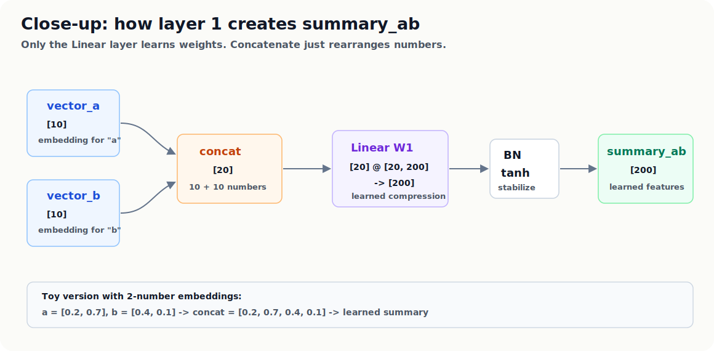

### A Tiny Numeric Version

Use two-number embeddings:

```text
a = [0.2, 0.7]
b = [0.4, 0.1]
```

Concatenate:

```text
pair_ab = [0.2, 0.7, 0.4, 0.1]
```

Now apply a learned transformation:

```text
four input numbers
-> Linear
-> new summary numbers
```

The Linear layer decides which combinations are useful. Training adjusts its
weights so that the final next-character prediction improves.

Memory hook:

```text
concatenate preserves both vectors
Linear learns how to summarize them
```

## 6. First Layer: Summarize Character Pairs

Apply the same pair summarization rule to all four adjacent pairs:

```text
[a b] -> summary_ab
[c d] -> summary_cd
[e f] -> summary_ef
[g h] -> summary_gh
```

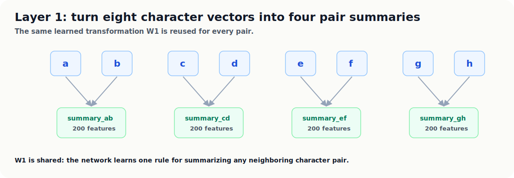

The important detail is:

```text
all four pairs use the same W1 weights
```

Conceptually:

```python
summary_ab = summarize_pair(a, b, W1)
summary_cd = summarize_pair(c, d, W1)
summary_ef = summarize_pair(e, f, W1)
summary_gh = summarize_pair(g, h, W1)
```

The network does not learn one rule for `"ab"` and a different rule for
`"cd"`. It learns one general pair-processing rule and reuses it.

This is called:

```text
weight sharing
```

After layer 1:

```text
8 character vectors
-> 4 pair-summary vectors
```

Each summary contains information from `2` original characters.

## 7. Second Layer: Summarize Groups Of Four

Now pair the pair summaries:

```text
[summary_ab summary_cd] -> summary_abcd
[summary_ef summary_gh] -> summary_efgh
```

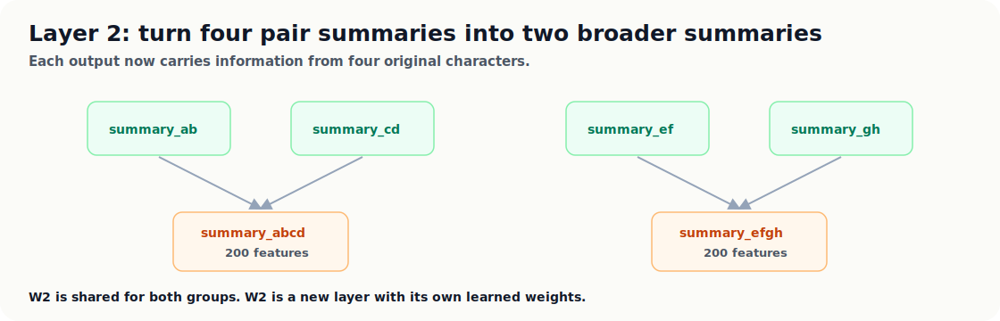

Each incoming summary has `200` features.

Concatenating two summaries gives:

```text
200 + 200 = 400 features
```

Then a new Linear layer compresses the joined vector:

```python
summary_abcd = torch.tanh(
    BatchNorm(concatenate(summary_ab, summary_cd) @ W2)
)
```

Shapes:

```text
joined summaries   [400]
W2                 [400, 200]
summary_abcd       [200]
```

Layer 2 uses new weights:

```text
W2 is not W1
```

But `W2` is shared across the two groups:

```text
[summary_ab summary_cd]
[summary_ef summary_gh]
```

After layer 2:

```text
4 pair-summary vectors
-> 2 broader summary vectors
```

Each remaining summary now contains information from `4` original characters.

## 8. Third Layer: Summarize The Full Context

Join the final two summaries:

```text
[summary_abcd summary_efgh]
-> summary_abcdefgh
```

Then convert the final summary into next-character scores:

```text
summary_abcdefgh
-> 27 logits
```

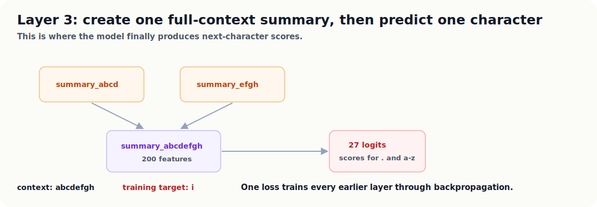

The third Linear layer learns:

```text
how should the model combine the first half and second half?
```

The output layer learns:

```text
which next characters are plausible given the final summary?
```

The entire flow is:

```text
[a b c d e f g h]
-> [summary_ab summary_cd summary_ef summary_gh]
-> [summary_abcd summary_efgh]
-> [summary_abcdefgh]
-> [27 scores]
-> loss against target "i"
```

## 9. Are These Separate Neural Networks?

No.

They are separate learned layers inside one neural network.

Think of a model as a team of stages:

```text
embedding layer
-> first summarization layer W1
-> second summarization layer W2
-> third summarization layer W3
-> output layer Wout
```

Each layer has its own weights because it has a different job:

| layer | input meaning | output meaning |
| --- | --- | --- |
| `W1` | two character embeddings | one pair summary |
| `W2` | two pair summaries | one four-character summary |
| `W3` | two four-character summaries | one eight-character summary |
| `Wout` | full-context summary | `27` next-character scores |

When the prediction is wrong:

```text
abcdefgh -> guessed "k"
target   -> "i"
```

backpropagation updates all of these:

```text
Wout
W3
W2
W1
character embeddings
```

Memory hook:

```text
many learned layers
one model
one final loss
one joint training process
```

## 10. Now Add Tensor Shapes

Tensor shapes become easier once the value flow is clear.

Use these symbols:

| symbol | meaning | example |
| --- | --- | ---: |
| `B` | number of training examples processed together | `4` |
| `T` | number of positions or summaries still present | starts at `8` |
| `C` | channels or features stored at each position | starts at `10` |
| `V` | vocabulary size | `27` |

Start with token ids:

```text
token ids
[4, 8]
```

Read that as:

```text
4 training examples
8 previous-character ids per example
```

The leading `4` is the batch size. In general, it can be written as `B`.

Embedding lookup:

```text
[4, 8]
-> Embedding
-> [4, 8, 10]
```

Read that as:

```text
4 examples
8 character positions
10 embedding features per position
```

### Why Does `[4, 8, 10]` Become `[4, 4, 20]`?

Pair adjacent positions:

```text
[a b c d e f g h]
-> [ab cd ef gh]
```

So:

```text
8 positions / 2 = 4 pairs
```

Each pair carries both embedding vectors:

```text
10 features + 10 features = 20 features
```

Therefore:

```text
[4, 8, 10]
-> pair neighbors
-> [4, 4, 20]
```

Nothing has been learned yet. The values were only regrouped.

Then the first Linear layer learns summaries:

```text
[4, 4, 20]
-> Linear
-> [4, 4, 200]
```

Each of the `4` raw pairs becomes one `200`-feature summary.

### The Full Real Shape Flow

```text
token ids
[4, 8]

Embedding
[4, 8, 10]

group adjacent character embeddings
[4, 4, 20]

Linear + BatchNorm + tanh
[4, 4, 200]

group adjacent pair summaries
[4, 2, 400]

Linear + BatchNorm + tanh
[4, 2, 200]

group adjacent four-character summaries
[4, 1, 400]

squeeze the one remaining position
[4, 400]

Linear + BatchNorm + tanh
[4, 200]

final Linear
[4, 27]
```

The repeating pattern is:

```text
join two neighboring vectors
-> feature width doubles
-> Linear learns a compressed summary
```

## 11. Why Does Linear Work On A 3D Tensor?

Consider:

```text
x.shape = [4, 4, 20]
```

This means:

```text
4 examples
4 pair positions per example
20 raw features per pair
```

We want each pair to become a `200`-feature summary.

The Linear weights have shape:

```text
W1.shape = [20, 200]
```

PyTorch applies the matrix multiplication to the final dimension:

```text
[4, 4, 20] @ [20, 200]
-> [4, 4, 200]
```

Only the final axis changes:

```text
20 raw pair features
-> 200 learned summary features
```

The first two axes stay in place:

```text
4 examples remain 4 examples
4 pair positions remain 4 pair positions
```

Think of the equivalent loops:

```python
for example in range(4):
    for pair_position in range(4):
        output[example, pair_position] = (
            x[example, pair_position] @ W1
        )
```

PyTorch performs those repeated matrix multiplications efficiently.

### A Small `2D` Matrix Multiplication

Start with two input rows. Each row has `3` features:

```text
x =
[
  [1, 2, 3],
  [4, 5, 6],
]

x.shape = [2, 3]
```

Use a weight matrix that converts `3` input features into `2` output features:

```text
W =
[
  [ 1,  2],
  [ 0,  1],
  [-1,  0],
]

W.shape = [3, 2]
```

The inner dimensions match:

```text
[2, 3] @ [3, 2]
    ^       ^
    both are 3
```

For the first input row:

```text
[1, 2, 3] @ W

= [
    1 * 1 + 2 * 0 + 3 * -1,
    1 * 2 + 2 * 1 + 3 *  0,
  ]

= [-2, 4]
```

For the second input row:

```text
[4, 5, 6] @ W

= [
    4 * 1 + 5 * 0 + 6 * -1,
    4 * 2 + 5 * 1 + 6 *  0,
  ]

= [-2, 13]
```

Therefore:

```text
[2, 3] @ [3, 2]
-> [2, 2]

x @ W =
[
  [-2,  4],
  [-2, 13],
]
```

Read this as:

```text
each 3-feature input row
-> the same learned transformation
-> one 2-feature output row
```

### Extend The Same Rule To A `3D` Tensor

Now organize four input rows into two examples with two positions each:

```text
x =
[
  [                       # example 0
    [1, 2, 3],             # position 0
    [4, 5, 6],             # position 1
  ],
  [                       # example 1
    [7, 8, 9],             # position 0
    [2, 1, 0],             # position 1
  ],
]

x.shape = [2, 2, 3]
```

The last dimension still contains the features:

```text
[2 examples, 2 positions, 3 features]
```

Multiply by the same weights:

```text
[2, 2, 3] @ [3, 2]
-> [2, 2, 2]
```

PyTorch applies `W` to each `3`-number vector independently:

```text
x[0, 0] @ W = [1, 2, 3] @ W = [-2,  4]
x[0, 1] @ W = [4, 5, 6] @ W = [-2, 13]
x[1, 0] @ W = [7, 8, 9] @ W = [-2, 22]
x[1, 1] @ W = [2, 1, 0] @ W = [ 2,  5]
```

The result keeps the example and position structure:

```text
x @ W =
[
  [
    [-2,  4],
    [-2, 13],
  ],
  [
    [-2, 22],
    [ 2,  5],
  ],
]

shape = [2, 2, 2]
```

The first two dimensions are unchanged:

```text
2 examples remain 2 examples
2 positions remain 2 positions
```

Only the final feature dimension changes:

```text
3 input features
-> 2 output features
```

### Map This Back To The Model

The same rule explains:

```text
[4, 80] @ [80, 200]
-> [4, 200]
```

This is the flat MLP. There are `4` examples. Each full-context `80`-feature
row becomes one `200`-feature summary.

For the first hierarchical layer, use:

```text
[4, 4, 20] @ [20, 200]
-> [4, 4, 200]
```

Read the `3D` input as:

```text
4 examples
4 pair positions inside each example
20 raw features for each pair
```

There are:

```text
4 * 4 = 16
```

separate `20`-feature vectors. PyTorch applies the same `[20, 200]` weight
matrix to every one of them:

```text
each 20-feature pair vector
-> Linear
-> one 200-feature vector
```

The earlier dimensions remain unchanged:

```text
[4, 4, 20]
 ^  ^
 keep these

-> [4, 4, 200]
        ^^^
        replace only the final feature width
```

If the operation also adds a bias:

```python
x @ W + b
```

with:

```text
x.shape = [4, 4, 20]
W.shape = [20, 200]
b.shape = [200]
```

PyTorch adds the same `200`-number bias vector to every one of the `4 * 4`
output vectors:

```text
[4, 4, 200] + [200]
-> [4, 4, 200]
```

This automatic reuse of the bias across the earlier dimensions is called
**broadcasting**.

Memory hook:

```text
Linear transforms the last axis.
Earlier axes tell PyTorch how many times to reuse the same Linear layer.
```

## 12. How The Code Builds The Hierarchy

The key operation is:

```python
class FlattenConsecutive:
    def __init__(self, n):
        self.n = n

    def __call__(self, x):
        B, T, C = x.shape
        x = x.view(B, T // self.n, C * self.n)
        if x.shape[1] == 1:
            x = x.squeeze(1)
        self.out = x
        return self.out
```

For:

```python
FlattenConsecutive(2)
```

the important line is:

```python
x = x.view(B, T // 2, C * 2)
```

Read it as:

```text
group every 2 consecutive positions
halve the number of positions
double the number of features carried by each group
```

Example:

```text
[4, 8, 10]
-> [4, 4, 20]
```

`FlattenConsecutive` does not learn weights. It only rearranges values.

### Concrete Example: Why `[4, 8, 10]` Becomes `[4, 4, 20]`

Use smaller embedding vectors for a concrete example:

```text
x.shape = [4, 8, 10]
```

Read this as:

```text
4 examples in the batch
8 character positions inside each example
10 embedding features for each character
```

For one example, the eight embedded characters look like:

```text
[vector_a vector_b vector_c vector_d vector_e vector_f vector_g vector_h]
```

Each `vector_*` contains `10` numbers.

The flat MLP joins all eight vectors immediately:

```text
[4, 8, 10]
-> flatten all 8 characters
-> [4, 80]
```

Why `80`?

```text
8 characters * 10 features per character = 80 features
```

That is valid for the flat MLP. But the hierarchical model deliberately does
not want one full-context vector yet. Its first layer should learn a reusable
rule for a small local group:

```text
[a b] [c d] [e f] [g h]
```

Each pair contains two embeddings:

```text
10 features for the first character
+ 10 features for the second character
= 20 features for the pair
```

There are four pairs:

```text
8 characters / 2 characters per pair = 4 pairs
```

Therefore:

```text
[4, 8, 10]
-> group adjacent characters in pairs
-> [4, 4, 20]
```

Read the result as:

```text
4 examples
4 pairs inside each example
20 raw features for each pair
```

For one example:

```text
[
  concatenate(vector_a, vector_b),  # 20 numbers
  concatenate(vector_c, vector_d),  # 20 numbers
  concatenate(vector_e, vector_f),  # 20 numbers
  concatenate(vector_g, vector_h),  # 20 numbers
]
```

No values were removed:

```text
before grouping: 8 * 10 = 80 numbers per example
after grouping:  4 * 20 = 80 numbers per example
```

Only the organization changed.

### Two Ways To Build The Pairs: `torch.cat` Versus `view`

One explicit way to create adjacent pairs is:

```python
e = torch.randn(4, 8, 10)

explicit = torch.cat(
    [e[:, ::2, :], e[:, 1::2, :]],
    dim=2,
)

explicit.shape
# torch.Size([4, 4, 20])
```

Break down the two slices:

```text
e[:, ::2, :]
-> take positions 0, 2, 4, 6
-> [vector_a vector_c vector_e vector_g]
-> shape [4, 4, 10]

e[:, 1::2, :]
-> take positions 1, 3, 5, 7
-> [vector_b vector_d vector_f vector_h]
-> shape [4, 4, 10]
```

Concatenate along:

```text
dim=2
```

which is the final feature dimension:

```text
[vector_a vector_c vector_e vector_g]
     +        +        +        +
[vector_b vector_d vector_f vector_h]

-> [pair_ab pair_cd pair_ef pair_gh]
```

Each pair contains:

```text
10 features + 10 features = 20 features
```

The shorter implementation is:

```python
grouped = e.view(4, 4, 20)

grouped.shape
# torch.Size([4, 4, 20])
```

For this tensor:

```python
(e.view(4, 4, 20) == explicit).all()
# tensor(True)
```

Why are the values equal?

PyTorch stores the feature values for adjacent positions consecutively in
memory. Use two-feature embeddings to see the layout:

```text
vector_a = [a1, a2]
vector_b = [b1, b2]
vector_c = [c1, c2]
vector_d = [d1, d2]

stored values:
a1 a2 b1 b2 c1 c2 d1 d2
```

The desired pair vectors already occupy consecutive stretches:

```text
[a1 a2 b1 b2] [c1 c2 d1 d2]
```

`view` changes how PyTorch interprets the same ordered values:

```text
before:
4 position groups * 2 features

after:
2 pair groups * 4 features
```

The real tensor follows the same pattern:

```text
before:
[4 examples, 8 positions, 10 features]

after:
[4 examples, 4 pairs, 20 features]
```

The difference between the two implementations is:

```text
torch.cat:
select values and construct a concatenated result

view:
reuse the existing storage with a new shape interpretation
```

For a contiguous tensor, `view` avoids copying the values. That is why
`FlattenConsecutive` uses:

```python
x = x.view(B, T // 2, C * 2)
```

This works because the desired groups contain adjacent positions. A simple
`view` would not create a different ordering such as:

```text
[pair_ac pair_bd pair_eg pair_fh]
```

Also, `view` requires a compatible memory layout. If an earlier operation
produces a non-contiguous tensor, `reshape` is often the convenient
alternative:

```python
x = x.reshape(B, T // 2, C * 2)
```

### Why Not `[4, 2, 20]`?

A shape of:

```text
[4, 2, 20]
```

would mean:

```text
4 examples
2 groups inside each example
20 features in each group
```

That only stores:

```text
2 groups * 20 features = 40 numbers per example
```

But the input contains `80` numbers per example. Half of the information would
be missing.

If the model wanted two groups while keeping all eight characters, each group
would need to contain four characters:

```text
[a b c d] [e f g h]
```

Each four-character group would contain:

```text
4 characters * 10 features = 40 features
```

So the information-preserving shape would be:

```text
[4, 2, 40]
```

### Why Pack Two Characters Into The Last Dimension?

PyTorch `Linear` transforms the final dimension.

After grouping:

```text
x.shape = [4, 4, 20]
```

the final `20` means:

```text
the 20 raw features belonging to one adjacent character pair
```

Now use:

```text
W.shape = [20, 200]
```

Matrix multiplication gives:

```text
[4, 4, 20] @ [20, 200]
-> [4, 4, 200]
```

PyTorch applies the same learned transformation to each pair:

```text
[a b] -> summary_ab
[c d] -> summary_cd
[e f] -> summary_ef
[g h] -> summary_gh
```

The two characters are packed into the final axis so `Linear` can inspect both
of their embeddings together and learn interactions between them.

Concatenation is not yet learned fusion:

```text
concatenate:
place two 10-feature vectors next to each other
-> one raw 20-feature pair vector

Linear:
apply learned weights to the 20 raw features
-> one learned 200-feature pair summary
```

Why groups of `2`?

```text
8 characters
-> 4 two-character summaries
-> 2 four-character summaries
-> 1 eight-character summary
```

Grouping by `2` is an architecture choice. It creates a simple hierarchy whose
receptive field doubles at every layer.

### Read The Repeated `2`s In The Model Definition

Return to the hierarchical model definition from section 3. There are two
related reasons that `2` appears repeatedly.

First:

```python
FlattenConsecutive(2)
```

means:

```text
group 2 neighboring vectors together
```

Second, joining two vectors doubles the feature width. That is why the
following `Linear` layer expects `* 2` input features.

### Follow Every Intermediate Shape

For a batch size of `4`, inspecting the output after every layer gives:

```text
Embedding             : [4, 8, 10]

FlattenConsecutive    : [4, 4, 20]
Linear                : [4, 4, 200]
BatchNorm1d           : [4, 4, 200]
Tanh                  : [4, 4, 200]

FlattenConsecutive    : [4, 2, 400]
Linear                : [4, 2, 200]
BatchNorm1d           : [4, 2, 200]
Tanh                  : [4, 2, 200]

FlattenConsecutive    : [4, 400]
Linear                : [4, 200]
BatchNorm1d           : [4, 200]
Tanh                  : [4, 200]

Linear                : [4, 27]
```

Read the first block:

```text
[4, 8, 10]
4 examples, 8 characters per example, 10 features per character

-> FlattenConsecutive(2)

[4, 4, 20]
4 examples, 4 adjacent pairs per example, 20 raw features per pair

-> Linear(20, 200)

[4, 4, 200]
4 examples, 4 learned pair summaries per example, 200 features per summary
```

`BatchNorm1d` and `Tanh` transform the values but preserve this shape:

```text
[4, 4, 200]
-> BatchNorm1d
-> [4, 4, 200]
-> Tanh
-> [4, 4, 200]
```

Read the second block:

```text
[4, 4, 200]
4 examples, 4 pair summaries per example, 200 features per summary

-> FlattenConsecutive(2)

[4, 2, 400]
4 examples, 2 four-character groups per example, 400 raw features per group

-> Linear(400, 200)

[4, 2, 200]
4 examples, 2 learned four-character summaries per example, 200 features each
```

Again, `BatchNorm1d` and `Tanh` preserve the shape:

```text
[4, 2, 200]
-> BatchNorm1d
-> [4, 2, 200]
-> Tanh
-> [4, 2, 200]
```

Read the third block:

```text
[4, 2, 200]
4 examples, 2 four-character summaries per example, 200 features each

-> FlattenConsecutive(2)

[4, 1, 400]
4 examples, 1 full-context group per example, 400 raw features per group
```

`FlattenConsecutive` removes the unnecessary one-position axis:

```text
[4, 1, 400]
-> squeeze(1)
-> [4, 400]
```

Then:

```text
[4, 400]
-> Linear(400, 200)
-> [4, 200]
-> BatchNorm1d
-> [4, 200]
-> Tanh
-> [4, 200]
```

There is now one learned full-context summary for each example.

The final Linear layer converts that summary into next-character scores:

```text
[4, 200]
-> Linear(200, 27)
-> [4, 27]
```

Read the final shape as:

```text
4 examples
27 logits for each example
```

The three rounds are not arbitrary. The input context contains eight
characters:

```text
8 = 2 * 2 * 2
```

So grouping by `2` three times reduces:

```text
8 positions
-> 4 pair summaries
-> 2 four-character summaries
-> 1 eight-character summary
```

Memory hook:

```text
FlattenConsecutive(2):
combine 2 neighboring positions

Linear(previous_width * 2, hidden_width):
learn a summary from the 2 packed vectors
```

`Sequential` means:

```text
run one layer
feed its output into the next layer
continue until logits appear
```

## 13. Why BatchNorm Needs `dim=(0, 1)`

Before the hierarchy, a hidden activation tensor often looked like:

```text
[B, C]
```

For example:

```text
[4 examples, 200 channels]
```

To compute one mean per channel, average over the batch axis:

```python
xmean = x.mean(dim=0, keepdim=True)
```

The hierarchy introduces an extra position axis:

```text
[B, T, C]
```

For example:

```text
[4 examples, 4 pair positions, 200 channels]
```

For channel `7`, the model now has values such as:

```text
x[0, 0, 7]
x[0, 1, 7]
x[0, 2, 7]
x[0, 3, 7]
x[1, 0, 7]
x[1, 1, 7]
...
```

To normalize channel `7`, collect that channel across:

```text
every training example
every position inside each example
```

The BatchNorm fix is:

```python
if x.ndim == 2:
    dim = 0
elif x.ndim == 3:
    dim = (0, 1)

xmean = x.mean(dim, keepdim=True)
xvar = x.var(dim, keepdim=True)
```

Read it as:

```text
2D input [B, C]:
average over B

3D input [B, T, C]:
average over B and T
```

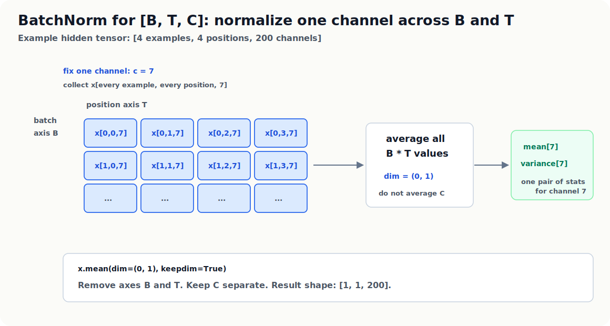

That is why the code uses:

```python
xmean = x.mean(dim=(0, 1), keepdim=True)
xvar = x.var(dim=(0, 1), keepdim=True)
```

Read:

```text
average away axis 0: batch examples
average away axis 1: sequence positions
keep axis 2 separate: channels
```

Input:

```text
[B, T, C]
```

Statistics:

```text
[1, 1, C]
```

There is one mean and one variance for each channel.

Why keep channels separate?

```text
different channels represent different learned features
each channel can naturally have a different numeric scale
BatchNorm calibrates each channel independently
```

## 14. Receptive Field

After each summarization layer, one remaining vector can see more of the
original context.

```text
input embedding:
sees 1 character

layer 1 summary:
sees 2 characters

layer 2 summary:
sees 4 characters

layer 3 summary:
sees 8 characters
```

This visible context is called the:

```text
receptive field
```

Definition:

```text
The receptive field of a feature is the portion of the original input that can
influence that feature.
```

The hierarchy expands its receptive field with depth:

```text
1 -> 2 -> 4 -> 8
```

## 15. What WaveNet Is Actually About

The original WaveNet architecture models raw audio.

Its task is:

```text
previous audio samples -> predict the next audio sample
```

Makemore uses characters instead:

```text
previous characters -> predict the next character
```

Both are autoregressive models.

Autoregressive means:

```text
predict the next value from earlier values
then use generated values to continue predicting
```

This post starts with a small visible hierarchy to develop the intuition. The
original WaveNet architecture uses causal dilated convolutions to apply related local
processing efficiently across long sequences.

## 16. What Does Causal Mean?

When predicting the next character, the model must only use the past.

For:

```text
abcdefgh -> predict i
```

the model can inspect:

```text
a b c d e f g h
```

It cannot inspect:

```text
i
```

because `i` is the answer.

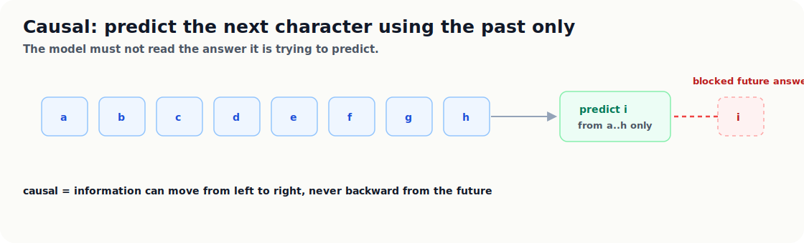

Definition:

```text
causal = no information can flow backward from future values into a prediction
```

Why is this necessary?

If the answer leaks into the input during training, the loss looks excellent
but the model cannot generate new text. During generation, future answers do not
exist yet.

## 17. What Does Dilated Mean?

A normal local operation reads nearby values.

```text
gap 1:
read neighboring positions
```

A dilated operation introduces spaces:

```text
gap 2:
read positions two steps apart

gap 4:
read positions four steps apart
```

As layers get deeper, increasing gaps let the model reach farther into the past
without requiring an enormous number of layers.

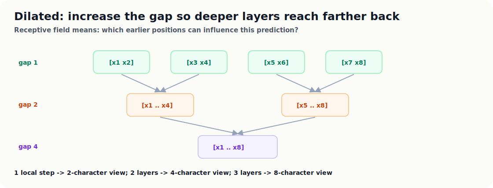

The memory hook is:

```text
causal  = past only
dilated = farther back with gaps
```

## 18. Visible Hierarchy Versus Full WaveNet

The visible hierarchy does:

```text
8 positions
-> 4 summaries
-> 2 summaries
-> 1 summary
```

This is deliberately easy to inspect.

The full WaveNet architecture uses dilated causal convolutions. Its layers preserve a
sequence of outputs while growing the context visible at each position.

The graph below traces one simplified prediction:

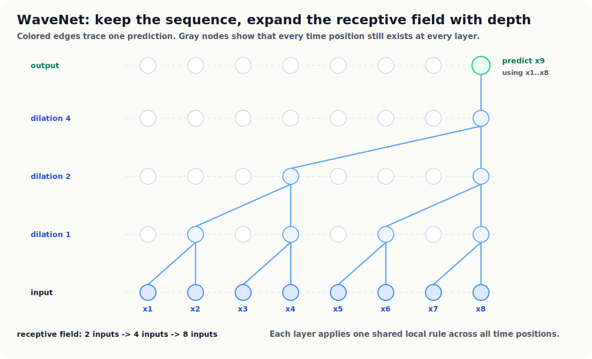

Read it from bottom to top:

```text
input row:
the model receives x1 through x8

dilation 1:
each highlighted feature can combine 2 neighboring inputs

dilation 2:
each highlighted feature can combine information from 4 inputs

dilation 4:
the rightmost highlighted feature can combine information from all 8 inputs

output:
predict x9 from x1 through x8
```

Only one prediction path is colored so the graph remains readable. The gray
nodes matter: unlike the visible `8 -> 4 -> 2 -> 1` hierarchy, a WaveNet layer
retains features at every time position. The same local operation is reused
across those positions.

The shared idea is:

```text
learn local patterns
combine them across depth
grow the receptive field efficiently
never read future values
```

The difference is implementation:

| visible hierarchy | full WaveNet architecture |
| --- | --- |
| groups positions into a visible tree | applies convolutions across a sequence |
| shrinks `8 -> 4 -> 2 -> 1` | keeps outputs across time |
| teaches the hierarchy directly | scales the idea efficiently |

## 19. Why Convolution Is A Built-In Sliding Linear Layer

The phrase:

```text
convolution is a built-in efficient sliding Linear layer
```

means this:

```text
take one local window
flatten the numbers inside it
apply the same learned weights
move to the next local window
repeat
```

The numbers are not physically moving. The model is selecting different local
slices of the sequence.

### What Is Getting Slid?

The thing that slides is the **local window selector**.

For a sequence:

```text
[a b c d e f g h]
```

a width-2 window can look at:

```text
[a b]
[b c]
[c d]
[d e]
[e f]
[f g]
[g h]
```

That is the sliding part.

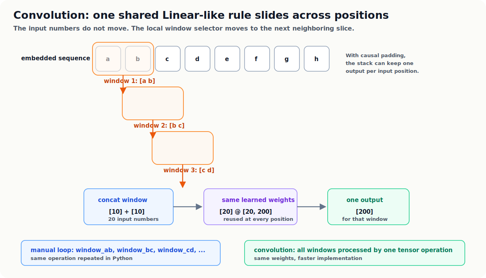

If each character embedding has `10` numbers, then each two-character window
contains:

```text
10 + 10 = 20 numbers
```

So one window can be transformed by a Linear-like operation:

```text
[20] @ [20, 200] -> [200]
```

The key is that the same learned weights are reused at every position:

```text
[a b] -> same weights -> output_ab
[b c] -> same weights -> output_bc
[c d] -> same weights -> output_cd
```

### Manual Loop Version

If we wrote the idea by hand, it would look like this:

```python
for t in range(number_of_windows):
    window = sequence[:, t:t+2, :]
    window = window.reshape(batch_size, 20)
    out[:, t, :] = window @ W + b
```

This is the conceptual loop.

A convolution does this loop inside an optimized tensor operation:

```python
out = conv(sequence)
```

That is why it is efficient. It avoids a slow Python loop and uses one shared
set of weights across all positions.

### What Does Grouped Neighboring Positions Mean?

Grouping neighboring positions means taking nearby feature vectors and treating
their numbers as one local input.

With tiny 2-number embeddings:

```text
a = [a1, a2]
b = [b1, b2]

[a b] = [a1, a2, b1, b2]
```

With the blog's main numbers:

```text
a = [10 numbers]
b = [10 numbers]

[a b] = [20 numbers]
```

The earlier `FlattenConsecutive(2)` layer also groups neighboring positions,
but it groups non-overlapping pairs:

```text
[a b c d e f g h]
-> [ab cd ef gh]
```

A regular width-2 convolution with stride `1` uses overlapping windows:

```text
[a b]
  [b c]
    [c d]
      [d e]
        [e f]
          [f g]
            [g h]
```

So the difference is:

| operation | local windows | sequence length |
| --- | --- | --- |
| `FlattenConsecutive(2)` | `[ab] [cd] [ef] [gh]` | shrinks `8 -> 4` |
| width-2 convolution, stride `1` | `[ab] [bc] [cd] ... [gh]` | slides across positions |

### Is The Hierarchy Getting Slid?

Not exactly.

The window slides over the **current sequence of feature vectors**.

At the first layer, the current sequence is character embeddings:

```text
[a b c d e f g h]
```

At the next layer, the current sequence is learned features created by the
previous layer:

```text
[feature_1 feature_2 feature_3 ...]
```

So stacking convolutions builds a hierarchy indirectly:

```text
layer 1:
slides over small local character windows

layer 2:
slides over layer-1 features

layer 3:
slides over layer-2 features
```

Each deeper layer can represent a larger region of the original input. That is
the receptive field growing with depth.

For causal language modeling, the convolution is arranged so that a prediction
does not read future characters. Causal padding lets the model keep positions
while still obeying:

```text
past only
no future answer leakage
```

The memory hook is:

```text
FlattenConsecutive:
explicitly group non-overlapping neighbors and shrink the sequence

Convolution:
slide one shared local Linear-like rule across many neighboring windows
```

## 20. What Full WaveNet Adds

The visible makemore hierarchy is useful because it makes receptive-field growth
easy to see:

```text
8 characters
-> 4 pair summaries
-> 2 four-character summaries
-> 1 full-context summary
```

A full WaveNet is built for much deeper sequence processing. It keeps a feature
vector at every time position and adds three important ideas:

```text
gated activation
residual connection
skip connection
```

These ideas solve a different problem from dilation.

```text
dilation:
let deeper layers inspect a larger history efficiently

gating:
control which newly computed features should pass through

residual and skip routes:
make a deep stack easier to train and easier to use
```

### One Block Computes `z`, Then Uses It Two Ways

One residual block receives an internal state called `x`.

Think of `x` as:

```text
the model's current representation of the sequence
```

This block is called residual because one of its paths will compute:

```text
x_next = x + update
```

The block computes new useful features:

```text
z = new features computed from x
```

Then the model has a choice:

```text
what should we do with z?
```

WaveNet uses the same `z` in two ways:

```text
one route turns z into an update for future layers
one route turns z into a contribution for the final logits
```

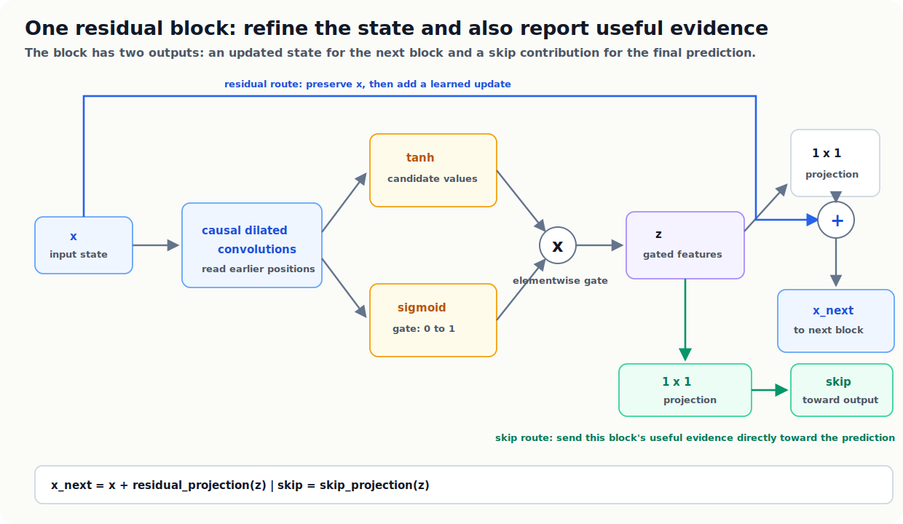

So one block has two outputs:

```text
x_next:
"Here is the representation the next block should continue working on."

skip:
"Here is my direct contribution to the final answer."
```

The residual route is about continuing computation through depth.

The skip route is about feeding the final output directly.

The same block structure is stacked many times. Different blocks can use
different dilations:

```text
block 1: dilation 1
block 2: dilation 2
block 3: dilation 4
block 4: dilation 8
```

As depth grows, each block can reason about a larger portion of the past.

### What Is The Gate?

The block computes `z` with a gated activation.

The gate decides how much newly computed information should pass through.

The candidate branch uses `tanh`:

```text
tanh(...) produces values from -1 to 1
```

The gate branch uses `sigmoid`:

```text
sigmoid(...) produces values from 0 to 1
```

Then WaveNet multiplies them element by element:

```text
z = tanh(candidate) * sigmoid(gate)
```

Small example:

```text
candidate after tanh = [ 0.80, -0.50, 0.30]
gate after sigmoid   = [ 0.90,  0.10, 0.60]
                         ------------------
gated result z       = [ 0.72, -0.05, 0.18]
```

Interpretation:

```text
gate near 1:
allow most of that candidate feature through

gate near 0:
suppress most of that candidate feature
```

This is a **gated activation**. It is more precise than calling it a gated
linear layer: the convolutional transformations are learned, but the `tanh`,
`sigmoid`, and multiplication add a nonlinear control mechanism.

Intuitively, a block can say:

```text
"I detected a useful pattern, so pass this feature onward."

or:

"This candidate feature is not useful in this context, so reduce it."
```

### What Is A Projection?

A projection is a learned transformation that converts one feature vector into
another feature vector.

In this post, you can read projection as:

```text
learned Linear-like remix of channels
```

For example:

```text
input features  -> projection -> output features
[2 numbers]                    [3 numbers]
```

The projection decides:

```text
which input features matter
how strongly they matter
which output slots they should affect
```

So when we say:

```text
residual_projection(z)
```

we mean:

```text
use learned weights to turn z into a residual update
```

And when we say:

```text
skip_projection(z)
```

we mean:

```text
use learned weights to turn z into a skip contribution
```

These are two different learned projections. They both read `z`, but they
produce outputs for different destinations.

### What Is A `1 x 1` Projection?

A `1 x 1` projection is a projection applied separately at each time position.

It does **not** look at neighboring positions.

It only mixes the channels at the current position:

```text
position t features -> 1 x 1 projection -> new position t features
```

For one position:

```text
[channels_in] @ [channels_in, channels_out] -> [channels_out]
```

For a whole sequence:

```text
position 1 -> same projection -> new position 1
position 2 -> same projection -> new position 2
position 3 -> same projection -> new position 3
```

So `1 x 1` means:

```text
look at one position at a time
mix its feature channels
reuse the same learned weights at every position
```

It is like the 3D Linear idea from earlier in the post, but written in
convolution language.

Why use it here?

Because after the block computes `z`, the model needs two route-specific
versions of `z`:

```text
residual_1x1(z):
make an update with the same shape as x, so x + update is possible

skip_1x1(z):
make a skip contribution with the same skip width as other blocks, so skips
can be summed
```

### What Does A Forward Pass Mean?

A forward pass means:

```text
start with the input
apply the model's current learned transformations
calculate the output
```

It does not update the model yet. Training calculates the loss after the
forward pass. Backpropagation then calculates how the parameters should change.

A simplified forward pass through one residual block is:

```python
candidate = tanh(filter_dilated_conv(x))
gate = sigmoid(gate_dilated_conv(x))

z = candidate * gate

residual_update = residual_1x1(z)
skip = skip_1x1(z)

x_next = x + residual_update
return x_next, skip
```

For block 1, the same idea can be named more explicitly:

```python
x1 = input_state_to_block_1

z1 = gated_dilated_conv_block_1(x1)

update1 = residual_1x1_block_1(z1)
skip1 = skip_1x1_block_1(z1)

x2 = x1 + update1
```

Then block 2 receives `x2`:

```text
x1 -> block 1 -> x2 -> block 2 -> x3 -> block 3 -> x4
```

The skip outputs are stored separately:

```text
skip1 -> final output
skip2 -> final output
skip3 -> final output
```

Read this from top to bottom:

```text
1. Read earlier positions with causal dilated convolutions.
2. Create candidate features.
3. Create gate values.
4. Multiply them element by element to get z.
5. Turn z into update1 for the residual route.
6. Turn z into skip1 for the skip route.
7. Add update1 to x1 to create x2.
8. Send x2 to the next block and send skip1 toward the final output.
```

### Walk Through One Position

Use tiny made-up numbers for one sequence position.

Suppose block 1 receives:

```text
x1[position] = [10, 20, 30]
```

That means the current representation at this position has `3` channels.

The gated dilated convolution computes:

```text
z1[position] = [2, -1]
```

That means block 1 found `2` gated features at this position.

Now the same `z1` goes through two different projections.

First, the residual projection creates `update1`:

```text
residual_1x1_block_1(z1[position]) -> update1[position]
```

Use a tiny learned weight matrix:

```text
z1[position] = [2, -1]

residual weights =
[
  [0.5, 0,  1],
  [0,   2, -1],
]
```

Then:

```text
update1[position]
= [2, -1] @ residual weights
= [1, -2, 3]
```

Now the residual addition is possible because `x1[position]` and
`update1[position]` both have `3` numbers:

```text
x1[position]      = [10, 20, 30]
update1[position] = [ 1, -2,  3]
                    ------------
x2[position]      = [11, 18, 33]
```

This `x2[position]` is what the next block continues working on.

Second, the skip projection creates `skip1`:

```text
skip_1x1_block_1(z1[position]) -> skip1[position]
```

This uses a different learned weight matrix:

```text
skip weights =
[
  [0.1, 0.4, 0],
  [0,   0.2, 0.5],
]
```

Then:

```text
skip1[position]
= [2, -1] @ skip weights
= [0.2, 0.6, -0.5]
```

This `skip1[position]` does not go to the next block. It goes to the final
output path, where it will be added to skip contributions from other blocks.

The whole one-position story is:

```text
x1[position]
   |
block 1 computes z1[position]
   |
   +--> residual_1x1(z1) -> update1[position]
   |                         |
   |                         v
   |                    x2[position] = x1[position] + update1[position]
   |                         |
   |                         v
   |                    next block
   |
   +--> skip_1x1(z1) -> skip1[position] -> final output path
```

### What Is `update1`?

`update1` means:

```text
the learned correction produced by block 1
```

It is not a parameter update. It is not the optimizer changing the weights.

It is an activation tensor created during the forward pass:

```text
update1 = residual_1x1_block_1(z1)
```

The model uses it to change the internal state:

```text
x2 = x1 + update1
```

So:

```text
x1:
the representation before block 1 changes it

update1:
the correction block 1 wants to add

x2:
the representation after block 1 changes it
```

Small vector example:

```text
x1      = [10.0, 20.0, 30.0]
update1 = [ 1.0, -2.0,  5.0]
          ------------------
x2      = [11.0, 18.0, 35.0]
```

In the real model, this happens for every time position and every feature
channel.

For one position:

```text
x1[position]      = current feature vector at that position
update1[position] = correction vector for that position
x2[position]      = corrected feature vector for the next block
```

The `residual_1x1` layer learns how to turn `z1` into a correction with the
right shape. It must match the shape of `x1` so the addition is possible:

```text
x1 shape      = [positions, channels]
update1 shape = [positions, channels]
x2 shape      = [positions, channels]
```

The important distinction is:

```text
update1 changes the activations passed to the next block

backprop later changes the model's weights
```

### Residual Route: Continue Computation Through Depth

The residual route updates the internal representation:

```text
x_next = x + residual_update
```

Across several blocks:

```text
x2 = x1 + update1
x3 = x2 + update2
x4 = x3 + update3
```

So the state evolves like this:

```text
x1 -> x2 -> x3 -> x4
```

Each block modifies the state a little.

The next block does not start from scratch. It receives the previous state plus
the correction made by the current block.

This matters because deep networks are hard to train if every layer must
replace the entire representation. With residual connections, a block can do a
smaller job:

```text
keep useful existing information
add a learned correction
pass the corrected state onward
```

Residual connections also create a simpler path for gradients during
backpropagation. That makes very deep models easier to optimize.

### Skip Route: Feed The Final Output Directly

The skip route creates an output contribution:

```text
skip = skip_projection(z)
```

This `skip` does not become the next block's input.

Instead, it is stored for the final prediction:

```text
skip_outputs = [skip1, skip2, skip3, ...]
```

At the end:

```text
combined_skip = skip1 + skip2 + skip3 + ...
logits = output_head(combined_skip)
```

The conceptual picture is:

```text
x1 -> block1 -> x2 -> block2 -> x3 -> block3 -> x4
       |              |              |
       v              v              v
     skip1          skip2          skip3
       \              |              /
        \             |             /
          combined final prediction
```

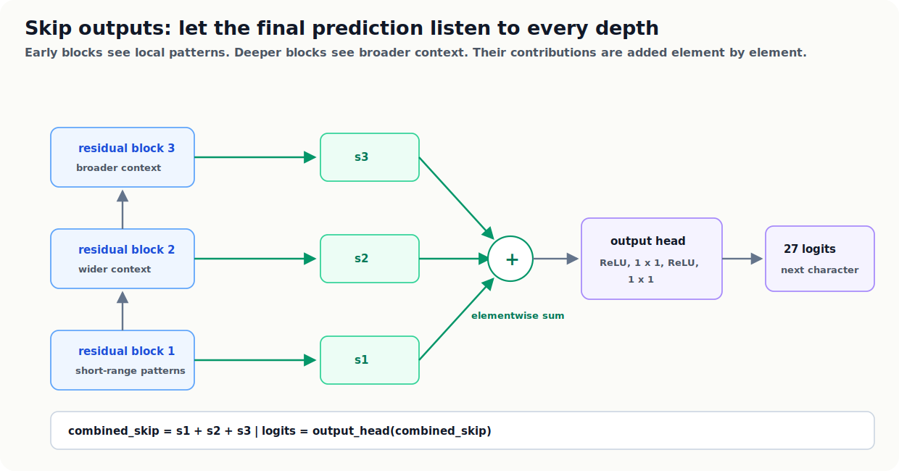

Different depths can notice different kinds of patterns:

```text
early blocks:
short-range local relationships

deeper blocks:
relationships that require a broader history
```

The skip network lets the final prediction use both.

The clean distinction is:

```text
residual route:
x gets updated and sent to the next block

skip route:
z contributes directly to the final logits
```

### Why Sum The Skip Outputs?

Suppose three blocks produce skip vectors with the same width:

```text
s1 = [0.20, 0.10, 0.40]
s2 = [0.50, 0.00, 0.10]
s3 = [0.10, 0.30, 0.20]
```

WaveNet combines them element by element:

```text
combined_skip = s1 + s2 + s3
              = [0.80, 0.40, 0.70]
```

In code:

```python
combined_skip = sum(skip_outputs)
logits = output_head(combined_skip)
```

This means:

```text
collect evidence from every depth
keep a fixed feature width
give each block a direct route toward the loss
```

The output head then turns the combined skip features into final scores. In a
WaveNet-style network it is a small stack of nonlinearities and `1 x 1`
convolutions:

```text
sum skips
-> ReLU
-> 1 x 1 convolution
-> ReLU
-> 1 x 1 convolution
-> logits
```

During backpropagation, the loss can send gradient signals directly through
the skip routes to blocks at different depths. The last block is not the only
block responsible for carrying all useful information to the output.

### What Would This Look Like For Makemore?

The original WaveNet predicts the next audio sample:

```text
previous audio samples -> next-audio-sample probabilities
```

A character version predicts the next character:

```text
a b c d e f g h -> 27 next-character logits
```

The `27` logits represent:

```text
"." + 26 letters
```

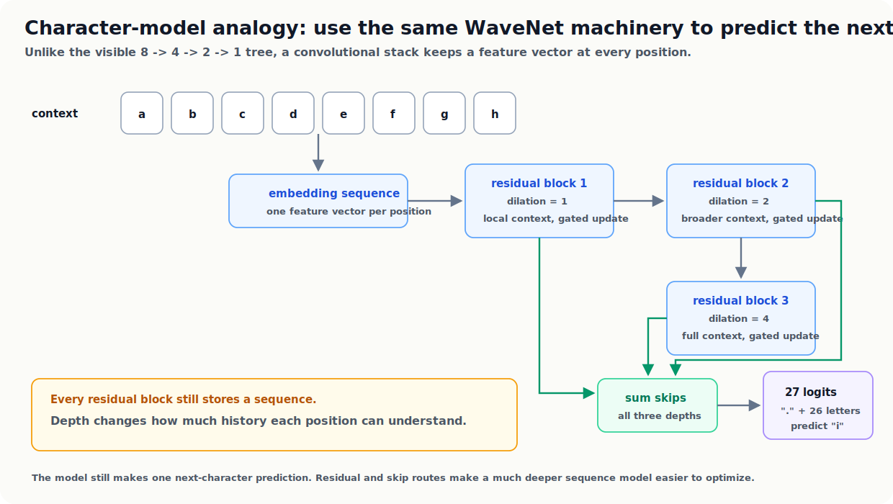

The conceptual forward pass is:

```text
character ids
-> embedding sequence
-> causal convolution
-> residual block with dilation 1
-> residual block with dilation 2
-> residual block with dilation 4
-> sum skip contributions
-> output head
-> 27 logits
-> softmax probabilities
```

This is not the exact visible `FlattenConsecutive(2)` model built earlier in
the post.

The visible hierarchy does:

```text
8 positions -> 4 summaries -> 2 summaries -> 1 summary
```

A full WaveNet-style convolutional stack does:

```text
keep positions across layers
grow the receptive field at each position
refine each layer's state through residual routes
collect useful evidence from every depth through skip routes
```

### Would It Improve The Character Model?

It can improve a character model when additional depth and longer context are
actually useful.

The intuition is:

```text
dilation:
see a larger history efficiently

gates:
control which newly detected features pass through

residual connections:
preserve useful state while deeper layers learn refinements

skip connections:
let the final prediction use local and broad-context evidence
```

But improvement is not automatic.

For a tiny dataset or a short fixed context, the simpler hierarchy may already
be sufficient. A larger model can also overfit or require more careful
optimization.

The engineering question is empirical:

```text
does validation loss improve after adding the extra complexity?
```

The strategic reason for the WaveNet design is not that every individual idea
must always improve every model. The design makes it practical to train a deep
causal sequence network with a large receptive field.

## 21. How This Connects To The Bengio MLP

The progression is:

```text
Bengio-style MLP
learn embeddings
flatten a fixed context
predict the next token

Makemore Part 5 hierarchy
learn embeddings
combine local groups gradually
predict the next token

WaveNet
use causal dilated convolutions
grow context efficiently across long sequences
predict the next value
```

The objective remains the same:

```text
given previous values, assign high probability to the correct next value
```

## 22. Experiment Log

The model changes are measured one at a time:

| experiment | train loss | validation loss |
| --- | ---: | ---: |
| original `3`-character MLP | `2.058` | `2.105` |
| increase context `3 -> 8` | `1.918` | `2.027` |
| flat MLP -> hierarchy | `1.941` | `2.029` |
| fix BatchNorm axes | `1.912` | `2.022` |
| scale embedding and hidden widths | `1.769` | `1.993` |

The hierarchy is not an automatic win by itself.

The engineering lesson is:

```text
change one thing
measure validation loss
inspect shapes
fix bugs
scale only after the model is correct
```

## 23. One-Page Memory Version

```text
Task:
previous characters -> predict one next character

Embedding:
character id -> learned vector

Feature or channel:
one numeric slot in a learned vector

Layer 1:
[a b c d e f g h]
-> [summary_ab summary_cd summary_ef summary_gh]

Layer 2:
[summary_ab summary_cd summary_ef summary_gh]
-> [summary_abcd summary_efgh]

Layer 3:
[summary_abcd summary_efgh]
-> [summary_abcdefgh]
-> 27 next-character scores

FlattenConsecutive:
join nearby vectors without learning

Linear:
learn how to turn joined vectors into useful summaries

Weight sharing:
reuse one Linear transformation across positions in the same layer

Receptive field:
how much original context can influence a feature

BatchNorm for [B, T, C]:
average over B and T
keep C separate

Causal:
never read future answers

Dilated:
use growing gaps to reach farther into the past efficiently

Convolution:
slide one shared local Linear-like rule across positions

Gated activation:
multiply candidate features by learned 0-to-1 gate values

Projection:
learned Linear-like remix from one feature vector to another

1 x 1 projection:
apply that remix independently at each position

Residual route:
turn z1 into update1, then pass x2 = x1 + update1 into the next block

Skip route:
turn z1 into skip1, then store skip1 for the final prediction
```

## 24. Recall Checks

Try to answer without scrolling upward:

```text
1. Does the model predict after layer 1, layer 2, and layer 3?

2. What is summary_ab?

3. Why does [4, 8, 10] become [4, 4, 20]?

4. What does Linear change in [4, 4, 20] -> [4, 4, 200]?

5. Why are W1, W2, and W3 different?

6. Why does BatchNorm use dim=(0, 1) for [B, T, C]?

7. What is a receptive field?

8. What is the difference between causal and dilated?

9. Why is the visible hierarchy WaveNet-style rather than a complete WaveNet?

10. What is the difference between `FlattenConsecutive(2)` and a width-2
    convolution with stride 1?

11. What are the two outputs of one WaveNet residual block?

12. What is the difference between a residual route and a skip route?

13. Why are skip outputs summed?
```

Short answers:

```text
1. No. There is one next-character prediction at the end.

2. A learned numeric vector summarizing the a-b pair.

3. Eight positions become four pairs. Each pair carries 10 + 10 features.

4. It transforms each raw 20-feature pair into a learned 200-feature summary.

5. They solve different jobs at different levels of the hierarchy.

6. Normalize each channel across all examples and positions. Do not mix channels.

7. The original input positions that can influence a feature or prediction.

8. Causal means past only. Dilated means reach farther back with gaps.

9. It teaches the hierarchy with an explicit tree instead of implementing a
   full causal dilated convolution stack.

10. `FlattenConsecutive(2)` uses non-overlapping pairs and shrinks the sequence.
    A width-2 convolution with stride 1 slides over overlapping pairs.

11. `x_next` for the next block and `skip` for the output network.

12. The residual route turns `z` into an update and sends `x + update` to the
    next block. The skip route turns `z` into a contribution for the final
    prediction.

13. Summation combines evidence from every depth, keeps a fixed feature width,
    and gives each block a direct route toward the loss.
```

## 25. Optional Scaled Variant

The teaching walkthrough above consistently uses:

```text
n_embd = 10
n_hidden = 200
```

The same architecture can use different widths. For example:

```text
n_embd = 24
n_hidden = 128
```

Only the feature widths change:

```text
token ids
[4, 8]

Embedding
[4, 8, 24]

group adjacent character embeddings
[4, 4, 48]

Linear + BatchNorm + tanh
[4, 4, 128]

group adjacent pair summaries
[4, 2, 256]

Linear + BatchNorm + tanh
[4, 2, 128]

group adjacent four-character summaries
[4, 1, 256]

squeeze the one remaining position
[4, 256]

Linear + BatchNorm + tanh
[4, 128]

final Linear
[4, 27]
```

The structure is unchanged:

```text
join two neighboring vectors
-> feature width doubles
-> Linear learns a summary with n_hidden features
```
