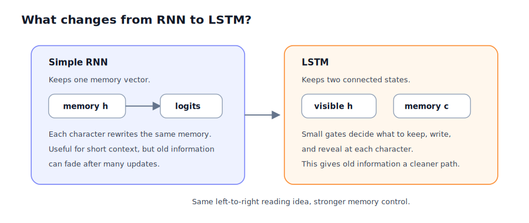
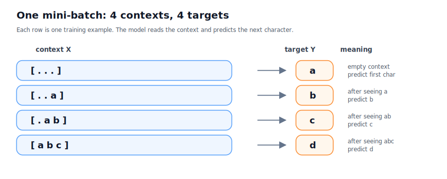
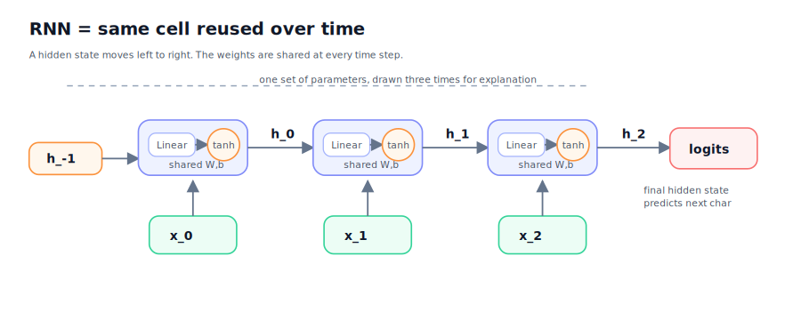
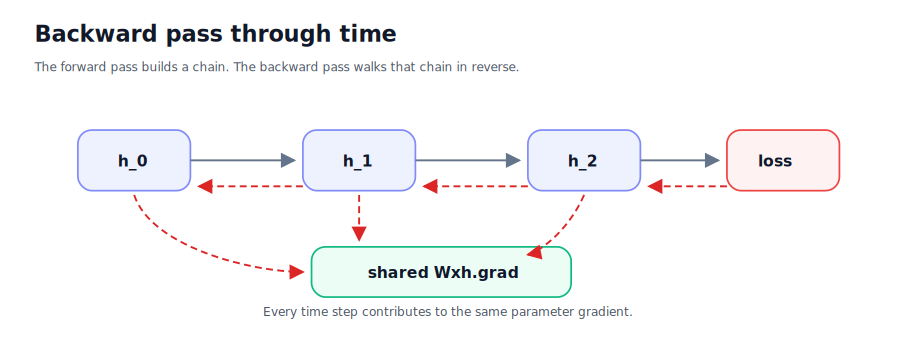
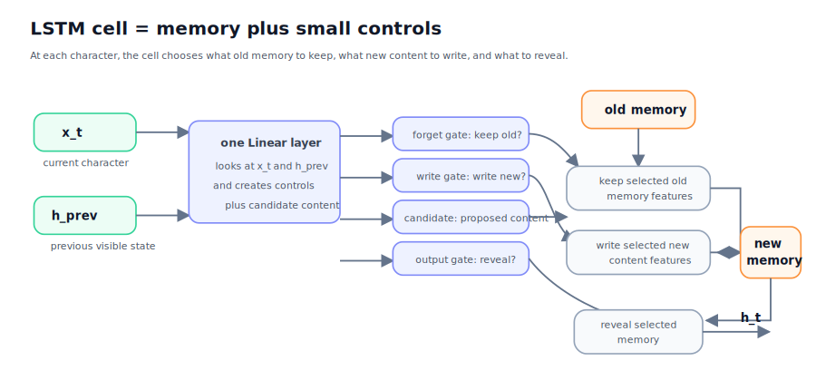
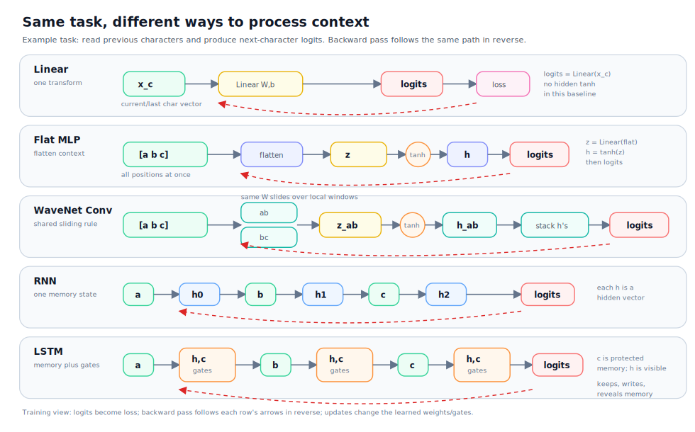

# Building Makemore Part 6: RNNs And LSTMs From Scratch

This post explains recurrent neural networks at the same level as the earlier
Makemore notes.

The goal is not to memorize formulas. The goal is to understand this pipeline:

```text
characters
-> token ids
-> embeddings
-> read one time step at a time
-> update memory
-> predict the next character
-> compute loss
-> backprop through all time steps
-> update parameters
```

The most important mental shift is:

```text
MLP / WaveNet:
all context positions are visible at once

RNN / LSTM:
the model reads the context from left to right and carries a state forward
```

## 0. Story So Far

The previous notes build one idea at a time.

```text
01 micrograd
scalar values, chain rule, gradients

02 bigram
one previous character predicts one next character

03 PyTorch basics
tensors, shapes, matmul, autograd

04 MLP
several previous characters are embedded, flattened, and fed to a network

05 Bengio paper
learned embeddings let similar tokens share statistical strength

06 activations, gradients, BatchNorm
training quality depends on signal scale and gradient flow

07 backprop ninja
the backward pass is just local derivative rules chained together

08 WaveNet hierarchy
build local summaries, combine them into broader summaries, then predict
```

RNNs and LSTMs answer a different question:

```text
What if we do not flatten the whole context?
What if we read it like a sequence?
```

For a context:

```text
[a b c]
```

a recurrent model does:

```text
read a -> update memory
read b -> update memory
read c -> update memory
use final memory -> predict next character
```

## 1. The Papers In One Pass

There are two main ideas to keep separate.

The simple recurrent network, often associated with Elman's 1990 paper, adds a
state that feeds back into the next time step.

```text
current input + previous hidden state -> next hidden state
```

That is the core RNN idea.

The LSTM, from Hochreiter and Schmidhuber's 1997 paper, fixes a weakness of
simple RNNs: long chains of repeated nonlinear updates can make useful
gradients shrink or explode. LSTMs add a memory path and gates.

```text
forget gate  -> how much old memory to keep
input/write gate -> how much new information to write
output gate  -> how much memory to expose as hidden state
```

The paper-level intuition, without formulas:

```text
RNN:
one memory vector is rewritten at every character

LSTM:
two connected states are carried forward
small gates decide what to keep, write, and reveal
```



## 2. The Tiny Character Batch

Use one tiny dataset first.

Vocabulary:

```text
. a b c d
```

Token ids:

```text
. -> 0
a -> 1
b -> 2
c -> 3
d -> 4
```

Four training examples:



The same batch as a plain text table:

```text
row   context chars   token ids      target char   target id
---   -------------   ----------     -----------   ---------
0     . . .           0 0 0          a             1
1     . . a           0 0 1          b             2
2     . a b           0 1 2          c             3
3     a b c           1 2 3          d             4

X = [
  [0, 0, 0],
  [0, 0, 1],
  [0, 1, 2],
  [1, 2, 3],
]

Y = [1, 2, 3, 4]
```

The batch axis is vertical. The time axis is horizontal:

```text
          time step
          t=0  t=1  t=2
batch 0    .    .    .
batch 1    .    .    a
batch 2    .    a    b
batch 3    a    b    c
```

In tensor form:

```python
import torch

chars = [".", "a", "b", "c", "d"]
stoi = {ch: i for i, ch in enumerate(chars)}
itos = {i: ch for ch, i in stoi.items()}

examples = [
    ("...", "a"),
    ("..a", "b"),
    (".ab", "c"),
    ("abc", "d"),
]

X = torch.tensor([[stoi[ch] for ch in ctx] for ctx, target in examples])
Y = torch.tensor([stoi[target] for ctx, target in examples])

print(X)
print(Y)
```

Output:

```text
tensor([[0, 0, 0],
        [0, 0, 1],
        [0, 1, 2],
        [1, 2, 3]])

tensor([1, 2, 3, 4])
```

Shape:

```text
X: [4, 3]
Y: [4]
```

Read `[4, 3]` as:

```text
4 examples in the batch
3 character positions per example
```

This batch is tiny on purpose. If you understand this, the full names dataset is
just more rows and a larger vocabulary.

## 3. Why Embeddings Still Appear

Token ids are integer labels. The number `3` does not mean character `c` is
three times character `a`.

So we learn an embedding table:

```text
C: [vocab_size, n_embd]
```

For the tiny example:

```text
vocab_size = 5
n_embd = 3
```

So:

```text
C: [5, 3]
```

Each token id looks up one row:

```text
0 -> vector for "."
1 -> vector for "a"
2 -> vector for "b"
```

Code:

```python
torch.manual_seed(7)

vocab_size = 5
n_embd = 3

C = torch.randn(vocab_size, n_embd) * 0.1
emb = C[X]

print(emb.shape)
```

Output:

```text
torch.Size([4, 3, 3])
```

Read `[4, 3, 3]` as:

```text
4 examples
3 time steps
3 embedding features per character
```

Text diagram:

```text
X
[4, 3]

C[X]
[4, 3, 3]

one row:
[".", ".", "a"]
-> [vector_. vector_. vector_a]
```

One row after embedding looks like this:

```text
before embedding:

[".", ".", "a"]

after embedding with n_embd = 3:

[
  [e0_0, e0_1, e0_2],   vector for "."
  [e0_0, e0_1, e0_2],   vector for "."
  [e1_0, e1_1, e1_2],   vector for "a"
]

shape for one row: [3, 3]
shape for four rows: [4, 3, 3]
```

## 4. What An RNN Cell Does

A simple RNN keeps one hidden state.

At each time step it receives:

```text
x_t      current character embedding
h_prev   memory from the previous time step
```

It produces:

```text
h_t      updated memory
```

Formula:

```text
h_t = tanh([x_t, h_prev] @ Wxh + bh)
```

As a box diagram:

```text
            previous memory
                  h_prev [4, 4]
                       |
                       v
current input     concatenate       learned update       new memory
x_t [4, 3] ----> [x_t, h_prev] --> Linear + tanh ----> h_t [4, 4]
                      [4, 7]          [7, 4]
```

Where:

```text
[x_t, h_prev] means concatenate the two vectors
Wxh is the learned weight matrix
bh is the learned bias
tanh keeps hidden values in a controlled range
```



Important: the diagram draws three cells, but there is only one set of weights.

```text
same Wxh at t = 0
same Wxh at t = 1
same Wxh at t = 2
```

That sharing is what makes it recurrent.

## 5. RNN Forward Pass With Shapes

Before shapes, connect the notation to actual characters.

Take one training row:

```text
context: . . a
target:  b
```

The three context positions are:

```text
position 0   position 1   position 2
    .            .            a
```

After embedding lookup, each position becomes a vector:

```text
position 0   "." -> x_0
position 1   "." -> x_1
position 2   "a" -> x_2
```

So `x_0`, `x_1`, and `x_2` are not new characters. They are the embedding
vectors for the characters at time steps `0`, `1`, and `2`.

With `n_embd = 3`, one row could look like:

```text
context chars:
[ ".", ".", "a" ]

token ids:
[ 0, 0, 1 ]

embedding vectors:
x_0 = C[0] = [0.12, -0.03,  0.08]   vector for "."
x_1 = C[0] = [0.12, -0.03,  0.08]   vector for "."
x_2 = C[1] = [0.04,  0.10, -0.02]   vector for "a"
```

In PyTorch, for the full four-example batch:

```python
emb = C[X]        # [4, 3, 3]

x_0 = emb[:, 0, :] # all batch rows, time step 0
x_1 = emb[:, 1, :] # all batch rows, time step 1
x_2 = emb[:, 2, :] # all batch rows, time step 2
```

Shape:

```text
x_0: [4, 3]
x_1: [4, 3]
x_2: [4, 3]
```

Each `x_t` contains one embedding vector per batch row:

```text
x_0 contains embeddings for the first character in every row:

row 0: "." -> vector
row 1: "." -> vector
row 2: "." -> vector
row 3: "a" -> vector

x_1 contains embeddings for the second character in every row:

row 0: "." -> vector
row 1: "." -> vector
row 2: "a" -> vector
row 3: "b" -> vector

x_2 contains embeddings for the third character in every row:

row 0: "." -> vector
row 1: "a" -> vector
row 2: "b" -> vector
row 3: "c" -> vector
```

Now connect this to hidden memory.

At the start:

```text
h_prev = zeros
```

That means the RNN has not read any character yet.

After reading `x_0`:

```text
h_0 = new memory after reading position 0
```

Then:

```text
h_prev becomes h_0
```

After reading `x_1`:

```text
h_1 = new memory after reading positions 0 and 1
```

Then:

```text
h_prev becomes h_1
```

After reading `x_2`:

```text
h_2 = new memory after reading positions 0, 1, and 2
```

For the row `[".", ".", "a"]`, the memory story is:

```text
start memory
    no characters read yet

read x_0 = vector for "."
    memory now summarizes "."

read x_1 = vector for "."
    memory now summarizes ". ."

read x_2 = vector for "a"
    memory now summarizes ". . a"

use final memory h_2
    predict "b"
```

The full forward pass is:

```text
X token ids
[4, 3]
  |
  v
Embedding lookup C[X]
[4, 3, 3]
  |
  v
read t = 0
x_0 [4, 3] + h_start [4, 4] -> h_0 [4, 4]
  |
  v
read t = 1
x_1 [4, 3] + h_0     [4, 4] -> h_1 [4, 4]
  |
  v
read t = 2
x_2 [4, 3] + h_1     [4, 4] -> h_2 [4, 4]
  |
  v
Output Linear
h_2 [4, 4] -> logits [4, 5]
  |
  v
cross entropy with Y [4]
one scalar loss
```

Use:

```text
B = 4
T = 3
n_embd = 3
n_hidden = 4
vocab_size = 5
```

Parameters:

```text
C:    [5, 3]
Wxh:  [3 + 4, 4] = [7, 4]
bh:   [4]
Why:  [4, 5]
by:   [5]
```

Forward pass:

```python
import torch.nn.functional as F

B, T = X.shape
n_hidden = 4

Wxh = torch.randn(n_embd + n_hidden, n_hidden) * 0.1
bh = torch.zeros(n_hidden)
Why = torch.randn(n_hidden, vocab_size) * 0.1
by = torch.zeros(vocab_size)

for p in [C, Wxh, bh, Why, by]:
    p.requires_grad = True

emb = C[X]                         # [4, 3, 3]
h = torch.zeros(B, n_hidden)       # [4, 4]

for t in range(T):
    x_t = emb[:, t, :]             # [4, 3]
    xh = torch.cat([x_t, h], dim=1) # [4, 7]
    h = torch.tanh(xh @ Wxh + bh)  # [4, 4]

logits = h @ Why + by              # [4, 5]
loss = F.cross_entropy(logits, Y)
```

The loop can also be written with explicit names:

```python
h_prev = torch.zeros(B, n_hidden)  # no memory yet

x_0 = emb[:, 0, :]
h_0 = torch.tanh(torch.cat([x_0, h_prev], dim=1) @ Wxh + bh)

x_1 = emb[:, 1, :]
h_1 = torch.tanh(torch.cat([x_1, h_0], dim=1) @ Wxh + bh)

x_2 = emb[:, 2, :]
h_2 = torch.tanh(torch.cat([x_2, h_1], dim=1) @ Wxh + bh)

logits = h_2 @ Why + by
```

This is the same computation as the `for` loop:

```text
loop variable h starts as h_prev

t = 0:
    h = h_0

t = 1:
    h = h_1

t = 2:
    h = h_2
```

Tiny tensor example:

```python
B = 4
n_embd = 3
n_hidden = 4

x_t = torch.randn(B, n_embd)       # [4, 3]
h_prev = torch.zeros(B, n_hidden) # [4, 4]

xh = torch.cat([x_t, h_prev], dim=1)
print(xh.shape)

W = torch.randn(n_embd + n_hidden, n_hidden)
b = torch.zeros(n_hidden)

h_t = torch.tanh(xh @ W + b)
print(h_t.shape)
```

Output:

```text
torch.Size([4, 7])
torch.Size([4, 4])
```

Read it as:

```text
x_t     [4, 3]   current character embedding for 4 batch rows
h_prev  [4, 4]   previous memory for 4 batch rows
xh      [4, 7]   current character plus previous memory
h_t     [4, 4]   new memory for 4 batch rows
```

Output from the tiny run:

```text
emb.shape (4, 3, 3)
t=0 x_t (4, 3) h (4, 4)
t=1 x_t (4, 3) h (4, 4)
t=2 x_t (4, 3) h (4, 4)
logits.shape (4, 5)
initial loss 1.6065
```

The loss is near:

```text
log(5) = 1.609
```

That is expected at initialization because there are five possible next
characters and the model is close to random.

## 6. Why The Same Code Trains All Time Steps

The final loss depends on the final hidden state:

```text
loss depends on h_2
```

But:

```text
h_2 depends on h_1
h_1 depends on h_0
h_0 depends on x_0 and Wxh
```

So the loss indirectly depends on every earlier step.

Text diagram:

```text
forward:

x_0 -------> h_0 -------> h_1 -------> h_2 -------> logits -------> loss
             ^            ^            ^
             |            |            |
            Wxh          Wxh          Wxh

backward:

loss ------> logits.grad
              |
              v
            h_2.grad
              |
              v
            h_1.grad
              |
              v
            h_0.grad
              |
              v
      C.grad and Wxh.grad
```

The backward pass follows the chain in reverse:

```text
loss -> logits -> h_2 -> h_1 -> h_0 -> embeddings
```



This is called backpropagation through time.

There is no new magic rule. The model was unrolled into a normal computation
graph, and autograd applies the chain rule through that graph.

## 7. One Training Update

The training step is the same pattern as earlier notes.

```python
loss.backward()

with torch.no_grad():
    for p in [C, Wxh, bh, Why, by]:
        p -= 0.5 * p.grad
        p.grad = None
```

What this means:

```text
loss.backward()
computes how every parameter affected the loss

p -= learning_rate * p.grad
moves each parameter in the direction that lowers this batch loss

p.grad = None
clears old gradients before the next forward pass
```

The update loop as a text diagram:

```text
before update:

parameter p  = current value
p.grad       = slope of loss with respect to p

gradient descent:

new p = old p - learning_rate * p.grad

if p.grad is positive:
    increasing p raised the loss
    update makes p smaller

if p.grad is negative:
    increasing p lowered the loss
    update makes p larger
```

From the tiny run:

```text
initial loss          1.6065
loss after one update 1.5816
```

After more updates on only these four examples:

```text
loss after 80 more updates 0.0421
```

Predictions:

```text
... target a pred a p(target) 0.962
..a target b pred b p(target) 0.963
.ab target c pred c p(target) 0.958
abc target d pred d p(target) 0.952
```

This does not prove the model generalizes. It proves the scratch recurrent
forward pass, backward pass, and parameter update are wired correctly.

## 8. A Scratch RNN Model Class

The small code above can be wrapped in a PyTorch module without using
`nn.RNN`.

```python
import torch
import torch.nn as nn
import torch.nn.functional as F

class RNNCellScratch(nn.Module):
    def __init__(self, n_embd, n_hidden):
        super().__init__()
        self.xh_to_h = nn.Linear(n_embd + n_hidden, n_hidden)

    def forward(self, x_t, h_prev):
        xh = torch.cat([x_t, h_prev], dim=1)
        h = torch.tanh(self.xh_to_h(xh))
        return h

class RNNCharScratch(nn.Module):
    def __init__(self, vocab_size, n_embd, n_hidden):
        super().__init__()
        self.embedding = nn.Embedding(vocab_size, n_embd)
        self.cell = RNNCellScratch(n_embd, n_hidden)
        self.h0 = nn.Parameter(torch.zeros(n_hidden))
        self.output = nn.Linear(n_hidden, vocab_size)

    def forward(self, idx, targets=None):
        B, T = idx.shape
        emb = self.embedding(idx)
        h = self.h0.expand(B, -1)

        for t in range(T):
            h = self.cell(emb[:, t, :], h)

        logits = self.output(h)
        loss = None
        if targets is not None:
            loss = F.cross_entropy(logits, targets)
        return logits, loss
```

Key point:

```text
for t in range(T)
```

is the recurrent loop. It reads one character position at a time.

The model predicts only after the final time step because this Makemore setup is:

```text
fixed context -> one next character
```

You could also predict at every time step, but that is a different training
setup.

### New PyTorch Operations In This Class

This line deserves a slow explanation:

```python
h = self.h0.expand(B, -1)
```

First look at `self.h0`:

```python
self.h0 = nn.Parameter(torch.zeros(n_hidden))
```

`torch.zeros(n_hidden)` creates one starting hidden vector:

```text
if n_hidden = 4:

self.h0 = [0.0, 0.0, 0.0, 0.0]
shape: [4]
```

`nn.Parameter(...)` tells PyTorch:

```text
this tensor is a trainable model parameter
include it in model.parameters()
compute gradients for it during loss.backward()
update it during training
```

So `self.h0` is the learned starting memory. Instead of always starting from
hardcoded zeros, the model can learn a better starting hidden state.

But one mini-batch has `B` examples. If `B = 4`, the RNN needs one starting
hidden vector per row:

```text
needed h shape: [4, 4]

row 0 starting memory: [0.0, 0.0, 0.0, 0.0]
row 1 starting memory: [0.0, 0.0, 0.0, 0.0]
row 2 starting memory: [0.0, 0.0, 0.0, 0.0]
row 3 starting memory: [0.0, 0.0, 0.0, 0.0]
```

That is what `expand(B, -1)` does:

```python
h0 = torch.zeros(4)
h = h0.expand(4, -1)
print(h.shape)
```

Output:

```text
torch.Size([4, 4])
```

Read:

```text
expand(4, -1)

4   make 4 batch rows
-1  keep the existing hidden-size dimension unchanged
```

So:

```text
self.h0 shape: [4]

self.h0.expand(B, -1)
shape: [B, 4]
```

`expand` does not copy the values into new memory. It creates a view that
behaves as if the same starting vector appears once per batch row. That is fine
here because every row starts from the same learned initial memory.

A small example:

```python
h0 = torch.tensor([1.0, 2.0, 3.0])
h = h0.expand(4, -1)
print(h)
```

Output:

```text
tensor([[1., 2., 3.],
        [1., 2., 3.],
        [1., 2., 3.],
        [1., 2., 3.]])
```

Other operations in the class:

```python
B, T = idx.shape
```

If `idx` is `[4, 3]`, then:

```text
B = 4  batch size
T = 3  time steps
```

```python
emb = self.embedding(idx)
```

This performs embedding lookup:

```text
idx: [4, 3]
emb: [4, 3, n_embd]
```

```python
emb[:, t, :]
```

This selects all batch rows at one time step:

```text
emb[:, 0, :] -> x_0 for every row
emb[:, 1, :] -> x_1 for every row
emb[:, 2, :] -> x_2 for every row
```

```python
targets=None
```

This lets the same model do two jobs:

```text
training:
    logits, loss = model(idx, targets)

sampling:
    logits, loss = model(idx)
```

During sampling there is no target, so the model returns logits and leaves
`loss` as `None`.

## 9. Why Simple RNNs Struggle

The simple RNN repeatedly applies:

```text
h_t = tanh(something)
```

For short contexts, that can work.

For long contexts, the model has to preserve old information through many
updates:

```text
h_0 -> h_1 -> h_2 -> h_3 -> ... -> h_50
```

During backprop, gradients must travel backward through the same long chain:

```text
loss -> h_50 -> h_49 -> ... -> h_0
```

Repeated multiplication by matrices and repeated nonlinearities can make
gradients:

```text
too small: old steps barely learn
too large: training becomes unstable
```

This is the practical reason LSTMs exist.

## 10. LSTM: The Concept Before The Formula

An LSTM carries two states:

```text
h   hidden state
    the visible summary used for prediction

c   cell state
    the longer-lived memory
```

For one training row like:

```text
abc -> d
```

the LSTM reads:

```text
start with empty h and empty c

read a:
    update visible summary h
    update longer memory c

read b:
    update h again
    update c again

read c:
    update h again
    update c again

use final h:
    predict d
```

At each time step, it asks three questions:

```text
1. What old memory should I keep?
2. What new information should I write?
3. What part of memory should I expose as h_t?
```

Those decisions are gates.

A gate is just a vector of numbers between `0` and `1`.

```text
0 means block this feature
1 means let this feature through
```

If one memory feature is `0.80` and a gate value is `0.25`, the gated value is:

```text
0.80 * 0.25 = 0.20
```

So the gate kept only one quarter of that feature.

If the gate value is `1.00`:

```text
0.80 * 1.00 = 0.80
```

the feature passes through unchanged.

If the gate value is `0.00`:

```text
0.80 * 0.00 = 0.00
```

the feature is blocked.

For a vector, the same idea happens feature by feature:

```text
memory: [0.80, -0.20, 0.50, 0.10]
gate:   [1.00,  0.00, 0.50, 0.20]

result: [0.80,  0.00, 0.25, 0.02]
```



## 11. LSTM Forward Pass With Shapes

The LSTM still reads left to right:

```text
time 0:
x_0 + (h_start, c_start) -> (h_0, c_0)

time 1:
x_1 + (h_0, c_0)        -> (h_1, c_1)

time 2:
x_2 + (h_1, c_1)        -> (h_2, c_2)

prediction:
h_2 -> logits -> loss
```

The difference is what happens inside one cell:

```text
                    +--------------------------+
x_t      ---------> |                          |
h_prev  ---------> | Linear makes 4 decisions | ----> gates + candidate
                    |                          |
                    +--------------------------+

old memory c_prev -- keep some of it ----------------+
                                                     +--> new memory c_t
new candidate memory -- write some of it ------------+

new memory c_t -- expose some of it --------------------> visible h_t
```

Use the same tiny batch:

```text
B = 4
T = 3
n_embd = 3
n_hidden = 4
```

The LSTM creates four vectors at each step.

Use descriptive names first:

```text
forget_gate
    decides how much old memory to keep

write_gate
    decides how much new candidate memory to write

candidate_memory
    proposes new content that could be written into memory

output_gate
    decides how much memory becomes visible as h
```

The paper shorthand is:

```text
f = forget_gate
i = write_gate
g = candidate_memory
o = output_gate
```

Instead of using four separate Linear layers, we usually use one Linear layer
that outputs `4 * n_hidden` features:

```text
[x_t, h_prev]      [4, 7]
Linear             [7, 16]
gates              [4, 16]
split into four    [4, 4], [4, 4], [4, 4], [4, 4]
```

More explicitly:

```text
gates [4, 16]

split along the feature dimension:

columns  0..3   -> forget_gate      [4, 4]
columns  4..7   -> write_gate       [4, 4]
columns  8..11  -> candidate_memory [4, 4]
columns 12..15  -> output_gate      [4, 4]
```

Code:

```python
Wgates = torch.randn(n_embd + n_hidden, 4 * n_hidden) * 0.1
bgates = torch.zeros(4 * n_hidden)

h = torch.zeros(B, n_hidden)
c = torch.zeros(B, n_hidden)

for t in range(T):
    x_t = emb[:, t, :]
    xh = torch.cat([x_t, h], dim=1)
    gates = xh @ Wgates + bgates

    forget_gate, write_gate, candidate_memory, output_gate = gates.chunk(4, dim=1)
    forget_gate = torch.sigmoid(forget_gate)
    write_gate = torch.sigmoid(write_gate)
    candidate_memory = torch.tanh(candidate_memory)
    output_gate = torch.sigmoid(output_gate)

    old_memory = c
    c = forget_gate * old_memory + write_gate * candidate_memory
    h = output_gate * torch.tanh(c)
```

Output from the tiny run:

```text
t=0 gates (4, 16) c (4, 4) h (4, 4)
t=1 gates (4, 16) c (4, 4) h (4, 4)
t=2 gates (4, 16) c (4, 4) h (4, 4)
lstm initial loss 1.609
gate means 0.498 0.498 0.501
```

The gate means are near `0.5` at initialization because `sigmoid(0) = 0.5`.

### New PyTorch Operations In The LSTM Cell

This line splits one big tensor into four smaller tensors:

```python
forget_gate, write_gate, candidate_memory, output_gate = gates.chunk(4, dim=1)
```

Before the split:

```text
gates shape: [4, 16]
```

Read it as:

```text
4 batch rows
16 features per row
```

Since `n_hidden = 4`, the `16` features are really four groups:

```text
16 = 4 groups * 4 hidden features
```

`chunk(4, dim=1)` means:

```text
split into 4 equal chunks
split along dim=1, the feature dimension
```

So:

```text
gates:            [4, 16]
forget_gate:      [4, 4]
write_gate:       [4, 4]
candidate_memory: [4, 4]
output_gate:      [4, 4]
```

Small example:

```python
x = torch.arange(24).view(2, 12)
a, b, c = x.chunk(3, dim=1)

print(x)
print(a)
print(b)
print(c)
```

Output:

```text
x shape: [2, 12]
a shape: [2, 4]   first 4 columns
b shape: [2, 4]   next 4 columns
c shape: [2, 4]   last 4 columns
```

This line turns raw numbers into gate values:

```python
forget_gate = torch.sigmoid(forget_gate)
```

`sigmoid` squashes any number into the range `0` to `1`:

```text
large negative number -> close to 0
0                     -> 0.5
large positive number -> close to 1
```

That is why it is useful for gates:

```text
0.0 means block
0.5 means keep half
1.0 means pass through
```

This line creates candidate memory:

```python
candidate_memory = torch.tanh(candidate_memory)
```

`tanh` squashes values into the range `-1` to `1`.

That is useful for content, not gates:

```text
candidate memory can be negative, zero, or positive
gate values should only be between 0 and 1
```

So the LSTM uses:

```text
sigmoid for gates
tanh for candidate content
```

## 12. Reading The LSTM Update

The memory update is:

```text
new memory = kept old memory + written new memory
```

As a flow diagram:

```text
old memory path:

old memory ---- multiplied by forget_gate ----+
                                               |
                                               +---- add ----> new memory
                                               |
new candidate ---- multiplied by write_gate ---+

visible output:

new memory ---- tanh ---- multiplied by output_gate ----> visible h
```

For one memory feature, read the update as arithmetic:

```text
old_memory_feature = 0.80
forget_gate        = 0.90

kept_old_memory = 0.80 * 0.90
kept_old_memory = 0.72
```

The forget gate is high, so most of the old memory survives.

Now write a little new content:

```text
candidate_memory = 0.20
write_gate       = 0.10

written_new_memory = 0.20 * 0.10
written_new_memory = 0.02
```

The new memory feature becomes:

```text
new_memory = kept_old_memory + written_new_memory
new_memory = 0.72 + 0.02
new_memory = 0.74
```

That feature mostly preserved old memory.

Now compare a feature where the model chooses to replace memory:

```text
old_memory_feature = 0.80
forget_gate        = 0.05

kept_old_memory = 0.80 * 0.05
kept_old_memory = 0.04

candidate_memory = -0.60
write_gate       = 0.95

written_new_memory = -0.60 * 0.95
written_new_memory = -0.57

new_memory = 0.04 + -0.57
new_memory = -0.53
```

That feature mostly replaced old memory with new content.

Only now introduce the compact paper notation:

```text
c_prev = previous memory
f      = forget_gate
i      = write_gate
g      = candidate_memory
c_t    = new memory

c_t = f * c_prev + i * g
```

The visible hidden state uses the output gate:

```text
o   = output_gate
h_t = visible hidden state

h_t = o * tanh(c_t)
```

Meaning:

```text
new memory c_t
-> squash it through tanh so values stay controlled
-> multiply by output_gate
-> visible hidden state h_t
```

## 13. A Scratch LSTM Model Class

This version does not use `nn.LSTM`.

```python
class LSTMCellScratch(nn.Module):
    def __init__(self, n_embd, n_hidden):
        super().__init__()
        self.xh_to_gates = nn.Linear(n_embd + n_hidden, 4 * n_hidden)

    def forward(self, x_t, state):
        h_prev, c_prev = state
        xh = torch.cat([x_t, h_prev], dim=1)
        gates = self.xh_to_gates(xh)

        forget_gate, write_gate, candidate_memory, output_gate = gates.chunk(4, dim=1)
        forget_gate = torch.sigmoid(forget_gate)
        write_gate = torch.sigmoid(write_gate)
        candidate_memory = torch.tanh(candidate_memory)
        output_gate = torch.sigmoid(output_gate)

        c = forget_gate * c_prev + write_gate * candidate_memory
        h = output_gate * torch.tanh(c)
        return h, c

class LSTMCharScratch(nn.Module):
    def __init__(self, vocab_size, n_embd, n_hidden):
        super().__init__()
        self.embedding = nn.Embedding(vocab_size, n_embd)
        self.cell = LSTMCellScratch(n_embd, n_hidden)
        self.h0 = nn.Parameter(torch.zeros(n_hidden))
        self.c0 = nn.Parameter(torch.zeros(n_hidden))
        self.output = nn.Linear(n_hidden, vocab_size)

    def forward(self, idx, targets=None):
        B, T = idx.shape
        emb = self.embedding(idx)
        h = self.h0.expand(B, -1)
        c = self.c0.expand(B, -1)

        for t in range(T):
            h, c = self.cell(emb[:, t, :], (h, c))

        logits = self.output(h)
        loss = None
        if targets is not None:
            loss = F.cross_entropy(logits, targets)
        return logits, loss
```

The only structural difference from the RNN class:

```text
RNN carries h
LSTM carries h and c
```

Class-level picture:

```text
RNNCharScratch

idx [B, T]
  -> Embedding
  -> loop over T:
       h = RNNCell(x_t, h)
  -> Linear(h)
  -> logits [B, vocab_size]

LSTMCharScratch

idx [B, T]
  -> Embedding
  -> loop over T:
       h, c = LSTMCell(x_t, h, c)
  -> Linear(h)
  -> logits [B, vocab_size]
```

## 14. Training Loop From Scratch

The training loop is identical for the scratch RNN and scratch LSTM because both
models expose:

```text
logits, loss = model(X_batch, Y_batch)
```

Minimal loop:

```python
model = RNNCharScratch(vocab_size=5, n_embd=3, n_hidden=4)
# or:
# model = LSTMCharScratch(vocab_size=5, n_embd=3, n_hidden=4)

learning_rate = 0.5

for step in range(100):
    logits, loss = model(X, Y)

    model.zero_grad(set_to_none=True)
    loss.backward()

    with torch.no_grad():
        for p in model.parameters():
            p -= learning_rate * p.grad

    if step % 20 == 0:
        print(step, loss.item())
```

What happens on each iteration:

```text
1. forward pass
   run the model and produce logits

2. loss
   compare logits against target ids

3. zero gradients
   remove old gradient buffers

4. backward pass
   autograd computes gradients through time

5. update
   move parameters using gradient descent
```

Training and validation as a system:

```text
training loop:

sample mini-batch from Xtr/Ytr
  -> forward
  -> loss
  -> backward
  -> update parameters
  -> repeat

validation loop:

use Xdev/Ydev
  -> forward only
  -> loss
  -> no backward
  -> no parameter update
```

No special backward code is needed for the RNN or LSTM if we use PyTorch
operations. PyTorch records the computation graph created by the Python loop.

### New PyTorch Operations In The Training Loop

```python
model.zero_grad(set_to_none=True)
```

Every parameter stores its gradient in `parameter.grad`.

Gradients accumulate by default in PyTorch. If you call `loss.backward()` twice
without clearing gradients, PyTorch adds the new gradients on top of the old
ones.

So before each backward pass:

```text
clear old gradients
run backward
use fresh gradients for this update
```

`set_to_none=True` means:

```text
set p.grad to None instead of filling it with zeros
```

This is usually a little more efficient. Conceptually it means:

```text
there is no gradient stored yet for this new step
```

```python
with torch.no_grad():
```

This tells PyTorch:

```text
do the following tensor operations
but do not record them into the computation graph
```

We use it during parameter updates:

```python
with torch.no_grad():
    for p in model.parameters():
        p -= learning_rate * p.grad
```

The update should change parameter values. It should not itself become part of
the next backward graph.

## 15. Validation

Training loss tells us whether the model fits the examples it sees.

Validation loss tells us whether it predicts held-out examples.

For the full names dataset, split words first:

```python
import random

words = open("data/names.txt").read().splitlines()
random.Random(42).shuffle(words)

n1 = int(0.8 * len(words))
n2 = int(0.9 * len(words))

train_words = words[:n1]
dev_words = words[n1:n2]
test_words = words[n2:]
```

Then build context windows separately:

```text
train words -> Xtr, Ytr
dev words   -> Xdev, Ydev
test words  -> Xte, Yte
```

Evaluation function:

```python
@torch.no_grad()
def estimate_loss(model, X, Y, batch_size=4096):
    model.eval()
    losses = []
    for start in range(0, X.shape[0], batch_size):
        xb = X[start:start + batch_size]
        yb = Y[start:start + batch_size]
        logits, loss = model(xb, yb)
        losses.append(loss.item())
    model.train()
    return sum(losses) / len(losses)
```

New operations here:

```python
@torch.no_grad()
```

This is the decorator version of:

```python
with torch.no_grad():
```

It means the whole function runs without building a backward graph.

Validation does not update parameters, so there is no need to store gradients.

```python
model.eval()
```

This switches the model into evaluation mode.

For this scratch RNN/LSTM, it barely changes anything. But for layers such as
BatchNorm and Dropout, train mode and eval mode behave differently. It is a good
habit to use `model.eval()` during validation.

```python
model.train()
```

This switches the model back into training mode after validation.

During training:

```python
if step % 200 == 0:
    train_loss = estimate_loss(model, Xtr, Ytr)
    dev_loss = estimate_loss(model, Xdev, Ydev)
    print(step, train_loss, dev_loss)
```

How to read the numbers:

```text
train loss high, dev loss high
model is underfitting or not trained enough

train loss low, dev loss much higher
model is overfitting

train loss and dev loss both falling
training is working
```

## 16. Sampling

Sampling is the generation loop.

For a character model:

```text
start with context of dots
run model
softmax logits into probabilities
sample one character
append it to the context
repeat until "."
```

Code:

```python
@torch.no_grad()
def sample(model, block_size, itos, num_names=10, max_len=20):
    model.eval()
    names = []
    for _ in range(num_names):
        context = [0] * block_size
        out = []

        for _ in range(max_len):
            xb = torch.tensor([context])
            logits, _ = model(xb)
            probs = F.softmax(logits, dim=1)
            ix = torch.multinomial(probs, num_samples=1).item()

            context = context[1:] + [ix]
            if ix == 0:
                break
            out.append(itos[ix])

        names.append("".join(out))

    model.train()
    return names
```

This sampling loop is almost identical to the earlier MLP sampling loop. The
difference is inside the model: the recurrent model reads the context one step
at a time.

## 17. RNN Versus LSTM Versus WaveNet

Put the models next to each other first.



In the first rows of the diagram, `z` means "pre-activation": the raw output of
a learned linear transform before the nonlinearity.

```text
linear baseline:
logits = Linear(x_c)
```

There is no hidden `tanh` in that baseline. It maps the input vector directly to
next-character scores.

```text
flat MLP:
z = Linear(flatten([a, b, c]))
h = tanh(z)
logits = Linear(h)
```

Here `h` is the hidden representation after the nonlinear update.

```text
WaveNet-style convolution:
z_ab = BatchNorm(Linear([a, b]))
h_ab = tanh(z_ab)

z_bc = BatchNorm(Linear([b, c]))
h_bc = tanh(z_bc)
```

The same local rule is reused across windows. Later layers stack those nonlinear
local summaries so the model can build wider context.

For the RNN row, `h0`, `h1`, and `h2` are not single numbers. Each one is a
hidden vector, such as shape `[n_hidden]` for one example or `[B, n_hidden]` for
a batch.

```text
h0 = tanh(Linear([embedding(a), h_start]))
h1 = tanh(Linear([embedding(b), h0]))
h2 = tanh(Linear([embedding(c), h1]))
```

Read each row left to right for the forward pass:

```text
input context -> model-specific processing -> logits -> loss
```

Read the dashed red arrows right to left for the backward pass:

```text
loss -> gradients through the same operations -> parameter updates
```

The training loop is the same outside the model:

```text
forward
loss
backward
update
validate without update
```

What changes is the model's internal route from context to logits.

All five are sequence models or sequence-model building blocks, but they
organize computation differently.

```text
linear:
apply one learned transform to one vector

flat MLP:
flatten all context positions at once

hierarchical MLP:
combine neighboring groups into wider summaries

WaveNet-style convolution:
slide local rules across positions, stack layers to grow receptive field

RNN:
scan left to right with one hidden state

LSTM:
scan left to right with hidden state plus gated memory
```

For `abc -> d`, the RNN/LSTM view is:

```text
a -> memory
b -> updated memory
c -> updated memory
memory -> scores for next character
```

The WaveNet view is:

```text
[a b c]
local grouped computation across positions
deeper layers see broader context
final representation -> scores for next character
```

The transformer view, later, will be:

```text
every position can look at previous positions directly through attention
```

## 18. One-Page Memory Version

RNN:

```text
h = hidden state
x = current input embedding

h_t = tanh(Linear([x_t, h_prev]))
logits = Linear(h_final)
loss = cross_entropy(logits, target)
```

LSTM:

```text
h = visible hidden state
c = memory cell

four vectors = split(Linear([x_t, h_prev]))

forget_gate      = how much old memory to keep
write_gate       = how much new content to write
candidate_memory = proposed new content
output_gate      = how much memory to reveal

new_memory =
    forget_gate * old_memory
    + write_gate * candidate_memory

visible_hidden =
    output_gate * tanh(new_memory)
```

Training:

```text
forward through time
compute cross-entropy loss
backward through time
update shared parameters
validate on held-out examples
```

What to remember:

```text
RNN = same cell reused over time
LSTM = RNN with a protected memory path and gates
BPTT = ordinary backprop through the unrolled time loop
```

## 19. Recall Checks

1. In `X.shape == [4, 3]`, what do `4` and `3` mean?
2. Why do we use `C[X]` before feeding characters to the RNN?
3. Why is the same `Wxh` used at every time step?
4. Why does the final loss still train earlier time steps?
5. What extra state does an LSTM carry compared with a simple RNN?
6. What does the forget gate control?
7. What does validation loss tell you that training loss cannot?

## Sources

- Jeffrey L. Elman, *Finding Structure in Time*: https://doi.org/10.1016/0364-0213(90)90002-E
- Sepp Hochreiter and Jurgen Schmidhuber, *Long Short-Term Memory*: https://direct.mit.edu/neco/article/9/8/1735/6109/Long-Short-Term-Memory
- Yoshua Bengio et al., *A Neural Probabilistic Language Model*: https://www.jmlr.org/papers/volume3/bengio03a/bengio03a.pdf
