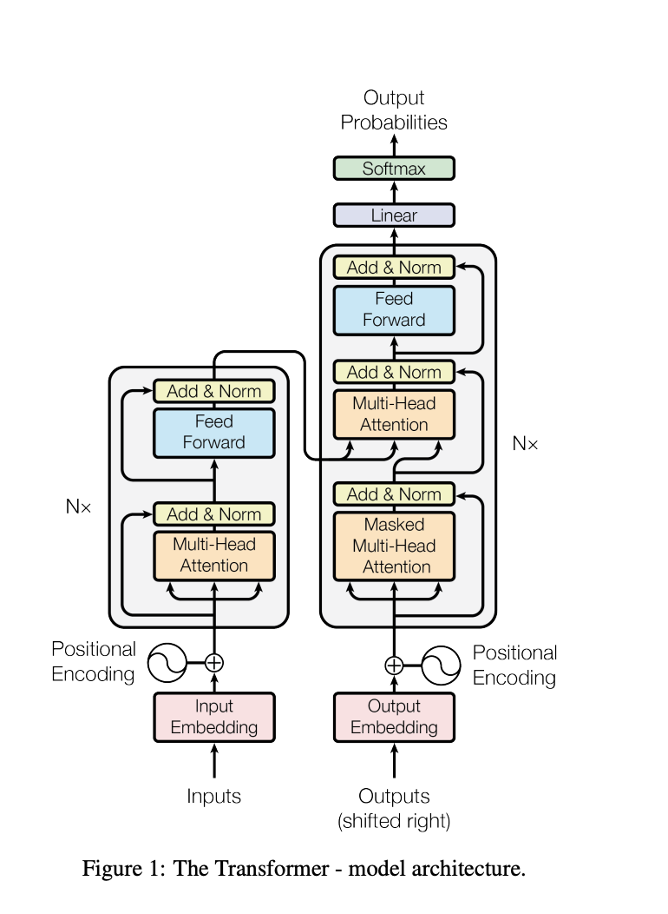

# Building GPT From Scratch: Pretraining A Tiny Transformer

This post is about teaching a small model to continue text.

## What To Expect

This blog follows the whole path from a text file to a small GPT-like model.

The full story is:

```text
1. Prepare the text
2. Train a first simple model
3. Validate it on text it did not train on
4. Add self-attention so the model can use earlier context
5. Build the Transformer by stacking attention blocks
6. Generate new text from the trained model
```

A GPT-like model is complicated, but the training idea is simple:
<span style="color:#8aff8a"><strong>use previous tokens to predict the next
token</strong></span>.

The first part prepares the data:

```text
text file
-> token ids
-> train/validation split
```

Then we train a tiny baseline model. It will not be impressive, but it gives us
the core training loop:

```text
input tokens
-> predict the next token
-> measure the mistake
-> update the model
```

Then we validate. Validation means we test the model on text it did not train
on. This tells us whether the model is learning patterns, not just memorizing.

After the training loop works, we make the model stronger. Self-attention lets
each token look back at earlier tokens and decide which ones matter.

The Transformer is the final shape: repeated attention blocks plus a few
supporting layers that make the model train well.

Memory hook:

```text
given previous tokens, predict the next token
```

## Tokenization

We give the model a text file, show it many examples of "what comes next?", and
train it to get better at guessing the next piece of text.

Skim version: before we build the model, we need to
<span style="color:#ffff99"><strong>turn text into numbers</strong></span>,
split the numbers into train and validation data, and decide how we will measure
whether the model is improving.

A computer cannot train directly on this:

```text
hello
```

It needs numbers.

Tokenization means <span style="color:#ffff99"><strong>choosing text pieces and
assigning each piece an integer id</strong></span>.

Tokenization is the step where we choose the pieces of text and give each piece
a number.

The pieces can be:

```text
characters: h, e, l, l, o
word chunks: hello
subword chunks: he, llo
```

For the first version, we use characters because they are easiest to see.

Suppose the whole text is:

```python
text = "hello"
```

First, collect every unique character:

```python
chars = sorted(list(set(text)))
print(chars)
```

This gives:

```text
['e', 'h', 'l', 'o']
```

Now give each character an id:

```python
stoi = {ch: i for i, ch in enumerate(chars)}
itos = {i: ch for i, ch in enumerate(chars)}

print(stoi)
```

One possible mapping is:

```text
{
  'e': 0,
  'h': 1,
  'l': 2,
  'o': 3,
}
```

Now `hello` can become numbers:

```python
encode = lambda s: [stoi[c] for c in s]
decode = lambda ids: ''.join(itos[i] for i in ids)

ids = encode("hello")
print(ids)
print(decode(ids))
```

Output:

```text
[1, 0, 2, 2, 3]
hello
```

That is the whole concept:

```text
text -> ids -> text
```

Sanity check: if <span style="color:#8aff8a"><strong>`decode(encode(text))`
gives back the original text</strong></span>, the basic tokenizer loop is
working.

The model trains on the ids:

```python
data = torch.tensor(encode(text), dtype=torch.long)
```

`encode(text)` makes a Python list of numbers. `torch.tensor(...)` turns that
list into the PyTorch format the model can use.

### Our Tokenizer vs tiktoken vs SentencePiece

All tokenizers do the same basic job:

```text
text <-> token ids
```

They differ in what they choose as a "piece" of text.

Our first tokenizer is character-level:

```text
hello -> h e l l o
```

This is simple and transparent, but it makes long sequences.

The GPT-2 tokenizer in `tiktoken` is already trained. It uses common chunks of
text, so it may represent `hello world` with far fewer tokens than a
character-level tokenizer.

For example:

```python
enc = tiktoken.get_encoding("gpt2")
ids = enc.encode("hello world")
print(ids)
print(enc.decode(ids))
```

Output:

```text
[31373, 995]
hello world
```

The GPT-2 tokenizer represents `hello world` with only two tokens. Our
character-level tokenizer represents the same text with eleven tokens:

```text
[55, 52, 59, 59, 62, 1, 70, 62, 65, 59, 51]
hello world
```

The key tradeoff is <span style="color:#93c5fd"><strong>codebook size versus
sequence length</strong></span>.

The codebook is the list of possible tokens. It is also called the vocabulary.

```text
small codebook:
few possible tokens
very long sequence of integers

large codebook:
many possible tokens
shorter sequence of integers
```

Our first tokenizer has a very small codebook: just the unique characters in the
text. In our setup, that is about `83` characters. This keeps the tokenizer easy
to understand, but it means the text becomes a very long sequence of integers.

The GPT-2 tokenizer uses a much larger codebook of subword pieces. Because
common chunks like `hello` or ` world` can become single tokens, the same text
can be represented with a shorter sequence of integers.

This matters because Transformers train on sequences of token ids. Longer
sequences mean:

```text
more positions to process
more memory use
more attention computation
less real text fits into the same context window
```

This is why GPT-like models typically use subword tokenization. It is a
practical middle ground:

```text
not as tiny as characters
not as huge and brittle as full words
usually much shorter than character sequences
```

```text
tiktoken GPT-2 = load existing tokenizer rules
```

SentencePiece is usually used to train or load tokenizer rules.

```text
SentencePiece library = tool
tokenizer.model = trained rules
```

So SentencePiece does not work just because the package is installed. It needs a
trained tokenizer model file, or you have to train one.

We start with character tokenization because it is
<span style="color:#8aff8a"><strong>intentionally simple</strong></span>. It
makes the data pipeline easy to inspect before we introduce more powerful
tokenizers.

## Train/Validation Split

If we train and test on the exact same text, we cannot tell whether the model is
learning or just memorizing.

Train data is for practice. Validation data checks whether the model learned
something useful <span style="color:#93c5fd"><strong>beyond the exact practice
text</strong></span>.

So we split the data into two parts:

```text
training data:
the part the model studies from

validation data:
the part we keep hidden while training, then use to check progress
```

In code:

```python
n = int(0.9 * len(data))
train_data = data[:n]
val_data = data[n:]
```

This means:

```text
first 90%  -> train
last 10%   -> validate
```

An intuition:

```text
training data = practice problems
validation data = quiz problems the model has not seen
```

If the model improves on training data but not validation data, it may be
memorizing the practice problems instead of learning the pattern.

For this language model, the main number we watch is usually loss.

```text
lower training loss:
the model is getting better on the text it studies

lower validation loss:
the model is also getting better on held-out text
```

### Metrics For LLM Pretraining

The main metrics are <span style="color:#ffff99"><strong>cross-entropy
loss</strong></span> and <span style="color:#ffff99"><strong>perplexity</strong></span>.

For next-token prediction, the main metric is cross-entropy loss.

The model looks at a context and produces a score for every possible next token.
After softmax, those scores become probabilities.

For example, after seeing:

```text
hello
```

the model might assign probabilities like:

```text
space: 0.40
!:     0.10
s:     0.05
other tokens: ...
```

If the true next token is `space`, the model did well because it gave the
correct token high probability.

If the true next token is `space` but the model gave it probability `0.001`,
the model was very surprised. Cross-entropy loss measures that surprise.

```text
high probability on the correct next token -> low loss
low probability on the correct next token  -> high loss
```

So during pretraining, we usually track:

```text
training loss:
surprise on the text the model trains on

validation loss:
surprise on held-out text
```

Lower validation loss means the model is getting better at predicting new text
from the same kind of data.

Another common metric is perplexity:

```text
perplexity = exp(loss)
```

Perplexity is another way to read the same signal. Intuitively:

```text
perplexity ~= how many likely next-token choices the model feels confused among
```

Lower perplexity is better.

```text
perplexity 100:
the model is very unsure

perplexity 10:
the model has narrowed the next token down much more

perplexity 2:
the model is very confident among a small number of likely choices
```

Loss and perplexity are useful because they match the actual pretraining task:

```text
given context, predict the next token
```

### Precision And Recall Intuition

Precision and recall are useful for many machine learning problems, but they are
<span style="color:#ff8a8a"><strong>not the main scorecard for next-token
pretraining</strong></span>.

Imagine a model that marks emails as spam.

Precision asks:

```text
When the model says "spam", how often is it right?
```

High precision means few false alarms.

Recall asks:

```text
Of all the real spam emails, how many did the model catch?
```

High recall means it misses very little spam.

The tradeoff:

```text
high precision:
be careful before saying yes

high recall:
try hard to catch every yes
```

Validation data is where these kinds of numbers matter. We want to measure the
model on examples it did not train on, because that is closer to how it will
behave on new data.

## Feeding Data In Chunks And Batches

We do <span style="color:#ff8a8a"><strong>not</strong></span> feed the whole
dataset into the model at once. The dataset can be millions of characters long,
which will never fit. Instead we feed small pieces.

There are two ideas here, and they are easy to mix up:

```text
block_size = how long ONE chunk is   (the time dimension)
batch_size = how many chunks at once (the batch dimension)
```

### Chunks And Block Size

We cut the data into chunks. The maximum length of a chunk is the
<span style="color:#ffff99"><strong>block size</strong></span>.

For our setup the block size is `8`. A chunk that trains on a block of `8`
actually needs `9` characters: `8` inputs plus the one extra character that is
the target for the last input.

```python
block_size = 8
x = train_data[:block_size]      # the 8 inputs
y = train_data[1:block_size+1]   # the same window, shifted by one = targets
```

One chunk of `9` characters is not one example. It is packed with
<span style="color:#8aff8a"><strong>8 individual examples</strong></span>:

```python
for t in range(block_size):
    context = x[:t+1]
    label = y[t]
    print(f"when input is {context} the target: {label}")
```

```text
when input is tensor([1])                       the target: 41
when input is tensor([ 1, 41])                  the target: 63
when input is tensor([ 1, 41, 63])              the target: 62
when input is tensor([ 1, 41, 63, 62])          the target: 67
when input is tensor([ 1, 41, 63, 62, 67])      the target: 7
when input is tensor([ 1, 41, 63, 62, 67,  7])  the target: 1
when input is tensor([ 1, 41, 63, 62, 67,  7,  1])      the target: 41
when input is tensor([ 1, 41, 63, 62, 67,  7,  1, 41])  the target: 63
```

The context grows one character at a time:

```text
chunk = 9 characters, block_size = 8

 chars:  1   41   63   62   67   7   1   41 | 63
         └─ x: the 8 inputs ──────────────┘   └ last target

 1                              -> 41
 1 41                           -> 63
 1 41 63                        -> 62
 1 41 63 62                     -> 67
 1 41 63 62 67                  -> 7
 1 41 63 62 67 7                -> 1
 1 41 63 62 67 7 1              -> 41
 1 41 63 62 67 7 1 41           -> 63
```

This is on purpose. We want the Transformer to learn to predict with
<span style="color:#93c5fd"><strong>as little as 1 character of context, and as
much as `block_size` characters</strong></span>. By the end of the chunk it has
seen every context length from `1` up to `block_size`.

The Transformer will <span style="color:#ff8a8a"><strong>never</strong></span>
see more than `block_size` characters at a time as input. Anything longer has to
be truncated down to the last `block_size` characters.

```text
context shorter than block_size -> fine, the model has seen these
context longer  than block_size -> truncate to the last block_size chars
```

### Batches And Batch Size

One chunk at a time would leave the GPU mostly idle. A GPU is happiest when it
has many independent pieces of work to crunch at once.

So we stack several chunks side by side and process them together. The number of
chunks we process in parallel is the
<span style="color:#ffff99"><strong>batch size</strong></span>.

```python
batch_size = 4   # how many independent sequences we process in parallel
block_size = 8   # the maximum context length for predictions
```

The chunks are <span style="color:#8aff8a"><strong>independent</strong></span>:
they do not talk to each other, and we pull them from
<span style="color:#93c5fd"><strong>random locations</strong></span> in the
training data so each batch is a fresh mix.

```python
torch.manual_seed(1337)

ix = torch.randint(len(train_data) - block_size, (batch_size,))
x = torch.stack([train_data[i:i+block_size]   for i in ix])
y = torch.stack([train_data[i+1:i+block_size+1] for i in ix])
```

Reading it line by line:

```text
ix : batch_size random offsets, each between 0 and len(data) - block_size
x  : block_size characters starting at each offset, stacked as rows
y  : the same windows shifted right by one, stacked as rows
```

`ix` is just `4` random starting points:

```text
ix = tensor([636549, 429903, 270558, 12140])   # shape [4]
```

Picture each offset landing somewhere random in the data, then grabbing the next
`8` characters:

```text
train_data: ........[chunk]...............[chunk]......[chunk]...[chunk].....
                     ^636549              ^429903     ^270558   ^12140
```

`x` stacks those four chunks into rows. `y` is the same four chunks shifted by
one, so every position in `x` has its next-character answer in `y`:

```text
x  (inputs)  shape [4, 8]        y  (targets) shape [4, 8]
[[62 61  4 67  1 70 48 66]       [[61  4 67  1 70 48 66 55]
 [70  1 66 55 56 65 67  1]        [ 1 66 55 56 65 67  1 48]
 [ 1 67 55 48 67  1 66 62]        [67 55 48 67  1 66 62 60]
 [66  1 69 52 65 72  1 55]]       [ 1 69 52 65 72  1 55 48]]
```

Look at the top-left: in `x` the value `62` sits at position `(0,0)`, and the
target at `y[0,0]` is `61` — the very next character. That is true for
every cell.

### What We Actually Feed The Transformer

Put the two ideas together and the input is a single `[batch_size, block_size]`
block of integers:

```text
x : shape [4, 8]   the inputs
y : shape [4, 8]   the targets, one for every position in x
```

That little `4 x 8` block is doing a lot of work. Each row contributes
`block_size` examples (context lengths `1` to `8`), and there are `batch_size`
rows, so one batch holds:

```text
batch_size * block_size = 4 * 8 = 32 independent examples
```

We can spell all `32` out by walking both dimensions:

```python
for b in range(batch_size):   # batch dimension: which chunk
    for t in range(block_size):   # time dimension: how far into the chunk
        context = x[b, :t+1]
        target = y[b, t]
        print(f"when input is {context.tolist()} the target: {target}")
```

```text
when input is [62]                       the target: 61
when input is [62, 61]                   the target: 4
...
when input is [62, 61, 4, 67, 1, 70, 48, 66]   the target: 55   <- end of row 0
when input is [70]                       the target: 1          <- row 1 starts
...
when input is [66, 1, 69, 52, 65, 72, 1, 55]   the target: 48   <- end of row 3
```

`32` separate "given this context, predict the next character" problems, all
packed into one tidy tensor and solved in a single forward/backward pass.

Memory hook:

```text
block_size = how far back one example can look
batch_size = how many examples we crunch at once
one batch = batch_size x block_size training examples
```

## The Bigram Model: Our First Baseline

Now we build the simplest possible model that can predict the next character: a
<span style="color:#ffff99"><strong>bigram language model</strong></span>. It will
not be good, but it gives us the full loop — a model, a loss, and text
generation — that the Transformer will later slot into.

The idea is almost too simple: <span style="color:#93c5fd"><strong>each token
directly looks up the scores for the next token</strong></span>. If I am
character `5`, I go to row `5` of a table and read off "given that I am `5`, here
is how likely every character is to come next." It only ever looks at the single
previous character — hence *bigram*.

```python
import torch
import torch.nn as nn
from torch.nn import functional as F
torch.manual_seed(1337)

class BigramLanguageModel(nn.Module):

    def __init__(self, vocab_size):
        super().__init__()
        # each token directly reads off the logits for the next token
        self.token_embedding_table = nn.Embedding(vocab_size, vocab_size)

    def forward(self, idx, targets=None):
        # idx and targets are both (B, T) tensors of integers
        logits = self.token_embedding_table(idx)   # (B, T, C)
        return logits
```

`nn.Embedding(vocab_size, vocab_size)` is just a lookup table with one row per
character, and each row has `vocab_size` numbers in it. Passing `idx` in returns
the matching rows.

### Logits Are Scores For The Next Character

The output is called <span style="color:#ffff99"><strong>logits</strong></span> —
a raw score for every possible next character. For each position in the input,
the model emits one score per character in the vocabulary.

```python
m = BigramLanguageModel(vocab_size)
logits = m(xb, yb)
print(logits.shape)
```

```text
torch.Size([4, 8, 83])
```

That shape is `(B, T, C)`, and these three letters show up everywhere from here
on:

```text
B = batch   : how many independent sequences   (4)
T = time    : position in the sequence, up to block_size   (8)
C = channels: one score per vocabulary character   (vocab_size = 83)
```

So for every one of the `4 x 8 = 32` positions, the model produces `83` scores.
A good model puts a <span style="color:#8aff8a"><strong>high number on the
correct next character</strong></span> and low numbers on the rest.

### Measuring The Loss

To score how wrong we are, we use
<span style="color:#ffff99"><strong>cross-entropy</strong></span> loss (the same
"negative log likelihood" idea from the metrics section): the logit at the
target character should be large, everything else small.

The catch is the shape. PyTorch's `F.cross_entropy` does not want
`(B, T, C)` — it wants the channels in the **second** dimension, i.e.
`(N, C)` for the logits and `(N,)` for the targets. Calling it directly fails:

```python
loss = F.cross_entropy(logits, targets)   # error: wrong shape
```

**Why does cross-entropy not just accept `(B, T, C)`?** Because to it, a
"position" is one prediction problem: a row of `C` scores plus the one correct
answer. It does not care that our positions happen to be arranged in a `B x T`
grid (4 sequences, 8 characters each). It only wants a flat list of prediction
problems.

We have `B x T` positions, and each is an independent "predict the next
character" problem. So we flatten the batch and time grid into one long
list — every position becomes just another row — and flatten the targets the
same way so they still line up:

```python
def forward(self, idx, targets=None):
    logits = self.token_embedding_table(idx)   # (B, T, C)

    if targets is None:
        loss = None
    else:
        B, T, C = logits.shape
        logits = logits.view(B*T, C)   # (B*T, C) -> stack all positions
        targets = targets.view(B*T)    # (B*T,)
        loss = F.cross_entropy(logits, targets)

    return logits, loss
```

Picture it with our real numbers (`B = 4`, `T = 8`, `C = 83`). The `view`
flattens the first two axes into one, leaving the row of `83` scores untouched:

```text
logits BEFORE: (B, T, C) = (4, 8, 83)        a 4x8 GRID of positions,
                                             each position = 83 scores

      seq 0:  [pos0][pos1]...[pos7]          each [posX] is a length-83 row
      seq 1:  [pos0][pos1]...[pos7]
      seq 2:  [pos0][pos1]...[pos7]
      seq 3:  [pos0][pos1]...[pos7]

                    | logits.view(B*T, C)
                    | stack every row into one tall list
                    v

logits AFTER:  (B*T, C) = (32, 83)           a flat LIST of 32 positions,
                                             each still 83 scores
      row 0:  [83 scores]   <- was seq0/pos0
      row 1:  [83 scores]   <- was seq0/pos1
      ...
      row 31: [83 scores]   <- was seq3/pos7
```

The targets ride along the same way — one correct character id per position, so
`(B, T)` becomes a flat `(B*T,)` in the exact same order:

```text
targets BEFORE: (B, T) = (4, 8)     [[c, c, ..., c],   <- 8 answers for seq 0
                                     [c, c, ..., c],
                                     [c, c, ..., c],
                                     [c, c, ..., c]]

                    | targets.view(B*T)
                    v

targets AFTER:  (B*T,) = (32,)      [c, c, c, ... , c]  <- 32 answers in a row
```

Order is what makes this safe: `view` does not shuffle anything, so `logits` row
`i` and `targets` entry `i` are still the same position. Now the shapes match
what `F.cross_entropy` wants — `(N, C)` scores and `(N,)` answers, with
`N = B*T = 32` — and it can score all `32` predictions at once.

```text
F.cross_entropy( (32, 83) logits , (32,) targets )  ->  one average loss number
```

We can sanity-check the number before any training. With `83` characters and no
learning at all, the best a model can do is guess uniformly — probability
`1/83` on the right answer. That gives an expected loss of:

```text
-ln(1 / 83) = ln(83) ~= 4.41
```

Our untrained model prints about `4.9` — a little worse than `4.41`, because the
random initial weights are not even uniform yet. Close to the expected value is
the sign we wanted: nothing is badly broken.

### Generating Text

`generate` makes the model write new text. You hand it some starting text, and
it repeatedly does one thing: <span style="color:#8aff8a"><strong>predict one
character, stick it on the end</strong></span>. Each loop makes the text one
character longer.

The text-so-far lives in `idx`, a tensor of character ids with shape `(B, T)`:

```text
B = how many sequences we are writing at once
T = how many characters are in each sequence RIGHT NOW
```

`T` is just a length counter. Every loop appends one character, so `T` ticks up
by one: `T -> T+1 -> T+2 -> ...`. That is the whole "grows one character at a
time" idea — the tensor gains one column each pass:

```text
idx shape over time (with B = 1):

  start        T = 1     [[0]]
  after pass 1 T = 2     [[0, 41]]
  after pass 2 T = 3     [[0, 41, 12]]
  after pass 3 T = 4     [[0, 41, 12, 7]]
                                     ^ newest character, appended each loop
```

And "for every sequence in the batch at once" just means: if `B = 3`, it writes
three separate texts in parallel, adding one character to *all three* each loop:

```text
            after pass 1      after pass 2
  text 0:   [0, 41]           [0, 41, 12]
  text 1:   [0,  7]           [0,  7, 53]
  text 2:   [0, 22]           [0, 22,  9]
            \____ one column added to every row, every pass ____/
```

In our run we only generate one sequence (`B = 1`), so you can ignore the batch
part for now — it is there only because the same code handles many at once.

```python
def generate(self, idx, max_new_tokens):
    # idx is (B, T) array of indices in the current context
    for _ in range(max_new_tokens):
        logits, loss = self(idx)            # targets is None -> loss is None
        logits = logits[:, -1, :]           # focus on the last step: (B, C)
        probs = F.softmax(logits, dim=-1)   # scores -> probabilities (B, C)
        idx_next = torch.multinomial(probs, num_samples=1)   # sample (B, 1)
        idx = torch.cat((idx, idx_next), dim=1)   # append: (B, T+1)
    return idx
```

Walking the loop:

```text
1. self(idx)        -> run the model. No targets here, so loss is None;
                       we do not have answers when generating.
2. logits[:, -1, :] -> keep only the LAST position's scores. That is the
                       prediction for the next character.
3. softmax          -> turn raw scores into a probability distribution.
4. multinomial      -> sample one character from that distribution
                       (not always the top one — sampling adds variety).
5. torch.cat        -> glue the new character onto the running sequence.
```

The tricky part is how the **shape changes** at each step. Here is one pass
through the loop, following the tensor (using `B = 1`, current length `T = 3`,
vocabulary `C = 83`):

```text
  idx                       (B, T)     = (1, 3)     the text so far: [[0, 41, 12]]
   |
   |  self(idx)  -> score every position
   v
  logits                    (B, T, C)  = (1, 3, 83) a row of 83 scores per position
   |
   |  logits[:, -1, :]  -> throw away all but the LAST position
   v
  logits                    (B, C)     = (1, 83)    83 scores for the next char only
   |
   |  softmax  -> normalize scores into probabilities (still 83 numbers)
   v
  probs                     (B, C)     = (1, 83)    e.g. [0.01, 0.00, 0.07, ...]
   |
   |  multinomial  -> draw ONE character id from those probabilities
   v
  idx_next                  (B, 1)     = (1, 1)     e.g. [[7]]
   |
   |  torch.cat((idx, idx_next), dim=1)  -> append to the end
   v
  idx                       (B, T+1)   = (1, 4)     [[0, 41, 12, 7]]
```

Read top to bottom: we go from the whole sequence, to scores for *every*
position, down to scores for just the *last* position, to probabilities, to a
single sampled character, and finally back to a sequence that is one character
longer. That last `idx` becomes the input to the next pass, and the cycle
repeats.

The two shape moves that trip people up:

```text
logits[:, -1, :] : (B, T, C) -> (B, C)   drop the time axis, keep last step
torch.cat(...)   : (B, T)    -> (B, T+1) add one column back on
```

One quirk worth noticing: we pass the
<span style="color:#93c5fd"><strong>entire</strong></span> growing `idx` into the
model every step, but the bigram only ever uses the
<span style="color:#8aff8a"><strong>last character</strong></span> — it ignores
everything before it. That is wasteful here, but we write it this general way on
purpose, because the Transformer *will* use the whole history.

To kick generation off, we feed a single starting character — index `0`, which
is the newline character:

```python
print(decode(m.generate(idx=torch.zeros((1, 1), dtype=torch.long),
                        max_new_tokens=100)[0].tolist()))
```

```text
cLEvM9zu|Kx-bb!FKG52'G g8,?J'C?MNatIZlDZnrjxzu0:SH4u'Ye a|5"|ohDrH' ,-o8to ap"N;FlR'Ykv1Q"m0?j b|!
```

Pure gibberish — which is exactly right for an untrained model. The plumbing
works end to end: model -> logits -> loss -> sampled text. All that is left is to
actually train it, and later to replace the lookup table with attention.

Memory hook:

```text
logits  = raw scores for the next character, shape (B, T, C)
loss    = cross-entropy, after reshaping to (B*T, C) and (B*T)
generate = predict last step -> softmax -> sample -> append -> repeat
```

## Training The Model

So far the model has random weights, which is why it produces gibberish.
Training means <span style="color:#8aff8a"><strong>nudging those weights, over
and over, so the loss goes down</strong></span> — so the model puts more
probability on the character that actually comes next.

### The Optimizer

First we create an optimizer. Its whole job is to take the weights and update
them using the gradients we compute.

```python
optimizer = torch.optim.AdamW(m.parameters(), lr=1e-3)
```

We use <span style="color:#ffff99"><strong>Adam</strong></span> (here the `AdamW`
variant). You can think of it as a smarter version of plain gradient descent: it
keeps a little memory of past gradients and adapts the step size per weight, so
it trains faster and more reliably. For a tiny model like this we can also afford
a higher learning rate, `1e-3`.

```text
lr (learning rate) = how big a step we take each update
   too small -> learns very slowly
   too big   -> overshoots and the loss bounces around
```

Because this model is so small, we also bump the batch up to `32`, so each step
learns from more examples at once:

```python
batch_size = 32   # more sequences per step than the 4 we used to demo
```

### The Loop

Now we repeat the same four moves thousands of times. Each pass is one *step*:

```python
batch_size = 32
for steps in range(10000):   # increase number of steps for good results...

    # sample a batch of data
    xb, yb = get_batch('train')

    # evaluate the loss
    logits, loss = m(xb, yb)
    optimizer.zero_grad(set_to_none=True)
    loss.backward()
    optimizer.step()

print(loss.item())
```

What each line means:

```text
get_batch('train')  -> grab a fresh random batch of chunks (the data feeder
                       from earlier). New examples every step = no memorizing
                       one fixed batch.

m(xb, yb)           -> forward pass. Run the model and measure the loss:
                       how wrong are these predictions?

optimizer.zero_grad -> reset gradients to zero. PyTorch ADDS up gradients by
                       default, so we must clear last step's before computing
                       this step's, or they pile up.

loss.backward()     -> backward pass. Work out, for every weight, which
                       direction would lower the loss (the gradients).

optimizer.step()    -> actually move the weights a small step in that
                       direction. This is the moment learning happens.
```

A clean mental model of one step:

```text
  sample batch  ->  forward (get loss)  ->  zero_grad  ->  backward  ->  step
       ^                                                                  |
       |__________________ repeat 10,000 times ___________________________|

  each lap: how wrong are we?  ->  which way is better?  ->  nudge that way
```

The order of `zero_grad -> backward -> step` matters: clear the old gradients,
compute fresh ones, then take the step. After `10000` steps our loss drops from
the starting `~4.9` to about:

```text
2.286759376525879
```

Lower loss means less surprise — the model is genuinely predicting better now,
not guessing uniformly.

### Generating Again

The real payoff is sampling from the *trained* model. Same `generate` call, now
asking for `300` characters:

```python
print(decode(m.generate(idx=torch.zeros((1, 1), dtype=torch.long),
                        max_new_tokens=300)[0].tolist()))
```

```text
Thitheap ry dmey whd s y Thecomoy Lisorioupt imy's s hien. bund ppen actuathexcan t e a licarid cifurch
To Her an wed le sid wapus s and ly mext|>
Heno aill mm, he he. ga, tened waind s ued wake ft't Mait deakny brarote a goowied." tatodlerket g e s hed tit be, npy Sherfled. mbee bawobon he tonthew
```

Still not English — but compare it to the earlier gibberish. There are now real
word shapes, spaces in sensible places, capital letters after line breaks. A
bigram can only ever look one character back, so this is about as good as it
gets. To do better, the model needs to look at *more* of the context — which is
exactly what self-attention and the Transformer will add next.

Memory hook:

```text
optimizer = the thing that updates weights from gradients (we use AdamW)
one step  = sample batch -> forward (loss) -> zero_grad -> backward -> step
training  = repeat the step thousands of times until loss stops dropping
```

## The Math Trick At The Heart Of Self-Attention

Everything so far has each token predicting on its own. The bigram never lets
tokens *talk to each other* — token 5 has no idea what tokens 1–4 were. Real
language needs context, so we need a way for tokens to <span style="color:#8aff8a"><strong>communicate</strong></span>.
Before the full self-attention machinery, there is a small mathematical trick
that makes that communication cheap. This section builds the intuition; the next
ones will show progressively faster ways to do the same thing.

### The Setup: B, T, C

We work with a tensor of shape `(B, T, C)`:

```text
B  = batch        -> how many independent sequences we process at once
T  = time         -> positions in the sequence (our 8 tokens, in order)
C  = channels     -> the vector of information stored at each position
```

So for one sequence we have `T = 8` tokens lined up in time, and each token
carries a `C`-dimensional vector describing it.

### The Rule: Information Only Flows Forward

The 8 tokens are currently <span style="color:#ff8a8a"><strong>not talking to each
other</strong></span>. We want to couple them — but in a very specific way.

Token at position 5 may look at positions 1, 2, 3, 4 and itself. It must
<span style="color:#ff8a8a"><strong>never</strong></span> look at positions 6, 7, 8.
Those are *future* tokens, and the whole game is to predict the future — if we
let a token peek ahead, we'd be cheating.

```text
position:     1     2     3     4     5     6     7     8
                                      ^
                              "I am token 5"

  can see:  [ 1 ]-[ 2 ]-[ 3 ]-[ 4 ]-[ 5 ]   X     X     X
            \________ past + present ______/  \__ future __/
                  information flows ->            (off-limits)
```

Information only flows from <span style="color:#93c5fd"><strong>previous context to
the current timestep</strong></span>. Never backward from the future.

### The Easiest Way To Communicate: Average The Past

What is the simplest possible way for token 5 to gather its history? Just
<span style="color:#ffff99"><strong>take the average of itself and all previous
tokens</strong></span>.

If I am token 5, I grab the channel vectors at steps 1, 2, 3, 4, 5, add them up,
and divide by 5. That average becomes a new feature vector that summarizes
<span style="color:#8aff8a"><strong>"me, in the context of my history."</strong></span>

```text
token 1:  x[1]                                  -> avg of {1}
token 2:  x[1], x[2]                            -> avg of {1,2}
token 3:  x[1], x[2], x[3]                      -> avg of {1,2,3}
token 4:  x[1], x[2], x[3], x[4]                -> avg of {1,2,3,4}
token 5:  x[1], x[2], x[3], x[4], x[5]          -> avg of {1,2,3,4,5}
                                                       ^
                            each token's new value = mean of itself + its past
```

Every position ends up holding the running average of everything up to and
including it — a tiny summary of its own backstory.

### Why Averaging Is Weak (But Fine For Now)

An average is <span style="color:#ff8a8a"><strong>lossy</strong></span>. It throws
away *which* token came where — the order and spacing of the past all collapse
into one blurred mean. It is an extremely weak form of communication.

That's okay. We start with the crudest version to get the mechanics right, then
upgrade it. Coming up next: the same "average the past" idea written several
different ways — first with loops, then with matrix multiplication, and finally
in the form that turns into real self-attention.

Memory hook:

```text
(B, T, C)   = batch, time (positions), channels (info per token)
the rule    = a token may only see itself + earlier tokens, never the future
the trick   = each token = average of itself and all previous tokens
why average = simplest way to mix the past; lossy, but we fix that later
```

## Three Ways To Average The Past

We'll now write that "average my history" idea **three different ways**. They
all produce the *exact same numbers* — the journey from version 1 to version 3 is
the journey from a slow loop to the operation that becomes real self-attention.

### Version 1: The Obvious For-Loop ("bag of words")

The direct way: literally loop over every batch and every time step, grab the
tokens up to now, and average them.

```python
# We want x[b,t] = mean_{i<=t} x[b,i]
xbow = torch.zeros((B, T, C))
for b in range(B):              # each sequence in the batch, independently
    for t in range(T):          # each position in time
        xprev = x[b, :t+1]      # (t+1, C) -> this token + everything before it
        xbow[b, t] = torch.mean(xprev, 0)   # average over the time dimension
```

The name <span style="color:#ffff99"><strong>`xbow`</strong></span> stands for
**"bag of words"** — when you average up a set of word/token embeddings and
forget their order, you're treating them like an unordered *bag*. That's exactly
what this does at every position.

Reading the loop:

```text
b loops over batches         -> handle each sequence on its own
t loops over time            -> handle each position on its own
xprev = x[b, :t+1]           -> shape (t+1, C): how many tokens are "in the past"
                                grows as t grows -> 1, then 2, then 3, ...
torch.mean(xprev, 0)         -> average DOWN the time axis (dim 0),
                                leaving one (C,) vector: the running summary
```

What comes out — position 1 is unchanged (it only has itself), position 2 is the
average of rows 1–2, position 3 the average of rows 1–3, and so on:

```text
        x  (one sequence, T rows of C channels)        xbow (the averages)

  t=1   [ a ........... ]                               [ a ]               <- just itself
  t=2   [ b ........... ]                               [ (a+b)/2 ]         <- avg of 1..2
  t=3   [ c ........... ]            ===>               [ (a+b+c)/3 ]       <- avg of 1..3
  t=4   [ d ........... ]                               [ (a+b+c+d)/4 ]     <- avg of 1..4
   :                                                     :
```

It works, but those Python loops are slow. We'd love to do this with **one**
fast operation. That operation is matrix multiplication.

### A Quick Detour: Matrix Multiply As Weighted Sums

Before version 2, here's the key insight that makes it click. A matrix multiply
`a @ b` produces, for each output row, a **weighted sum of the rows of `b`** —
and the weights are the numbers in the corresponding row of `a`.

Start with `a` as all ones:

```python
a = torch.ones(3, 3)
b = torch.randint(0, 10, (3, 2)).float()
c = a @ b
```

```text
   a (3x3)          b (3x2)            c = a @ b  (3x2)
 [1 1 1]          [2  7]             [14  16]   <- 2+6+6 , 7+4+5  (sum of ALL rows)
 [1 1 1]    @     [6  4]      =      [14  16]   <- same
 [1 1 1]          [6  5]             [14  16]   <- same
```

Every row of `a` is `[1 1 1]`, so every output row is the **sum of all rows of
`b`**. Now the magic — make `a` lower-triangular with `torch.tril`:

```python
a = torch.tril(torch.ones(3, 3))
```

```text
torch.tril keeps the lower-left triangle, zeros above the diagonal:

 [1 0 0]
 [1 1 0]
 [1 1 1]
```

Multiply again and watch what the zeros do — they **switch off** the future rows:

```text
   a (tril)         b                 c = a @ b
 [1 0 0]          [2  7]             [ 2   7]   <- 1*row1                = row1 only
 [1 1 0]    @     [6  4]      =      [ 8  11]   <- 1*row1 + 1*row2       = rows 1..2
 [1 1 1]          [6  5]             [14  16]   <- row1 + row2 + row3    = rows 1..3
```

The zeros in `a` mean "ignore that row." Row 1 of the answer sees only the first
row of `b`; row 2 sees the first two; row 3 sees all three. **This is exactly the
"only look at the past" rule, expressed as a matrix.** Right now it gives *sums*,
though — we want *averages*. So normalize each row of `a` to sum to 1:

```python
a = torch.tril(torch.ones(3, 3))
a = a / torch.sum(a, 1, keepdim=True)   # divide each row by its own sum
```

```text
 [1.0000  0       0     ]      row sums to 1   -> weights are all 1/(count so far)
 [0.5000  0.5000  0     ]
 [0.3333  0.3333  0.3333]

   a (normalized)    b                 c = a @ b
 [1.00 0    0   ]   [2  7]            [2.0000  7.0000]   <- just row1
 [0.50 0.50 0   ] @ [6  4]     =      [4.0000  5.5000]   <- average of rows 1..2
 [0.33 0.33 0.33]   [6  5]            [4.6667  5.3333]   <- average of rows 1..3
```

Now each output row is a **weighted average of the past** — and the lower-
triangular shape guarantees we never reach into the future. (`keepdim=True` keeps
the sum as a column `(3,1)` so broadcasting divides each row correctly.)

### Version 2: The Same Average, As One Matrix Multiply

Apply that detour to the real tensor. Build a `(T, T)` weight matrix `wei`, then
multiply it by `x`:

```python
# version 2: using matrix multiply for a weighted aggregation
wei = torch.tril(torch.ones(T, T))
wei = wei / wei.sum(1, keepdim=True)
xbow2 = wei @ x       # (T, T) @ (B, T, C) ---> (B, T, C)
torch.allclose(xbow, xbow2)   # True
```

The `wei` matrix is just the normalized triangle, now `8x8`:

```text
wei  (each row = "how much of each past token to blend in")
[1.000 0     0     0     0     0     0     0    ]   pos 1: 100% itself
[0.500 0.500 0     0     0     0     0     0    ]   pos 2: half + half
[0.333 0.333 0.333 0     0     0     0     0    ]   pos 3: thirds
[0.250 0.250 0.250 0.250 0     0     0     0    ]   pos 4: quarters
[0.200 0.200 0.200 0.200 0.200 0     0     0    ]   ...
[0.167 0.167 0.167 0.167 0.167 0.167 0     0    ]
[0.143 0.143 0.143 0.143 0.143 0.143 0.143 0    ]
[0.125 0.125 0.125 0.125 0.125 0.125 0.125 0.125]   pos 8: averages all 8
```

About the shapes — `wei` is `(T, T)` and `x` is `(B, T, C)`. They don't match, so
PyTorch <span style="color:#93c5fd"><strong>broadcasts</strong></span> `wei`
across the batch and runs a **batched matrix multiply** in parallel:

```text
        (T, T)  @  (B, T, C)
   PyTorch adds a batch dim ->  (B, T, T) @ (B, T, C)
   per batch element:           (T, T) @ (T, C)  =  (T, C)
   stacked back up:             (B, T, C)
```

`torch.allclose(xbow, xbow2)` returns `True` — the slow loop and the one-line
matmul give identical results. We just replaced two Python loops with a single
GPU-friendly operation.

### Version 3: Softmax — The Version That Becomes Attention

Version 3 produces the *same* averages again, but assembles `wei` in a way that
sets us up for real attention. Watch the four steps:

```python
# version 3: use Softmax
tril = torch.tril(torch.ones(T, T))
wei = torch.zeros((T, T))
wei = wei.masked_fill(tril == 0, float('-inf'))
wei = F.softmax(wei, dim=-1)
xbow3 = wei @ x
torch.allclose(xbow, xbow3)   # True
```

Step by step, watching `wei` transform:

```text
(1) tril = lower-triangular ones        (2) wei = zeros, then masked_fill
    -- the "who may talk" mask --           -- future positions -> -inf --

  [1 0 0 0 0 0 0 0]                        [0  -inf -inf -inf -inf -inf -inf -inf]
  [1 1 0 0 0 0 0 0]                        [0   0   -inf -inf -inf -inf -inf -inf]
  [1 1 1 0 0 0 0 0]                        [0   0    0   -inf -inf -inf -inf -inf]
  [1 1 1 1 0 0 0 0]            ===>        [0   0    0    0   -inf -inf -inf -inf]
  [1 1 1 1 1 0 0 0]                        [0   0    0    0    0   -inf -inf -inf]
   ...                                      ...
```

```text
(3) softmax along each row (dim=-1)     -> exponentiate, then divide by row sum

  exp(0) = 1   and   exp(-inf) = 0

  so each row of -inf/0 values turns straight back into the averaging weights:

  [1.000 0     0     0    ...]
  [0.500 0.500 0     0    ...]
  [0.333 0.333 0.333 0    ...]
   ...                              <- IDENTICAL to wei from version 2
```

`-inf` becomes `0` after softmax (a future token gets **zero weight** — it is not
aggregated), and the remaining `0`s become equal positive weights that sum to 1.
`torch.allclose(xbow, xbow3)` is `True` yet again.

### Why Bother With Version 3?

Versions 1 and 2 hard-code a flat average — every past token counts equally. But
look at what `wei` actually *is* in version 3:

```text
wei = torch.zeros((T,T))                          <- start: all affinities 0
wei = wei.masked_fill(tril == 0, float('-inf'))   <- future: forbidden (-inf)
wei = F.softmax(wei, dim=-1)                       <- turn into weights that sum to 1
```

Read `wei` as a table of <span style="color:#8aff8a"><strong>affinities</strong></span>
— *how interesting does each past token find every other past token?*

```text
        wei[t, i]  =  "how much should position t pull in info from position i?"

        right now we START these affinities at zero (a flat average),
        but they DO NOT have to stay flat.
```

Here's the whole point:

```text
  zeros        ->  affinities begin neutral; nothing is special yet
  masked_fill  ->  the future is set to -inf: those tokens CAN'T communicate
  softmax      ->  -inf -> 0 weight (blocked), the rest -> data-dependent weights

  In real attention these affinities are NOT fixed. They are computed from the
  tokens themselves, so a token can decide some past tokens are far more
  interesting than others -- and weight them more heavily.
```

So the long story, in one line:

> You can do a **weighted aggregation of your past** with a matrix multiply, where
> a **lower-triangular** matrix says *which* tokens may contribute, and the values
> in it say <span style="color:#ffff99"><strong>how much of each past token fuses
> into the current position</strong></span>.

A flat average was just the special case where all the weights are equal.
Self-attention is what happens when we let the data *learn* those weights — that
is the very next step.

Memory hook:

```text
v1 (loop)    = for each t, average x[:t+1]   -- correct but slow ("bag of words")
v2 (matmul)  = wei @ x, wei = normalized tril -- same numbers, one fast op
v3 (softmax) = zeros -> mask future to -inf -> softmax -> wei @ x  -- same again
tril         = the "only see the past" rule, written as a matrix
wei          = affinities: HOW MUCH of each past token fuses into position t
the punchline= let wei be LEARNED from the data -> that is self-attention
```

---

## Self-Attention: Letting Tokens Decide Who To Listen To

Everything so far used `wei = torch.zeros((T, T))` — a **flat average**. Every past
token counts exactly the same:

```text
   wei (the flat average)              what it means

  [1.00  0     0    ...]               token 4 listens to tokens 1,2,3,4
  [0.25  0.25  0.25  0.25 ...]         ...with EQUAL weight to each
        ^^^^^^^^^^^^^^^^^^
        uniform -- boring -- token 4 has no opinion about WHO matters
```

But that is not how language works. Different tokens care about different things:

```text
   a vowel scanning the past for a consonant:

   "...   t   h   e        c   a [t]"            <- I am 'a', a vowel
                                  ^
          I don't care equally about every past token.
          I'm specifically HUNTING for consonants near me.

          I want to pull in a LOT from 'c' and 't', a little from 'the'.
```

We want each token to gather from the past in a
<span style="color:#8aff8a"><strong>data-dependent</strong></span> way — weights that
*depend on the actual tokens*, not a fixed flat average. **Self-attention** is the
mechanism that makes this happen.

### The Big Idea: Query and Key

Every token emits **two little vectors**:

```text
   ┌─────────────────────────────────────────────────────────────┐
   │  QUERY  (q)  =  "what am I looking for?"                      │
   │                  e.g. 'a' the vowel: "I want a consonant"     │
   │                                                               │
   │  KEY    (k)  =  "what do I contain / what am I?"              │
   │                  e.g. 'c': "I am a consonant"                 │
   └─────────────────────────────────────────────────────────────┘
```

How do we measure whether token A's *query* matches token B's *key*? **Dot product.**

```text
   affinity(A, B)  =  q_A · k_B      (a single number)

   q_A and k_B point the SAME way   ->   big dot product   ->  HIGH affinity
   q_A and k_B unrelated            ->   ~zero dot product  ->  low affinity

   "the vowel's query lines up with the consonant's key -> they bond"
```

So the `wei` table — which used to be hard-coded zeros — is now **built from the
tokens themselves**: every entry `wei[t, i]` is the dot product of token `t`'s query
with token `i`'s key.

### A Single Head Of Self-Attention (the code)

```python
# let's see a single Head perform self-attention
head_size = 16
key   = nn.Linear(C, head_size, bias=False)
query = nn.Linear(C, head_size, bias=False)
value = nn.Linear(C, head_size, bias=False)

k = key(x)     # (B, T, 16)
q = query(x)   # (B, T, 16)
wei = q @ k.transpose(-2, -1)   # (B, T, 16) @ (B, 16, T) ---> (B, T, T)

tril = torch.tril(torch.ones(T, T))
# wei = torch.zeros((T, T))     # <- the OLD flat version, now replaced
wei = wei.masked_fill(tril == 0, float('-inf'))
wei = F.softmax(wei, dim=-1)

v = value(x)
out = wei @ v   # instead of  wei @ x

out.shape   # torch.Size([4, 8, 16])
```

### What `nn.Linear` Actually Does

`nn.Linear(in_features, out_features, bias=False)` is just a matrix multiply. It
holds a weight matrix and maps each token's `C`-dim vector down to `head_size`:

```text
   nn.Linear(C, head_size, bias=False)

      weight  W : shape (head_size, C)   <- learned, init'd random (Kaiming uniform)
      bias      : NONE here (bias=False), otherwise a (head_size,) vector added on

   for one token vector  x_t  of shape (C,):

      k_t = W @ x_t      ->  shape (head_size,) = (16,)

   "take this token's 32 numbers, mix them into 16 numbers that ARE its key"
```

Three separate Linears = three different learned projections of the same token:

```text
        x_t (C=32)
          │
     ┌────┼────┬─────────┐
     ▼    ▼              ▼
   key  query         value          each is its own (head_size, C) matrix
     │    │              │
     ▼    ▼              ▼
   k_t  q_t            v_t   (each 16-dim)
  "what  "what          "what I'll
   I am"  I want"        actually share"
```

### Walking The Dimensions

First, the symbols we use everywhere below — kept distinct **on purpose** so no two
ever collide:

```text
   B  = batch       = 4    independent sequences in the minibatch
   T  = block_size  = 8    tokens per sequence (time steps)
   C  = n_embd      = 32   channels per token (the embedding width)

   head_size = how wide ONE head's q/k/v vectors are
             = 16 here  (we just picked it — with a single head it's free
                         to be anything; later, multiple heads will FORCE
                         this number, but we're not there yet)

   Batch is 4 (NOT 32) on purpose, so "32" ALWAYS means channels, never batch.
```

```text
   x       : (B, T, C)  = (4, 8, 32)   <- batch of 4, 8 tokens each, 32 channels

   k = key(x)     -> (B, T, 16)        every token gets a 16-dim KEY
   q = query(x)   -> (B, T, 16)        every token gets a 16-dim QUERY

   wei = q @ k.transpose(-2, -1)

         q                k.transpose(-2,-1)         wei
     (B, T, 16)    @       (B, 16, T)        --->   (B, T, T)
     (4, 8, 16)    @       (4, 16, 8)        --->   (4, 8, 8)
```

Why does that shape work out to `(T, T)`? Because matrix-multiplying *all queries*
against *all keys* gives **every (query, key) pair** at once:

```text
              k1   k2   k3  ...  k8        (keys along the top)
            ┌────────────────────────┐
        q1  │ q1·k1 q1·k2 ...        │     row t = token t's QUERY
        q2  │ q2·k1 q2·k2 ...        │     dotted against EVERY key
        q3  │ q3·k1 q3·k2 ...        │
        ... │                        │     entry (t, i) = q_t · k_i
        q8  │ ...              q8·k8  │                 = affinity of t for i
            └────────────────────────┘
                                          shape: (T, T) = (8, 8)
```

The key change from before:

```text
   OLD:  wei = zeros   ->  SAME flat table reused for every batch element
   NEW:  wei = q @ kᵀ  ->  EACH batch element gets its OWN table,
                            because each has its own tokens -> own q, k

   wei is no longer a constant. It is DATA-DEPENDENT.
```

### Mask + Softmax (same two steps as before)

The raw affinities `wei[0]` (one batch element, **before** masking) are just numbers
— positive where query/key align, negative where they don't:

```text
   wei[0]  (raw scores, q·k)              after masked_fill(tril==0, -inf)

  [-1.76  0.55 -0.83  ...]               [-1.76  -inf  -inf  -inf ...]
  [-3.33 -1.66  2.04  ...]    mask the   [-3.33 -1.66  -inf  -inf ...]
  [-1.02 -1.26  0.08  ...]    future     [-1.02 -1.26  0.08  -inf ...]
   ...                        ───────>    ...
```

The mask is the **same `tril` trick** — a token still may not see the future. Then
softmax turns each row into weights that sum to 1:

```text
   wei[0]  after  F.softmax(dim=-1)   -- now DATA-DEPENDENT weights:

   row 6 (token 6 deciding who to listen to):
   [0.0176, 0.2689, 0.0215, 0.0089, 0.6812, 0.0019,  0,  0]
              ▲▲▲▲                   ▲▲▲▲▲▲
            position 2             position 5
          "kind of interesting"  "VERY interesting"

   token 6's query lined up strongly with position 5's key (0.68),
   somewhat with position 2's key (0.27), and basically ignored the rest.

   Compare to the OLD flat average, which would have given every
   past token 1/6 = 0.167.  Self-attention has OPINIONS.
```

### The Value Vector: What A Token Shares

One last piece. We do **not** aggregate the raw token `x` anymore. Each token also
emits a **value** `v = value(x)`, and *that* is what gets aggregated:

```text
   out = wei @ v          (not  wei @ x)

      x_t  =  the token's PRIVATE identity (all 32 channels of raw info)
      v_t  =  "if you decide to listen to me, THIS is what I'll tell you"

   think of it as:
      q  =  what I'm looking for
      k  =  what I am (for matching purposes)
      v  =  what I actually deliver if matched
```

```text
   out = wei @ v

     (B, T, T)   @   (B, T, 16)   --->   (B, T, 16)
     (4, 8, 8)   @   (4, 8, 16)   --->   (4, 8, 16)

   each output token = weighted sum of the VALUES of the tokens it chose to attend to
```

So `out` comes out `head_size`-dim (16), not `C`-dim — the head has gathered the
past into a fresh 16-dim summary, weighted by genuine, learned interest.

### Memory hook

```text
problem  = flat average treats every past token equally -- no opinions
fix      = self-attention: gather from the past in a DATA-DEPENDENT way

each token emits 3 vectors (via nn.Linear projections of x):
   query (q) = what am I looking for?
   key   (k) = what do I contain?
   value (v) = what will I share if you listen to me?

wei = q @ kᵀ          -> affinity of every token for every other (B,T,T)
   (replaces the old hard-coded zeros -- now built FROM the tokens)
mask -inf + softmax   -> still no peeking at the future; rows sum to 1
out = wei @ v         -> weighted sum of VALUES, not raw x   (B,T,head_size)

x = private identity   |   v = what I broadcast   |   wei = how much you tune in
```

---

## Six Things To Really Understand About Attention

Now that a single head works, here are the ideas that make attention click — the
ones easy to miss the first time.

### 1) Attention Is A Communication Mechanism (it's a graph)

Forget words for a second. Attention is just **nodes in a directed graph** passing
messages. Each node holds a vector of info; a node updates itself by taking a
**weighted sum of every node that points to it**.

```text
   a GENERAL attention graph                our LANGUAGE-MODEL graph
   (any edges allowed)                      (autoregressive: only point backward)

        ┌──►(1)◄──┐                          (0)   (1)   (2)  ...  (7)
       (0)        (2)                         ▲     ▲     ▲          ▲
        ▲  ╲    ╱  │                          │     │     │          │
        │   ╳     ▼                       node 0: just itself
       (5)─►(4)─►(3)                       node 1: 0, 1
            edges point                    node 2: 0, 1, 2
            every which way                ...
                                           node 7: 0,1,2,3,4,5,6,7  (all the past)
```

For an 8-token block (`block_size = 8`) the graph is fixed and triangular:

```text
   node 0  ◄── {0}                     "I can only see myself"
   node 1  ◄── {0,1}                   "myself + 1 token back"
   node 2  ◄── {0,1,2}
   node 3  ◄── {0,1,2,3}
   node 4  ◄── {0,1,2,3,4}
   node 5  ◄── {0,1,2,3,4,5}
   node 6  ◄── {0,1,2,3,4,5,6}
   node 7  ◄── {0,1,2,3,4,5,6,7}       "myself + all 7 tokens of history"

   This triangular pattern IS the tril mask. The autoregressive rule = the graph.
```

### 2) Attention Has No Sense Of Space

Attention acts over a **set** of vectors. The nodes have **no idea where they sit**
in the sequence — there are no arrows that say "I'm 3rd." That's why we had to add
**positional embeddings**: we *anchor* each token with its position so it knows where
it is.

```text
   attention sees:   { •  •  •  •  •  •  •  • }   <- an unordered SET
                       no built-in "1st, 2nd, 3rd..."

   so we inject it:  token_emb + position_emb     <- now each node knows its slot

   (contrast: a CONVOLUTION has a fixed spatial layout — the filter slides over
    a KNOWN grid of positions. Attention does not. It must be TOLD positions.)
```

### 3) Batch Elements Never Talk To Each Other

The `B` dimension is fully independent. With `B=4, T=8`, you have **4 separate pools
of 8 nodes**. Nodes only mix *within* their own pool.

```text
   batch 0:  (•••••••• )   <- 8 nodes, fully connected (causally) to each other
   batch 1:  (•••••••• )   <- separate pool, never sees batch 0
   batch 2:  (•••••••• )
   batch 3:  (•••••••• )

   32 nodes processed in total, but as 4 isolated groups of 8. No cross-pool edges.
```

### 4) Encoder vs Decoder: The Mask Is Optional

The `masked_fill(tril == 0, -inf)` line is the *only* thing forbidding the future.
That's a **decoder** (autoregressive, for generation). Delete that one line and every
node talks to every other node — that's an **encoder** block.

```text
   DECODER (what we built)            ENCODER (delete the mask line)
   wei.masked_fill(tril==0, -inf)     # no mask at all

   only see the past                  everyone sees everyone
   needed for GENERATING text         great for e.g. sentiment analysis,
                                       where the whole sentence is allowed
                                       to talk to itself

   Attention itself does NOT care. Both are valid; the mask is a choice.
```

### 5) Self-Attention vs Cross-Attention: Where Q, K, V Come From

We built **self-attention**: query, key, and value all come from the **same** `x`.
The nodes are attending to themselves.

```text
   SELF-ATTENTION                       CROSS-ATTENTION
   q, k, v  all from  x                 q from x  |  k, v from ANOTHER source

   x ──► query                          x ──► query
   x ──► key                            (encoder output) ──► key
   x ──► value                          (encoder output) ──► value

   "nodes talk among themselves"        "MY nodes pull info from an external
                                         set of nodes (e.g. an encoder that
                                         holds the context to condition on)"
```

Cross-attention is how you *condition* on outside context: you produce queries from
your own tokens, but read keys/values off a separate stack of nodes.

### 6) Scaled Attention: The `1/√(head_size)` You're Missing

Look at the paper's formula — there's a divisor we haven't used yet:

```text
                          ⎛  Q · Kᵀ  ⎞
   Attention(Q,K,V) = softmax⎜ ─────── ⎟ V          d_k = head_size
                          ⎝  √d_k   ⎠
```

**Why divide by √(head_size)?** If `q` and `k` are unit-Gaussian (variance ≈ 1), then
`wei = q @ kᵀ` has variance on the order of `head_size` — the numbers get **big**.

```text
   WITHOUT scaling:                       WITH  * head_size**-0.5 :
   k.var() ≈ 1.04                         k.var() ≈ 0.90
   q.var() ≈ 1.07                         q.var() ≈ 1.00
   wei.var() ≈ 17.5   <- blown up         wei.var() ≈ 1.00   <- tamed
```

Why does a blown-up `wei` matter? It feeds straight into **softmax**, and softmax on
large-magnitude inputs **sharpens toward a one-hot vector**:

```text
   softmax([0.1, -0.2, 0.3, -0.2, 0.5])      -> [0.19, 0.14, 0.24, 0.14, 0.29]
                                                  nicely DIFFUSE -- spreads attention

   softmax([0.1, -0.2, 0.3, -0.2, 0.5] * 8)  -> [0.03, 0.00, 0.16, 0.00, 0.80]
                                                  PEAKY -- collapses onto one node
```

A too-peaky softmax means each token basically copies a **single** other node instead
of *blending* the past. Why is that bad? Two reasons:

**(a) You throw away context.** The whole point of attention is that a token's meaning
comes from *several* past tokens together. Collapse to one-hot and you grab info from
exactly one position, ignoring the rest:

```text
   blended (wei.var ≈ 1):   out = 0.3·v2 + 0.4·v5 + 0.3·v6   <- mixes 3 contexts
   peaky   (wei.var ≈ 17):  out = 1.0·v5                     <- just a COPY of v5

   all that q/k/v machinery, and the aggregation became a no-op.
```

**(b) The real killer — it breaks learning at initialization.** At the start of
training `q` and `k` are random, so the affinities are essentially **noise**. There is
no real signal yet about which past token matters.

```text
   diffuse softmax  ->  noisy guess -> gentle near-uniform blend
                        gradient flows to ALL past tokens -> model gently learns

   peaky softmax    ->  random noise amplified into a CONFIDENT one-hot
                        model commits hard to whatever the random init favored...
                        ...a decision based on nothing
```

And softmax is nearly flat (derivative → 0) once it saturates, so a peaky softmax also
**starves the other nodes of gradient** — it makes a bad random choice *and* makes that
choice hard to correct later. Learning stalls.

```text
   softmax saturated near one-hot  ->  gradient ≈ 0 for the non-selected nodes
                                       (the vanishing-gradient region of softmax)
```

Dividing by `√(head_size)` keeps `wei.var ≈ 1`, so at init the softmax stays diffuse:
attention starts as a soft average over the past (much like the flat-average baseline
from earlier) and *learns* to sharpen onto the right tokens as training reveals real
structure. You want sharpening to be **earned from data**, not handed out for free by
an unlucky random seed.

> One-line version: a peaky-at-init softmax makes **confident decisions from noise**,
> and then can't backpropagate its way out of them.

### Memory hook

```text
1. graph     = attention is nodes aggregating from whoever points to them;
               our LM graph is triangular (node t sees 0..t) = the tril mask
2. no space  = attention sees an unordered SET -> must ADD positional embeddings
3. batches   = B pools are independent; nodes never cross batch elements
4. mask      = keep it -> DECODER (causal, generation);
               drop it -> ENCODER (all-to-all, e.g. sentiment)
5. self/cross= self: q,k,v from x  |  cross: q from x, k,v from another source
6. scale     = divide q·kᵀ by √(head_size) so wei.var ≈ 1, keeping softmax
               diffuse instead of collapsing to one-hot
```

---

## Wiring A Self-Attention Head Into The Network

Time to package everything into a reusable module and actually plug it into the model.

```python
class Head(nn.Module):
    """ one head of self-attention """

    def __init__(self, head_size):
        super().__init__()
        self.key   = nn.Linear(n_embd, head_size, bias=False)
        self.query = nn.Linear(n_embd, head_size, bias=False)
        self.value = nn.Linear(n_embd, head_size, bias=False)
        self.register_buffer('tril', torch.tril(torch.ones(block_size, block_size)))
        self.dropout = nn.Dropout(dropout)

    def forward(self, x):
        B, T, C = x.shape
        k = self.key(x)    # (B, T, head_size)
        q = self.query(x)  # (B, T, head_size)
        # compute attention scores ("affinities")
        wei = q @ k.transpose(-2, -1) * k.shape[-1]**-0.5  # (B,T,head_size)@(B,head_size,T) -> (B,T,T)
        wei = wei.masked_fill(self.tril[:T, :T] == 0, float('-inf'))  # (B,T,T)
        wei = F.softmax(wei, dim=-1)              # (B,T,T)
        wei = self.dropout(wei)
        # perform the weighted aggregation of the values
        v = self.value(x)  # (B, T, head_size)
        out = wei @ v      # (B,T,T) @ (B,T,head_size) -> (B,T,head_size)
        return out
```

Two small-but-important details that turn the loose code into a real module:

```text
   register_buffer('tril', ...)   <- tril is NOT a parameter (nothing to learn).
                                     register_buffer parks it on the module so it
                                     moves to GPU with .to(device) and is saved,
                                     but the optimizer never touches it.

   self.tril[:T, :T]              <- crop to the ACTUAL sequence length T, so the
                                     same head works whether T is 8 (training) or
                                     1,2,3... (early steps of generation).
```

Wiring it in changes only **two lines** of the model — one in `__init__`, one in
`forward`. Everything else (the embeddings, the final `lm_head` projection to logits) is
the same bigram model as before, so we show just the diff:

```python
# __init__:  add the head between the embeddings and the logits
self.sa_head = Head(n_embd)        # NEW

# forward:   right after  x = tok_emb + pos_emb
x = self.sa_head(x)                # NEW: let the tokens communicate   (B,T,C)
```

The data path just grew by one step:

```text
   before:  idx ─► tok+pos embedding ─────────────────► lm_head ─► logits
   after:   idx ─► tok+pos embedding ─► self-attention ─► lm_head ─► logits
                                          tokens talk
```

### First, Untangle Three "Lengths": `block_size`, `T`, `t`

Almost all the confusion here — and in `generate` below — comes from three things that
*look* like "how long is the sequence" but are **not** the same:

```text
   block_size   the FIXED cap (8). position_embedding_table has exactly
                block_size rows -> it only knows positions 0 .. block_size-1.
                There is NO embedding for a 9th token. This never changes.

   T            how many tokens are flowing through RIGHT NOW. It VARIES:
                during training it's the full block_size; during generation it
                starts at 1, then 2, 3, ... T is re-read every forward pass via
                  B, T = idx.shape

   t            ONE position inside those T tokens (0 <= t < T). "token t" is
                the t-th token. This is the t in tril[:T, :T] and in "the last
                time step" -> token t = T-1.
```

The single rule that connects them: **`T` must never exceed `block_size`.** Break it and
there's no position embedding for the overflow token, and the model crashes. Two tiny
crops enforce this rule — one in the head, one in `generate`.

### Two Crops, One Rule: Keep `T ≤ block_size`

**Crop #1 — inside the head: `self.tril[:T, :T]`.** `tril` is built once at the maximum
size (`block_size × block_size`). But a given forward pass might only have `T = 3` tokens,
so we slice the mask down to match the tokens actually present:

```text
   tril (block_size=8)        tril[:T, :T] with T=3
   ┌─────────────────┐        ┌───────┐
   │ 1 0 0 0 0 0 0 0 │        │ 1 0 0 │
   │ 1 1 0 0 0 0 0 0 │  ──►   │ 1 1 0 │   mask now matches the 3 tokens
   │ 1 1 1 0 0 0 0 0 │        │ 1 1 1 │   actually present this step
   │ ...             │        └───────┘
   └─────────────────┘
```

**Crop #2 — inside `generate`: `idx[:, -block_size:]`.** Generation keeps **appending**
tokens, so `idx` grows without bound and will pass `block_size`. Before each forward we
keep only the last `block_size` tokens, guaranteeing `T ≤ block_size`:

```python
idx_cond = idx[:, -block_size:]   # keep only the last block_size tokens -> T <= block_size
logits, loss = self(idx_cond)     # now every position has an embedding -> no crash
logits = logits[:, -1, :]         # take token t = T-1 (the last one)   -> (B, C)
```

The rest of the loop — softmax, sample, append — is unchanged from the bigram `generate`
we already wrote.

### Also: Drop The Learning Rate

```python
learning_rate = 1e-3    # was higher before
```

Self-attention is a more delicate beast than a plain lookup table — it **can't
tolerate a very high learning rate**. Lower it so training stays stable. The payoff:

```text
   plain bigram (no attention):   loss ≈ 2.5
   + one self-attention head:     loss ≈ 2.4   <- the head is clearly DOING something

   tokens are now communicating, and it shows up in the loss.
```

---

## Multi-Head Attention: Several Conversations At Once

One head gives each token **one** way to look at the past — a single query/key
pattern. But a token often needs to ask **several different questions at the same
time**:

```text
   the token 'a' (a vowel) might simultaneously want to know:

     head 1:  "where's the nearest consonant?"        (phonetics)
     head 2:  "what word am I inside of?"             (boundaries)
     head 3:  "is there a vowel I should agree with?" (harmony)
     head 4:  "how far back is the sentence start?"   (position-ish)

   one head can only chase ONE of these. We want all four AT ONCE.
```

> *"With a single attention head, averaging inhibits the ability to attend to
> information from different representation subspaces at different positions."*
> — Attention Is All You Need

So we run **several heads in parallel**, each with its own `q/k/v` projections (its own
"representation subspace"), and **concatenate** their outputs.

### How It's Done: Split, Attend, Concatenate

The trick is that the heads are **smaller**. Instead of one head of size 32, we use
**4 heads of size 8**, run them independently, and glue the results back together along
the channel dimension to recover the original 32:

```text
                       x  (B, T, 32)
                       │
        ┌──────────┬───┴───┬──────────┐         4 heads, each sees the SAME x
        ▼          ▼       ▼          ▼          but with its OWN q/k/v weights
     head 1     head 2  head 3     head 4
   (B,T,8)     (B,T,8) (B,T,8)    (B,T,8)        each outputs an 8-dim summary
        │          │       │          │
        └──────────┴───┬───┴──────────┘
                       ▼
              concat over channels
                  (B, T, 32)                     8 + 8 + 8 + 8 = 32 = n_embd

   four parallel "communication channels", each smaller, recombined into the full width
```

**The thing to get right: `x` is never chopped up.** Every head receives the *entire*
`x` — all `(B, T, 32)` of it. The `8` is **not** a slice of `x`; it's the **output width
of the `nn.Linear` projections inside each head**. Each head owns its own
`key/query/value = nn.Linear(32, 8)`, so it takes the full 32-wide token and *projects it
down* to its own 8-wide view:

```text
   x (B,T,32) ─┬─► head 1:  Linear(32,8) on the WHOLE x → q,k,v (B,T,8) → out (B,T,8)
               ├─► head 2:  Linear(32,8) on the WHOLE x → q,k,v (B,T,8) → out (B,T,8)
               ├─► head 3:  Linear(32,8) on the WHOLE x → q,k,v (B,T,8) → out (B,T,8)
               └─► head 4:  Linear(32,8) on the WHOLE x → q,k,v (B,T,8) → out (B,T,8)

   nothing is divided. all four heads read the SAME 32 numbers; each just compresses
   them to 8 in its OWN way (its own learned weights). the "split" is in the OUTPUT
   width, not in x.
```

So `head_size = 8` answers "how wide does THIS head make its q/k/v," and we pick it as
`n_embd / n_head = 32 / 4` for exactly one reason: so the four 8-wide outputs
concatenate back to precisely 32.

```python
class MultiHeadAttention(nn.Module):
    """ multiple heads of self-attention in parallel """

    def __init__(self, num_heads, head_size):
        super().__init__()
        self.heads = nn.ModuleList([Head(head_size) for _ in range(num_heads)])

    def forward(self, x):
        return torch.cat([h(x) for h in self.heads], dim=-1)   # concat over channels
```

```python
# in the model:
self.sa_heads = MultiHeadAttention(4, n_embd // 4)   # 4 heads of 8-dim self-attention
#                                   ^         ^
#                              num_heads   head_size = 32 // 4 = 8
```

```text
   WHY split instead of just adding more big heads?

   - each head specializes in a DIFFERENT kind of relationship (its own subspace)
   - running them in parallel is cheap and keeps total width = n_embd
   - concatenating lets the next layer mix all the specialists' findings

   it's like a GROUP CONVOLUTION: instead of one big conv over everything, you do
   several smaller convolutions in separate groups, then combine.
```

This is exactly the paper's `MultiHead(Q,K,V) = Concat(head₁,...,head_h) Wᴼ` — each
`headᵢ = Attention(QWᵢ, KWᵢ, VWᵢ)` is one of our small heads with its own projections.

### What The Concatenated Output Feeds Into

The concat hands back a `(B, T, 32)` tensor — the same shape `x` came in as. That's
deliberate: it can flow straight on through the rest of the network. Two things act on it
next, and they do **different** jobs — worth separating, because only one is non-linear:

```text
   concat (B, T, 32)
        │
        ├─► (1) a LINEAR projection   nn.Linear(32, 32)   ← "self.proj", the Wᴼ above.
        │       lets the 4 heads' findings MIX together.      We add it when we optimize
        │       Still linear — NO non-linearity here.         the net later. (same shape)
        │
        └─► (2) the FEED-FORWARD network                   ← THIS is the non-linear layer
                Linear(32, ·) → ReLU → Linear(·, 32),         you're asking about. The ReLU
                a per-token MLP.                               is what lets a token actually
                                                              *compute*, not just re-mix.
```

So the order is: **attention (heads each read all of `x`, attend, concat) → project/mix
→ feed-forward (each token thinks)**. Attention moved information *between* tokens; the
feed-forward — the non-linear layer — then transforms each token *on its own*. We build
that `FeedForward` next.

---

## The Transformer Block: Communication + Computation

Here's the famous diagram from *Attention Is All You Need*. We can already spot the
pieces we've built:

<div align="center">

</div>

<p align="center"><sub><em>From <a href="https://arxiv.org/pdf/1706.03762">Attention Is All You Need</a> (Vaswani et al., 2017) — left column is the encoder, right column is the decoder.</em></sub></p>

What we already have: **token + positional embedding** (the pink boxes `⊕` the
sinusoid), the **masked multi-head attention** (orange, decoder side), the **feed
forward** (blue), and the final **linear + softmax** (purple → green). We are building
only the **decoder** column (causal). We skip the middle orange box — the
**cross-attention to an encoder** — because a plain language model has no encoder to
condition on.

The one piece we haven't built yet sits right after attention: **Feed Forward**.

---

## Feed-Forward: Give Each Token Time To Think

After attention, the tokens have **looked at each other** and gathered information — but
they haven't had a moment to **process** what they gathered. Attention is *communication*;
it does not, by itself, do much *computation per token*.

```text
   attention   = the tokens TALK    (gather info from the past)
   feed-forward = each token THINKS  (digest what it just gathered)

   without the feed-forward, a token collects neighbors' values and immediately has to
   produce logits -- no chance to transform/combine that info first.
```

The feed-forward is just a tiny **MLP** applied to each token: a linear layer, then a
ReLU non-linearity.

```python
class FeedForward(nn.Module):
    """ a simple linear layer followed by a non-linearity """

    def __init__(self, n_embd):
        super().__init__()
        self.net = nn.Sequential(
            nn.Linear(n_embd, n_embd),
            nn.ReLU(),
        )

    def forward(self, x):
        return self.net(x)
```

This matches the paper's `FFN(x) = max(0, xW₁ + b₁)W₂ + b₂` — two linear layers with a
ReLU in between (`max(0, ·)` *is* ReLU).

**Why a non-linearity?** Without ReLU, stacking linear layers collapses into a single
linear layer — no extra power. The ReLU is what lets the token compute genuinely new,
non-linear features from what attention gathered.

```text
   Linear -> ReLU -> ... :  can represent curves, gates, "if this then that"
   Linear -> Linear     :  collapses to one Linear -- no thinking, just re-projection
```

**Crucially, this is per-token and independent.** Every token runs through the *same*
MLP on its *own* vector — no mixing across positions here (the mixing already happened
in attention).

```text
   token 0 ─► [MLP] ─► token 0'      same weights for every token,
   token 1 ─► [MLP] ─► token 1'      applied position-by-position,
   token 2 ─► [MLP] ─► token 2'      completely independently.
     ...                             (it's "position-wise")
```

```python
# in the model:
self.sa_heads = MultiHeadAttention(4, n_embd // 4)   # the tokens talk
self.ffwd     = FeedForward(n_embd)                  # then each token thinks
...
x = self.sa_heads(x)   # (B,T,C)  communication
x = self.ffwd(x)       # (B,T,C)  computation
logits = self.lm_head(x)
```

---

## The Block: Bundling Communication + Computation

Attention (talk) followed by feed-forward (think) is the repeating unit of a
Transformer. We wrap the pair into a single **`Block`** so we can stack it as many
times as we like:

```python
class Block(nn.Module):
    """ Transformer block: communication followed by computation """

    def __init__(self, n_embd, n_head):
        # n_embd: embedding dimension, n_head: the number of heads we'd like
        super().__init__()
        head_size = n_embd // n_head
        self.sa   = MultiHeadAttention(n_head, head_size)   # communication
        self.ffwd = FeedForward(n_embd)                     # computation

    def forward(self, x):
        x = self.sa(x)      # tokens talk to each other
        x = self.ffwd(x)    # each token thinks on what it heard
        return x
```

```text
   ┌──────────────── Block ────────────────┐
   │                                        │
   │   x ─► Multi-Head Attention ─► Feed-   │
   │         (communication)       Forward  │ ─► x'
   │                               (compute)│
   │                                        │
   └────────────────────────────────────────┘
        head_size = n_embd // n_head  -> heads stay small, concat back to n_embd

   stack N of these  ->  Block -> Block -> Block -> ...  ->  a deep Transformer
```

`head_size = n_embd // n_head` keeps the bookkeeping automatic: however many heads you
ask for, each is sized so their concatenation comes back out to `n_embd`. Now the whole
model is just *embed → stack of Blocks → final linear → logits*.

### Stacking The Blocks Sequentially

A single `Block` is one round of "talk, then think." A real Transformer is just **that
round repeated**. We drop a few `Block`s into an `nn.Sequential`, which simply pipes the
output of one straight into the next:

Just one line of `__init__` changes — swap the single head for a stack of blocks. The
embeddings and `lm_head` are exactly as before:

```python
# __init__:  replaces  self.sa_head = Head(n_embd)
self.blocks = nn.Sequential(
    Block(n_embd, n_head=4),
    Block(n_embd, n_head=4),
    Block(n_embd, n_head=4),
)                              # 3 blocks, applied in order
```

`nn.Sequential` is just shorthand for "run these in order, feeding each one's output
into the next":

```text
   x ─► Block ─► Block ─► Block ─► x'
        talk/      talk/    talk/
        think      think    think

   round 1: tokens gather + digest a first pass of context
   round 2: ...gather + digest again, now over RICHER representations
   round 3: ...and again -> deeper, more abstract features each time
```

In `forward`, the whole stack is now a single call — replace the one-off attention/MLP
lines with `self.blocks(x)`:

```python
    def forward(self, idx, targets=None):
        B, T = idx.shape
        tok_emb = self.token_embedding_table(idx)                              # (B,T,C)
        pos_emb = self.position_embedding_table(torch.arange(T, device=device)) # (T,C)
        x = tok_emb + pos_emb     # (B,T,C)
        x = self.blocks(x)        # (B,T,C)  <- talk+think, three times over
        logits = self.lm_head(x)  # (B,T,vocab_size)
        ...
```

```text
   the full forward, end to end:

   idx ─► token_emb + position_emb ─► [Block ×3] ─► lm_head ─► logits
           "what + where"              "talk/think    "project to
                                        repeatedly"     vocab scores"
```

Stacking deepens the model — but as we'll see next, stacking *too* naively makes deep
nets hard to train, which is exactly what residual connections and layer-norm are about
to fix.

---

## Memory Hook: One Block, End To End

If you remember nothing else, remember the **shapes flowing through one block**. The
width never changes — it goes in as `(B, T, 32)` and comes out as `(B, T, 32)`. Inside,
it fans out into heads, each head does `q·kᵀ → softmax → ·v`, the heads concat back to
32, and a feed-forward thinks on the result:

```text
   x  (B, T, 32)                                  one token = 32 numbers
   │
   │   ── MULTI-HEAD ATTENTION (tokens TALK) ───────────────────────────────
   │
   ├─► head 1 ─┐   each head sees the WHOLE x, projects it to q,k,v (B,T,8):
   ├─► head 2 ─┤        wei = q @ kᵀ / √8        (B,T,8)@(B,8,T) → (B,T,T)
   ├─► head 3 ─┤        wei = softmax(mask(wei)) (B,T,T)  who attends to whom
   └─► head 4 ─┘        out = wei @ v            (B,T,T)@(B,T,8) → (B,T,8)
        │
        ▼
   concat the 4 outputs over channels:  8+8+8+8 = 32   →   (B, T, 32)
        │
        ▼
   x  (B, T, 32)                  width restored after attention
   │
   │   ── FEED-FORWARD (each token THINKS) ─────────────────────────────────
   │
   ▼
   per-token MLP:  Linear(32, ·) → ReLU → Linear(·, 32)   →   (B, T, 32)
   │
   ▼
   x  (B, T, 32)                                  ← THIS is one Block.
                                                    stack N of them for depth.
```

And the one-line gloss of each piece:

```text
Head         = ONE attention head. Sees all of x; its own Linear(32→8) makes q,k,v.
               out = softmax(q·kᵀ/√head_size, causal-masked) @ v        → (B,T,8)

Multi-head   = run h heads in PARALLEL (each its own q/k/v), then CONCAT over channels.
               4 heads × 8 = 32 = n_embd. x is NEVER split — every head reads the full
               x; the "8" is each head's OUTPUT width. Different heads, different
               relationships (subspaces). Like a group convolution.

Feed-forward = per-token MLP: Linear → ReLU → Linear. Attention let tokens TALK
               (move info between positions); the FFN lets each token THINK
               (compute on its own vector). ReLU = the non-linearity that makes it
               more than a re-mix.

Block        = Multi-head attention (communicate) + Feed-forward (compute), same
               width in and out. head_size = n_embd // n_head. Stack N Blocks → a
               deep Transformer.

The mantra   = "communication followed by computation."
```

That's the **bare** block — the clean skeleton. Everything in the next three sections
(residuals, LayerNorm, dropout) bolts onto *this* shape without changing the `(B,T,32)
in → (B,T,32) out` contract. After them, we'll redraw this same hook with the training
machinery wired in.

---

## Optimization 1: Residual Connections — A Gradient Superhighway

### The problem: deep nets get *harder* to train, not easier

You'd think more layers = more power = lower loss. In 2015 a team at Microsoft Research
(He, Zhang, Ren, Sun — *Deep Residual Learning for Image Recognition*) showed the
opposite. They trained a plain 20-layer net and a plain 56-layer net on the same data:

```text
   training error (plain nets, no residuals)

   high │ 56-layer ······●·····              the DEEPER net is WORSE —
        │  ╲             ●                    and not just on test data,
        │   ╲      ●●●●●                      on the TRAINING data too.
        │ 20-layer●●●●●●●●●●●                 it can't even fit what it sees.
    low │            ●●●●●●●●●●●
        └──────────────────────────► iters
```

That last point is the tell. If the 56-layer net were merely *overfitting*, it would
have **low** training error and high test error. Instead its training error is high —
the optimizer literally cannot push gradients down through that many layers to learn.
The signal from the loss gets mangled on its way back to the early layers. Depth became
an **optimization** problem, not a capacity problem.

### The idea: a residual pathway you fork off from and add back to

The fix is almost embarrassingly simple. Instead of forcing every block to *transform*
its input, give the data a clean **residual pathway** straight down the middle, and let
each block *fork off*, do its computation, and **add** its result back:

```text
   x ─────────────────┬──────────────────►  (identity: x passes straight through)
                      │
                      ├──► weight layer ──► ReLU ──► weight layer ──► F(x)
                      │                                                │
                      └────────────────────► (+) ◄─────────────────────┘
                                              │
                                              ▼
                                          F(x) + x      "transform, then add yourself back"
```

So a block no longer computes `out = F(x)`. It computes `out = x + F(x)`. The block
only has to learn the **residual** `F(x)` — the *delta* to add on top of the input —
hence the name. You travel from input to target by **plus, and plus, and plus**: the
representation is built up by additions, not by repeated overwrites.

### Why addition is the magic: it forks the gradient, unchanged

The real payoff is in backprop. Think about what an **addition node** does to a gradient
flowing backward through it:

```text
   forward:    out = x + F(x)

   backward:   d(out) arrives at the (+) node
               │
               ├──►  flows to x      with the SAME gradient   (×1)
               └──►  flows to F(x)   with the SAME gradient   (×1)
```

**Addition distributes the incoming gradient equally and unchanged to both branches.**
That `×1` on the identity branch is everything. It means the gradient from the loss can
hop from one addition node to the next, all the way back to the very first token
embedding, **unimpeded** — never multiplied down to zero by a long chain of weight
matrices. You've built a **gradient superhighway** running straight from the supervision
at the top to the inputs at the bottom.

And there's a beautiful second effect at initialization. The `F(x)` branches start with
small random weights, so at the very beginning each block contributes **almost nothing**
— the network is basically `x → x → x → ...`, a clean identity all the way down. The
deep stack is "not there" yet. Then, *during optimization*, the blocks **come online
over time**, kicking in one contribution at a time as the gradient highway lets the
optimizer find useful residuals to add. You start from a trivially-trainable identity
and grow the depth into it.

### The code change: just add `x +` in `forward`

In the `Block`, wrap each sub-layer in `x + (...)`:

```python
    def forward(self, x):
        x = x + self.sa(x)     # fork off -> self-attention -> add back to residual path
        x = x + self.ffwd(x)   # fork off -> feed-forward   -> add back to residual path
        return x
```

That's the whole residual connection. `self.sa(x)` is the fork-off-and-compute; the
`x +` is the merge-back.

### One catch: you need a projection on the way back

There's a subtlety in *what* gets added back. Whatever a sub-layer computes has to land
back on the residual pathway with the **same width** (`n_embd`) so the addition lines up.
So both sub-layers end with a **linear projection back into the residual stream**:

```python
# MultiHeadAttention — after concatenating the heads:
self.proj = nn.Linear(n_embd, n_embd)   # project concat output back onto the residual path
...
out = self.proj(out)                    # (B,T,32) -> (B,T,32), ready to be added to x
```

This is the `self.proj` we foreshadowed in the multi-head section (the paper's `Wᴼ`).
It's still a linear layer — its job here is to take the concatenated head outputs and
map them cleanly into the residual pathway's coordinate system before the `+`.

### While we're here: the 4× feed-forward expansion

The original Transformer paper makes the feed-forward layer's **inner** dimension `4×`
wider than the model width — `d_model = 512`, `d_ff = 2048`. We copy that:

```python
class FeedFoward(nn.Module):
    def __init__(self, n_embd):
        super().__init__()
        self.net = nn.Sequential(
            nn.Linear(n_embd, 4 * n_embd),   # expand: 32 -> 128, room to compute
            nn.ReLU(),
            nn.Linear(4 * n_embd, n_embd),   # project back: 128 -> 32, onto residual path
        )
```

Why `4×`? Attention is where tokens *talk*; the feed-forward is where each token *thinks*
on its own. Giving that "thinking" a wider inner layer hands it more scratch space to
compute richer non-linear features before squeezing the result back down to `n_embd`.
The expand-then-project shape (`32 → 128 → 32`) is the standard MLP "bottleneck" trick.

### Result: it starts to look like English

With residuals + the deeper stack, the loss finally moves. Train loss drops to ~**1.9**,
validation to ~**2.08**, and the samples stop being pure noise:

```text
   ... "Lily wall to sugin mete mot! ... She shark. Jask fow souteil big sain ..."
```

Still gibberish, but it's *English-shaped* gibberish — word-like chunks, spacing,
punctuation, capital letters after periods. One new wrinkle to notice: **train loss
(1.9) is now pulling ahead of validation loss (2.08)**. The model is beginning to
**overfit** — memorizing the training text instead of generalizing. That's the cue for
our next tool: regularization. But first, one more optimization that makes deep stacks
train smoothly.

---

## Optimization 2: LayerNorm — Keeping Activations Sane

### Batch norm vs. layer norm: which direction do you normalize?

A deep stack also wants its activations kept on a sane scale at every layer — roughly
zero-mean, unit-variance — so no layer is fed exploding or vanishing numbers. The classic
tool is **batch normalization**, but Transformers use **layer normalization**. The only
difference is *which direction you normalize over*:

```text
   a batch of activations, rows = tokens, cols = features

                 feature →
              ┌───────────────────┐
     token ↓  │  ·   ·   ·   ·   · │  ◄── LAYER norm: normalize across a ROW
              │  ·   ·   ·   ·   · │      (each token's own features, on its own)
              │  ·   ·   ·   ·   · │
              └───────────────────┘
                 ▲
                 │
                 └── BATCH norm: normalize down a COLUMN
                     (one feature across all tokens in the batch)
```

LayerNorm normalizes **each token's feature vector independently** — no dependence on the
other examples in the batch. Karpathy's micrograd-style implementation is literally
BatchNorm with the reduction axis flipped from `0` (batch) to `1` (features):

```python
class LayerNorm1d:                          # (used to be BatchNorm1d)
    def __init__(self, dim, eps=1e-5):
        self.gamma = torch.ones(dim)        # learnable scale
        self.beta  = torch.zeros(dim)       # learnable shift

    def __call__(self, x):
        xmean = x.mean(1, keepdim=True)     # mean across FEATURES (dim 1), per token
        xvar  = x.var(1, keepdim=True)      # variance across FEATURES, per token
        xhat  = (x - xmean) / torch.sqrt(xvar + self.eps)   # -> unit mean/variance
        return self.gamma * xhat + self.beta

module = LayerNorm1d(100)
x = torch.randn(32, 100)   # 32 tokens, each a 100-dim vector
x = module(x)              # each of the 32 rows is now ~zero-mean, unit-variance
```

`gamma` and `beta` are **trainable** — so the layer normalizes to unit-Gaussian *at
initialization*, but optimization is free to scale and shift it afterward to whatever
distribution actually helps. It's "start normalized, then let the model decide."

### Pre-norm: a small deviation from the paper

The original paper applies LayerNorm **after** each sub-layer (`Add & Norm`). Modern
practice — and what we use — applies it **before** the sub-layer instead. This is the
**pre-norm** formulation: normalize `x`, *then* feed it into attention / feed-forward,
then add the result back to the (un-normalized) residual pathway. Pre-norm keeps the
residual superhighway perfectly clean — nothing rescales it between blocks — which is
exactly why deep pre-norm Transformers are so much easier to train.

Two LayerNorms per block, applied right before each sub-layer:

```python
class Block(nn.Module):
    def __init__(self, n_embd, n_head):
        super().__init__()
        head_size = n_embd // n_head
        self.sa   = MultiHeadAttention(n_head, head_size)
        self.ffwd = FeedFoward(n_embd)
        self.ln1  = nn.LayerNorm(n_embd)        # NEW: normalize before attention
        self.ln2  = nn.LayerNorm(n_embd)        # NEW: normalize before feed-forward

    def forward(self, x):
        x = x + self.sa(self.ln1(x))            # norm -> attention -> add back
        x = x + self.ffwd(self.ln2(x))          # norm -> feed-forward -> add back
        return x
```

Read `x = x + self.sa(self.ln1(x))` left to right: the residual pathway `x` is untouched;
we take a *normalized copy* `self.ln1(x)`, run attention on it, and add the result back.
LayerNorm sits *inside* the fork, never on the highway itself.

One more LayerNorm goes at the very end of the stack, right before the final linear layer
that decodes into vocab logits:

```python
self.blocks = nn.Sequential(
    Block(n_embd, n_head=4),
    Block(n_embd, n_head=4),
    Block(n_embd, n_head=4),
    nn.LayerNorm(n_embd),       # NEW: final norm before the lm_head
)
...
self.ln_f = nn.LayerNorm(n_embd)   # "layer norm final"
```

Result: validation nudges to ~**2.06**. A small numeric win here, but the real value of
LayerNorm shows up when you scale depth — it's what lets the deep stack keep training
without activations drifting.

---

## Regularization: Dropout — And What "Regularization" Even Means

### The problem we created: overfitting

Recall the warning sign from the residual section: train loss (1.9) pulling ahead of
validation loss (2.08). That gap **is** overfitting — the model is starting to *memorize*
the training text rather than learn patterns that generalize to text it hasn't seen.

**Regularization** is the umbrella term for any technique that fights this — that
deliberately makes the training task *harder* or the model *less able to memorize*, so it
is forced to learn robust, general patterns instead of brittle, example-specific ones. We
already scaled up the model (bigger `n_embd`, more layers, more heads); a bigger model
memorizes more eagerly, so we now need a counterweight.

### Dropout: randomly switch off neurons during training

**Dropout** (Srivastava et al., 2014) is the counterweight. On every forward pass during
training, it **randomly sets a fraction of activations to zero**:

```text
   full network                  with dropout (p = 0.2)

     ○──○──○                        ○──✕──○      ✕ = dropped this pass
      \/ \/                          \  /        (20% of units zeroed at random,
      /\ /\                          /\           a DIFFERENT random 20% each pass)
     ○──○──○                        ✕──○──○
```

Two ways to see why this helps:

1. **It trains an ensemble of subnetworks.** Each forward pass zeros out a *different*
   random subset, so you're effectively training a huge number of thinned networks that
   share weights. At test time dropout is **turned off** and all units are active —
   averaging over that ensemble, which is far more robust than any single net.
2. **It prevents co-adaptation.** No neuron can rely on any *specific* other neuron always
   being present (it might be dropped next pass), so the network can't build fragile,
   memorized "this exact unit fires when that exact unit does" shortcuts. It's forced to
   spread its bets across redundant, general features.

In our Transformer, dropout goes in three places — at the end of multi-head attention,
inside the feed-forward, and **on the attention affinities right after softmax**:

```python
# inside Head.forward, after softmax — randomly cut some token-to-token connections:
wei = F.softmax(wei, dim=-1)
wei = self.dropout(wei)        # some tokens are randomly prevented from communicating

# end of MultiHeadAttention and end of FeedFoward — drop some output activations:
out = self.dropout(self.proj(out))
```

Dropping affinities after softmax is especially neat: it randomly **severs some of the
"who talks to whom" links** each pass, so the model can't depend on any one token always
attending to any one other token.

### The dial: the dropout rate

Dropout has one hyperparameter — `p`, the fraction zeroed. We use `p = 0.2` (20%):

```python
dropout = 0.2
```

It joins the other knobs we tuned when scaling up: a **lower learning rate** (a bigger
network takes smaller, more careful steps) and a wider model overall. The rule of thumb:
the bigger the network, the more it *can* overfit, so the more regularization (dropout)
you dial in to hold it back. Regularization and capacity are two ends of the same
seesaw — you grow one, you grow the other to match.

---

## Memory Hook: One Block, Fully Optimized

Now redraw the *same* block with the three training upgrades wired in. Nothing about the
shapes changed — still `(B, T, 32)` in, `(B, T, 32)` out. What changed is **how the data
travels**: there's now a clean **residual highway** running straight down, each sub-layer
**forks off** a *normalized* copy, computes, drops some activations, and **adds** the
result back:

```text
   x  (B, T, 32) ═══════════════════════════════╗   ← the residual HIGHWAY
   │                                             ║     (x flows down untouched)
   │   ── ATTENTION sub-layer ──────────         ║
   ▼                                             ║
   ln1(x)            LayerNorm: per-token, ~unit-Gaussian  (PRE-norm: before the layer)
   │                                             ║
   ├─► 4 heads ─► concat (B,T,32) ─► proj ─► dropout   = sa(ln1(x))
   │                                             ║
   ▼                                             ▼
   x  =  x  +  sa(ln1(x))   ◄══════════ ADD back onto the highway   (B, T, 32)
   │                                             ║
   │   ── FEED-FORWARD sub-layer ──────          ║
   ▼                                             ║
   ln2(x)            LayerNorm again              ║
   │                                             ║
   ├─► Linear(32→128) ─► ReLU ─► Linear(128→32) ─► dropout   = ffwd(ln2(x))
   │                                             ║
   ▼                                             ▼
   x  =  x  +  ffwd(ln2(x))  ◄═════════ ADD back onto the highway   (B, T, 32)
   │
   ▼
   x  (B, T, 32)                  ← one OPTIMIZED Block. stack N, then ln_f → lm_head.
```

```python
    def forward(self, x):
        x = x + self.sa(self.ln1(x))      # norm → attend → drop → ADD back
        x = x + self.ffwd(self.ln2(x))    # norm → think  → drop → ADD back
        return x
```

And the one-line gloss of each upgrade — *why each one is there*:

```text
Residual (x + …)  = the GRADIENT SUPERHIGHWAY. The "+" node forks the gradient ×1 to
                    both branches, so loss-signal reaches the earliest layers
                    UNIMPEDED. At init the sub-layers ≈ 0, so the block starts as a
                    clean identity and "comes online" during training. Lets you go DEEP.

proj (Linear)     = maps a sub-layer's output back onto the residual stream's width
                    (n_embd) so the "+" lines up. The paper's Wᴼ.

4× feed-forward   = inner layer is 4×n_embd wide (32→128→32) — extra scratch space for
                    each token to THINK before squeezing back down.

LayerNorm (ln1/2) = normalize EACH TOKEN's own features to ~zero-mean/unit-var. PRE-norm
                    = applied INSIDE the fork, before the sub-layer, so the highway
                    itself is never rescaled. gamma/beta are learnable. Keeps deep
                    stacks trainable. (Paper does post-norm; we deviate.)

Dropout (p=0.2)   = REGULARIZATION. Randomly zero 20% of activations each pass (incl.
                    attention affinities after softmax = randomly cut "who talks to
                    whom"). Trains an ensemble of subnetworks; blocks co-adaptation;
                    fights the train-ahead-of-val overfitting we saw appear.

The mantra   = "communication followed by computation" — now on a gradient highway,
               normalized at every fork, with random dropout to keep it honest.
```

---

## Zoom Out: We Built a *Decoder*, Not the Whole Paper

Look back at the *Attention Is All You Need* diagram — it has **two** columns. We only
built the **right** one (the decoder), and even then we deleted one of its three boxes.
Two deliberate differences are worth naming, because they're exactly what makes this a
**GPT** and not a translator.

### Why the paper has two columns: it was built for translation

The original Transformer was a **machine-translation** model — French in, English out.
That task has *two* sequences, so the architecture has two halves:

```text
   #  <───────── ENCODE (French) ──────────><────────── DECODE (English) ─────────>
   #  les réseaux de neurones sont géniaux!  <START> neural networks are awesome! <END>
```

- The **encoder** (left column) reads the *entire* French sentence. Its job is just to
  *understand* the source, so it has **no triangular mask** — every French token may
  attend to every other French token, future included. There's nothing to "generate"
  here, so peeking ahead is fine.
- The **decoder** (right column) *generates* the English, one token at a time, starting
  from a special `<START>` token and stopping at `<END>`. Because it generates
  left-to-right, it **must** be causally masked — token *t* can only see tokens `< t`.

### The middle box: cross-attention, the bridge between the two

Here's the piece we dropped. The decoder needs to produce English **conditioned on** the
French — otherwise it'd just hallucinate fluent English unrelated to the source. That
conditioning happens in the decoder's *middle* attention box, **cross-attention**:

```text
   self-attention (ours):           cross-attention (the box we removed):

     Q, K, V  all come from x          Q  comes from x   (the decoder, English so far)
     │  │  │                           K, V come from the ENCODER's output (the French)
     └──┴──┴── tokens talk to             │  │
              EACH OTHER                  └──┴── English queries READ from French memory
```

The trick is *where the q/k/v come from*. In our self-attention, `q`, `k`, `v` are all
projected from the same `x`. In cross-attention, the **query comes from the decoder** (x,
the English generated so far — "what am I looking for?"), while the **keys and values are
piped in from the side** — they're the **encoder's output** (the encoded French — "here's
what's available to look at"). That arrow in the diagram running from the top of the
encoder into the middle of the decoder *is* those keys and values being fed in.

```text
   ENCODER (French)                 DECODER (English)
   ┌──────────────┐
   │ self-attn    │                 ┌──────────────────┐
   │ (no mask)    │                 │ masked self-attn │   Q,K,V from x
   │   ...        │                 ├──────────────────┤
   │ output ──────┼──► K, V ───────►│ CROSS-attention  │   Q from x,
   └──────────────┘                 │                  │   K,V from encoder ◄── the bridge
                                     ├──────────────────┤
                                     │ feed-forward     │
                                     └──────────────────┘
```

### What we did differently — and why GPT does the same

For *our* task there is **no second sequence**. We're not translating anything; we just
continue text from itself. So:

```text
   ✗ drop the ENCODER         — there is no source sentence to encode.
   ✗ drop CROSS-attention     — there is nothing on the side to condition on;
                                our keys/values come from x, same as the queries.
   ✓ keep MASKED self-attn    — we still generate left-to-right, so the causal
                                triangular mask stays.
```

What's left is a single causal stack: masked self-attention + feed-forward, repeated.
That **decoder-only** design is exactly what GPT uses. A GPT is just the right-hand
column of the paper, with the cross-attention box removed — an unconditional,
left-to-right text generator. Everything we built in this post **is** that model in
miniature.

---

## The Hyperparameters: Every Knob, And How To Tune It

```python
# hyperparameters
batch_size = 16      # how many independent sequences we process in parallel
block_size = 32      # the maximum context length for predictions
max_iters = 5000     # total training steps
eval_interval = 100  # how often we measure loss
learning_rate = 1e-3 # the optimizer's step size
device = 'cuda' if torch.cuda.is_available() else 'cpu'
eval_iters = 200     # how many batches we average over when measuring loss
n_embd = 64          # the model width (channels per token)
n_head = 4           # number of attention heads per block
n_layer = 4          # number of Blocks stacked
dropout = 0.0        # fraction of activations randomly zeroed
```

It helps to split these into **two families**. Some shape the *model* (its size and
capacity); some shape the *training* (how it learns). A useful mental picture:

```text
   ARCHITECTURE knobs  →  decide the model's SHAPE & CAPACITY  (set once, baked in)
        n_embd, n_head, n_layer, block_size, dropout

   OPTIMIZATION knobs  →  decide HOW it LEARNS                 (only affect training)
        learning_rate, batch_size, max_iters

   BOOKKEEPING knobs   →  just for measuring / hardware        (no effect on the model)
        eval_interval, eval_iters, device
```

### The architecture knobs (model capacity)

**`n_embd = 64` — the model width.** This is `C`, the number of channels in every token
vector — the size of the residual stream that flows down the whole network. Bigger
`n_embd` = each token carries more information = more capacity, but cost grows roughly
with its square (every Linear layer is `n_embd × n_embd`-ish). It's the single biggest
lever on model size. *Constraint:* it must be divisible by `n_head`.

> **Intuition (char-level).** Each token here is a single **character** (`vocab` ≈ 65
> distinct chars: `a–z`, `A–Z`, space, punctuation). `n_embd = 64` means we describe one
> character with **64 numbers** — a little fact-sheet about it:
>
> ```text
>    the character 'b', as 64 numbers, learns to encode things like:
>      • am I a consonant or a vowel?        • uppercase or lowercase?
>      • am I punctuation / whitespace?       • do I usually start a word?
>      • what tends to follow me?             • ... (60-odd more learned features)
> ```
>
> More channels = a richer fact-sheet per character. With only 2 numbers you could barely
> store "vowel? loud?"; with 64 the model has room to track dozens of subtle properties.

**`n_head = 4` — heads per attention block.** How many *parallel* attention patterns each
block runs. Recall `head_size = n_embd // n_head = 64 // 4 = 16`: the heads **split the
width among themselves**, so more heads = more *distinct* relationships the block can
track at once, but each head is *narrower*. It does **not** add parameters — it
re-partitions the same width. Tune it as a small set of divisors of `n_embd` (2, 4, 8).

> **Intuition (char-level).** A single attention head can only chase **one kind of
> question** at a time. With 4 heads, the block asks four different questions about the
> previous characters *at once*:
>
> ```text
>    head 1:  "where's the nearest consonant?"          (phonetics)
>    head 2:  "what word am I inside of?"               (boundaries)
>    head 3:  "is there a vowel I should agree with?"   (harmony)
>    head 4:  "how far back is the sentence start?"     (position-ish)
> ```
>
> One head can only follow ONE of these threads. We want all four **simultaneously** — so
> we run four narrow heads in parallel, each free to specialize on its own relationship,
> then concat their answers back together. More heads = more questions in flight per step.

**`n_layer = 4` — how many Blocks are stacked.** Depth. Each Block is one round of
"communicate then compute"; more layers = more rounds = more abstract features, but also
a longer gradient path (this is exactly why residuals + LayerNorm matter). Width
(`n_embd`) and depth (`n_layer`) are the two ways to grow capacity; balancing them is its
own small art (see tuning, below).

> **Intuition (char-level).** Each layer builds a *bigger unit of meaning* out of the
> layer below it — characters → fragments → words → phrasing:
>
> ```text
>    input    :  c  o  n  s  o  n  a  n  t       (raw characters)
>    layer 1  →  "co" "on" "ns" ...              letter PAIRS / common digraphs
>    layer 2  →  "cons"  "onan"                  fragments / syllables
>    layer 3  →  "consonant"                     whole words, spelling rules
>    layer 4  →  "...a CONSONANT, so a vowel likely comes next"   phrasing / grammar
> ```
>
> Depth = how many times you re-abstract. One layer sees characters; four layers can reason
> about words and what should grammatically follow.

**`block_size = 32` — the context length `T`.** The maximum number of past tokens the
model can attend to when predicting the next one — its "attention span." It sets the
number of rows in the positional-embedding table, and attention cost grows with its
**square** (`T × T` affinity matrix), which is why long context is expensive. A token at
position 0 has 1 token of context; a token at position 31 has 32. Predictions never see
further back than this.

> **Intuition (char-level).** It's how many previous **characters** the model may look
> back at to guess the next one. With `block_size = 32`, predicting the `?` here:
>
> ```text
>    ... t h e   c o n s o n a n ?          ← only the last ≤ 32 chars are visible
>        └──────── ≤ 32 chars ───────┘         (it sees "...consonan", predicts 't')
> ```
>
> Too small and it can't remember the start of a long word; double it and the model sees
> twice as far back — but the attention matrix gets 4× bigger (`32² → 64²`).

**`dropout = 0.0` — regularization strength.** The fraction of activations randomly zeroed
each step (see the dropout section). It's `0.0` here because for **pretraining on a large
corpus the data is barely repeated**, so there's little to overfit — dropout would just
slow learning. You dial it up (0.1–0.2) when the model is large relative to the data, or
when **finetuning** on a small dataset where overfitting is the real risk.

> **Intuition (char-level).** Dropout randomly **hides some of what the model just
> computed**, so it can't lean on one brittle shortcut like "the char after `q` is *always*
> `u`." Forced to cope without that one clue sometimes, it learns sturdier, more general
> spelling habits. `0.0` = never hide anything (fine when data is plentiful);
> `0.2` = hide a fifth of it each step (when the model would otherwise memorize).

### The optimization knobs (how it learns)

**`learning_rate = 1e-3` — the step size.** The most important knob to get right. After
backprop computes the gradient, the optimizer (AdamW) steps each weight by roughly
`-learning_rate × gradient`. Too high → training diverges or oscillates (loss spikes to
NaN); too low → it crawls and may get stuck. `1e-3` is on the high side, which is fine for
a *small* model like this; bigger models need smaller rates (GPT-2-scale uses ~`3e-4` to
`6e-4`). It is **not** a single fixed number in serious runs — see the schedule below.

> **Intuition (char-level).** It's how *boldly* the model rewrites its spelling rules
> after each mistake. Predict `q → x`, see the answer was `u`? A big learning rate
> over-corrects ("`q` is ALWAYS `u`!"); a tiny one barely nudges the belief. You want
> steps big enough to learn fast, small enough not to overshoot.

Picture the loss as a **valley** and training as walking downhill; `learning_rate` is the
length of each step you take:

```text
   too SMALL (1e-6)            just RIGHT (1e-3)           too BIG (1e-1)
   crawls, may get stuck       smooth descent to the       overshoots, bounces
                               bottom                       across the valley, diverges

   loss                        loss                        loss
    \                           \                            \      ●
     \●                          \                         ●   \   / \   ●
      \●                          \●                        \   \ /   \ /
       \●                          \ ●                        \   ●     ●
        \●__                        \  ●__                     \ /  (loss → NaN)
          ●●●●  (still high)         \___ ●●  (reaches min)     ●
   ──────────────► steps        ──────────────► steps      ──────────────► steps
```

Each `●` is one optimizer step of size `learning_rate × gradient`. Small steps need many
iterations to reach the bottom; oversized steps leap *past* the minimum and can climb back
*out* of the valley (the loss explodes to NaN). The schedule below — big steps early,
shrinking steps late — gets the best of both.

**`batch_size = 16` — sequences processed in parallel.** How many independent
`block_size`-length chunks go through each forward/backward pass. The gradient is
**averaged** over the batch, so a larger batch gives a **less noisy, more reliable**
gradient estimate (smoother, more stable training) — at the cost of more memory. It
interacts with learning rate: bigger batches tolerate (and often want) bigger learning
rates. When you can't fit a big batch in memory, **gradient accumulation** simulates one
by summing gradients over several small batches before stepping.

> **Intuition (char-level).** Instead of learning from one snippet of text at a time, the
> model reads **16 different snippets at once** and averages the lessons. One snippet might
> say "after `t` comes `h`"; another "after `t` comes `o`" — averaging 16 gives a *truer*
> sense of what really follows `t` than trusting any single example.

More examples per step = a less jittery direction downhill:

```text
   small batch (noisy gradient)        large batch (smooth gradient)
   each step guesses "downhill"        averaging many examples points
   from few examples → zig-zags        more reliably at the true minimum

        ●                                   ●
       ╱ ╲   ╱╲                              ╲
      ●   ╲ ╱  ╲ ●                            ●
           ●    ╲╱                             ╲
                 ● (wanders down)               ● (glides down)
```

The trade-off is memory: 16 snippets fit easily; thousands need a big GPU (or gradient
accumulation to fake it).

**`max_iters = 5000` — how long to train.** The number of optimizer steps. Total tokens
seen ≈ `max_iters × batch_size × block_size`. Too few → undertrained; too many →
diminishing returns (and, with a small dataset, eventual overfitting). Modern guidance
(Chinchilla scaling) says compute-optimal training uses **~20 tokens per parameter** — a
rule of thumb for picking this against model size.

### The bookkeeping knobs (no effect on the model)

**`eval_interval = 100`** — every 100 steps, pause and estimate train/val loss.
**`eval_iters = 200`** — average the loss over 200 batches when doing that estimate, so the
number isn't noisy. **`device`** — run on GPU (`cuda`) if available, else CPU. None of
these change the trained model; they're for monitoring and hardware. (The `estimate_loss`
function runs under `@torch.no_grad()` and toggles `model.eval()`/`model.train()` so
dropout and other train-only behavior are off during measurement.)

### How To Actually Tune These

You don't tune all ten at once — that's a ten-dimensional search you can't afford. The
craft is knowing **which knobs matter most, in what order, and how they scale.**

**1. Learning rate first — it dominates everything.** It's widely considered the single
most important hyperparameter. The standard search is a coarse **logarithmic sweep** —
try `1e-5, 1e-4, 1e-3, 1e-2, …` and watch the loss curve: pick the largest rate that
still trains *stably* (no spikes), then refine around it. In real LLM training the LR is
not constant but follows a **schedule**:

```text
   lr
    │        ╭─────╮                   ① WARMUP (≈10% of steps): ramp 0 → peak,
    │       ╱       ╲___                  linearly. Stops early giant steps from
    │      ╱            ╲___               blowing up a freshly-initialized model.
    │     ╱                 ╲___        ② COSINE DECAY: ease peak → ~0 over the rest,
    │    ╱                      ╲__        so late training takes ever-finer steps
    └───┴──────────────────────────► step  and settles into a good minimum.
        warmup            decay
```

**2. Batch size: as large as memory allows, then co-tune the LR.** Larger batch = smoother
gradient = more stable, faster wall-clock training; it's mostly bounded by GPU memory
(use gradient accumulation to go beyond it). Because big batches early in training can be
unstable, contemporary runs use **batch-size ramp-up** (start small, grow it). Batch size
and learning rate move *together* — change one, re-check the other.

**3. Architecture (width/depth) via scaling laws, tuned small then scaled up.** Don't
grid-search `n_embd`/`n_layer` on the full model — it's too expensive. The field relies on
**scaling laws**: train several *small* models, find the trend, and extrapolate, because
optimal hyperparameters and final losses scale *predictably* with model size. Practical
rules: balance depth and width rather than maxing one; keep `n_embd` divisible by
`n_head`; use Chinchilla's ~20-tokens-per-parameter to match `max_iters` to model size.

**4. Dropout / weight decay last, only if you're overfitting.** Turn regularization *up*
only when val loss pulls away from train loss. `0.0` for big-corpus pretraining, `0.1+`
for finetuning. (Recent scaling work even finds optimal **weight decay scales linearly
with batch size** — these knobs are coupled, not independent.)

**On search strategy:** for the few knobs worth sweeping, **random search beats grid
search** — with a fixed budget, random sampling covers the important dimensions far better
than a rigid grid that wastes trials varying knobs that don't matter. **Bayesian
optimization** (e.g. Optuna, Ax) is the next step up: it uses past trials to propose the
next promising configuration instead of sampling blindly. But the highest-leverage move is
always the same — **nail the learning rate and its schedule first**; everything else is a
smaller correction on top.

```text
   the tuning priority ladder (most bang-for-buck at the top):

     1. learning rate + schedule   ← spend your effort here
     2. batch size (+ its LR coupling)
     3. width / depth via scaling laws (tune small, extrapolate)
     4. regularization (dropout / weight decay) — only if overfitting
```

Sources: [Tuning Optimizer Hyperparameters (apxml)](https://apxml.com/courses/how-to-build-a-large-language-model/chapter-17-optimization-algorithms-llms/choosing-optimizer-hyperparameters),
[Hyperparameter Optimization for LLMs (Deepchecks)](https://deepchecks.com/hyperparameter-optimization-llms-best-practices-advanced-techniques/),
[Power Lines: Scaling Laws for Weight Decay and Batch Size in LLM Pre-training](https://arxiv.org/pdf/2505.13738),
[nanoGPT training parameters](https://www.mintlify.com/karpathy/nanoGPT/configuration/training-params).

---

## The Whole Machine: A Visual Walkthrough

We built each part in isolation. Now zoom all the way out and watch a single file run
top to bottom. Rather than re-reading 150 lines of code, hold **five zones** in your head
— this is the map of the entire script:

```text
   ┌─ ① CONFIG ────── the knobs            batch_size, block_size, n_embd, n_head, ...
   ├─ ② DATA ──────── text → numbers       chars, stoi/itos, encode/decode, get_batch
   ├─ ③ MODEL ─────── the network          Head → MultiHead → FeedForward → Block → GPT
   ├─ ④ TRAIN ─────── the learning loop    forward → zero → backward → step  (×5000)
   └─ ⑤ GENERATE ──── make new text        sample one char, append, repeat
```

Everything below is just those five zones, drawn out.

### ② DATA — turn a book into batches of integers

The model can't read letters, only numbers. So we build a tiny **character codec** and
chop the text into training examples:

```text
   raw text ──► sorted unique chars = the vocab (≈65)
                     │
                     ├─ stoi:  'a'→0  'b'→1  ...     (encode: string → list of ints)
                     └─ itos:  0→'a'  1→'b'  ...     (decode: ints → string)

   encode(entire text) ──► data = one long tensor of ints
                                   │
                                   ├─ first 90%  ─► train_data
                                   └─ last  10%  ─► val_data   (held out, to catch overfit)
```

### ② DATA — the `get_batch` offset trick (the heart of "predict the next char")

This is the one idea worth burning in: **`y` is just `x` shifted one character to the
right.** Every position in `x` is asked to predict the character sitting at the *same*
position in `y`:

```text
   pick a random start i, take a window of block_size chars:

   data:  ... │ t  h  e     c  o  n  s  o  n  a │ n  t ...
              i └─────────── block_size ────────┘

   x = data[i   : i+block_size]   =  t h e   c o n s o n a      (the input)
   y = data[i+1 : i+block_size+1] =  h e   c o n s o n a n      (input shifted +1)
                                     ▲
        x: "t"   should predict →  y: "h"
        x: "th"  should predict →  y:   "e"
        x: "the" should predict →  y:     " "      ... block_size predictions at once

   stack batch_size such windows  ─►  x, y are both (B, T) = (16, 32)
```

One slice gives you `block_size` next-char predictions for free — that's why training is
so efficient.

### ③ MODEL — the forward pass as a shape journey

Feeding `idx` `(B,T)` through the model is just a sequence of shape transforms. Follow
the **width**: it becomes `n_embd=64` at the embedding and stays there until the very
last layer projects it to vocab scores:

```text
   idx                       (B, T)            integers — which char at each position
    │  token_embedding  +  position_embedding
    ▼
   x                         (B, T, 64)        "what char"  +  "which position"
    │  self.blocks  =  4 × [ x + MHA(ln1 x);  x + FFN(ln2 x) ]
    ▼
   x                         (B, T, 64)        talked + thought, four rounds deep
    │  ln_f         (final LayerNorm)
    ▼
    │  lm_head      Linear(64 → vocab)
    ▼
   logits                    (B, T, vocab)     a score for EVERY possible next char,
    │                                          at EVERY position
    │  cross_entropy(logits, targets)          (only when training)
    ▼
   loss                      ()                one number: how wrong were we?
```

`cross_entropy` flattens `(B,T,vocab)` → `(B·T, vocab)` so every position in every
sequence is one training example — `16 × 32 = 512` predictions scored per batch.

### ④ TRAIN — the four-beat loop, 5000 times

The optimization loop is the same four beats you'll see in *every* PyTorch model, forever:

```text
   for iter in range(max_iters):          # 5000 steps

       ┌─ (every 100 steps) estimate_loss() on train & val ── print progress
       │     runs under @torch.no_grad() + model.eval()  (dropout off, no gradients)
       │
       xb, yb = get_batch('train')        # ← a fresh random batch

       ① logits, loss = model(xb, yb)     #  FORWARD   — predict, measure error
       ② optimizer.zero_grad()            #  CLEAR     — wipe last step's gradients
       ③ loss.backward()                  #  BACKWARD  — gradients flow to every weight
       ④ optimizer.step()                 #  UPDATE    — AdamW nudges weights downhill (lr)
```

**Remember it as: forward → zero → backward → step.** Forget `zero_grad` and gradients
*accumulate* across steps — a classic, silent bug.

### ⑤ GENERATE — autoregression: sample one, append, repeat

Sampling is a loop that keeps feeding the model its own output. Start from a single token
and grow the sequence one character at a time:

```text
   idx = [[0]]                         # a single starting token
   repeat max_new_tokens times:

       idx_cond = idx[:, -block_size:]      crop to the last block_size chars (the window)
       logits   = model(idx_cond)           predict next-char scores at every position
       logits   = logits[:, -1, :]          keep ONLY the last position (the newest char)
       probs    = softmax(logits)           scores → a probability over the vocab
       idx_next = multinomial(probs)        SAMPLE one char (not argmax → variety)
       idx      = cat(idx, idx_next)        append it, and loop with the longer context

   decode(idx) ──► readable text
```

Two details that matter: we take `logits[:, -1, :]` because only the **last** position's
prediction is new, and we **sample** (`multinomial`) instead of taking the most-likely
char — sampling is what gives the output its variety instead of a repetitive loop.

### The payoff: what 5000 steps actually produced

Run it, and after ~5000 steps on a small TinyStories-style corpus the loss settles at:

```text
   step 4999:  train loss 1.6635,  val loss 1.8226
```

And the model — which started as **pure random characters** — now generates this from a
cold start:

```text
   Once upon a time, there was a little girl named Lily. She shoes too say yum."
   Her mom asked him and he swimn around in the airprisess. He was so excited.
   When she got scared. She want to the trunking at his ceat splashing in the trees...
   <|endoftext|>
   Once upon a time, twoot beliely. They had wore dreaming.
```

Look at what emerged **with zero hand-coded grammar** — real words, capitalization after
periods, quotation marks that (mostly) close, `<|endoftext|>` boundaries between stories,
and the "Once upon a time" cadence of the training data. It's not *correct* English
("swimn", "airprisess"), but it's unmistakably **English-shaped**, learned purely from
predicting the next character.

One last thing to notice — the loss line is also a lesson: **train 1.66 vs val 1.82.**
That gap is the overfitting we predicted; with `dropout = 0.0` nothing is holding it back.
That single number is your cue for the *next* experiment — turn on dropout, add data, or
grow the model — which is exactly the loop real LLM training lives in.

---

## How Far Is This From a Real GPT?

The thing we just built and a frontier GPT are **the same architecture** — the difference
is almost entirely *scale*. Here's our model next to GPT-3 175B (the largest in the
original GPT-3 paper, Table 2.1):

| Knob | Our tiny GPT | GPT-3 (175B) | Ratio |
|---|---|---|---|
| Parameters | ~0.2 M | 175 B | ~1,000,000× |
| Layers (`n_layer`) | 4 | 96 | 24× |
| Embedding width (`n_embd` / `d_model`) | 64 | 12,288 | 192× |
| Heads (`n_head`) | 4 | 96 | 24× |
| Head size (`d_head`) | 16 | 128 | 8× |
| Context length (`block_size`) | 32 | 2,048 | 64× |
| Batch size | 16 seqs (~512 tokens) | 3.2 M tokens | ~6,000× |
| Vocab | ~65 characters | ~50,257 BPE subwords | — |
| Training data | ~300 K tokens | 300 B tokens | ~1,000,000× |
| Learning rate | 1e-3 | 0.6e-4 | smaller as it scales |
| Hardware | one laptop / GPU | thousands of GPUs | — |

```text
   what's the SAME                          what's DIFFERENT
   ───────────────                          ────────────────
   • decoder-only transformer               • every number is 10–10⁶× bigger
   • token + position embeddings            • BPE subword vocab, not characters
   • masked multi-head self-attention       • context measured in thousands, not 32
   • residual + pre-LayerNorm blocks        • training infra: thousands of GPUs,
   • feed-forward (4× inner) + softmax        months of compute, trillions of tokens
                                              (modern frontier models, beyond GPT-3)
```

Read the table as one message: **the architecture you understand now is the real one.**
GPT-3 is this exact diagram with bigger numbers and a serious infrastructure problem.
Notice even the learning rate follows the rule from the tuning section — it *shrinks* as
the model grows (`1e-3` for ours, `0.6e-4` for 175B).

## After Pretraining: Alignment (SFT → Reward Model → PPO)

There's one more gap, and it isn't size. The model we trained is a **pretrained base
model**: all it knows how to do is *continue text that looks like its training data*. Ask
it a question and it won't answer — it'll babble on in the style of the corpus, maybe
inventing more questions. It is **unaligned**: fluent, but with no notion of being
*helpful*. That behavior is undefined and often useless on its own.

Turning a babbling base model into a helpful assistant (the ChatGPT you actually talk to)
is a second phase called **alignment**, done with **fine-tuning**. The InstructGPT recipe
is three stages:

<div align="center">

</div>

<p align="center"><sub><em>The three-stage RLHF pipeline from <a href="https://arxiv.org/abs/2203.02155">InstructGPT</a> (Ouyang et al., 2022).</em></sub></p>

**Stage 1 — Supervised fine-tuning (SFT): teach it the *format* of being helpful.**
Humans write thousands of high-quality `(prompt, ideal answer)` demonstrations — a
question on top, the desired answer below. We then continue training the *same* base model
on these examples. Nothing about the architecture changes; we're just shifting its
"continue the text" instinct toward documents that look like **question → complete,
helpful answer**. After SFT it will at least *attempt* to answer instead of babble.

**Stage 2 — Train a reward model: teach a model what *good* looks like.** Demonstrations
are expensive, and "the one right answer" is fuzzy — but humans are good at *comparing*.
So for a given prompt we sample **several** answers from the SFT model and have a labeler
**rank them best → worst**. Those rankings train a separate **reward model**: a network
that takes a `(prompt, answer)` and outputs a single scalar — *how good is this answer?*
It's a learned, automatable stand-in for human preference.

**Stage 3 — PPO: optimize the model to score high reward.** Now reinforcement learning.
Initialize the **policy** (the thing generating text) from the SFT model. Loop: sample a
prompt, let the policy generate an answer, score that answer with the **reward model**,
and use **PPO** (Proximal Policy Optimization) to nudge the policy so the answers it
generates earn **higher reward**. Over many rounds the model's *sampling policy* shifts
toward responses the reward model — and therefore humans — prefer.

```text
   PRETRAIN  ──►  SFT  ──►  REWARD MODEL  ──►  PPO  ──►  aligned assistant
   "continue     "answer    "learn what       "optimize to
    any text"     in this    humans rank        score high on
    (unaligned)   format"    as good"           that preference"

   base model = the part WE built. everything after it is alignment.
```

That whole second phase — **RLHF, Reinforcement Learning from Human Feedback** — is the
bridge from the next-character predictor in this post to a model that follows
instructions. The base model is the foundation; alignment is what makes it *talk to you*.
And the foundation is exactly the machine you just built from scratch.
